## Background

## Config

## Basic Workflow

TODO:

- [x] list diagram images

- [ ] intersperse `git` commands corresponding to each diagram part

- [ ] make diagram for `git revert`

- [ ] make example for `git revert`

- [ ] walk through to check flow of diagrams with `git` commands

- [ ] add example code (including outputs) to commands

- [ ] if time allows / needed, adjust diagram image dimensions

Diagrams to go with the basic commands.

  

 

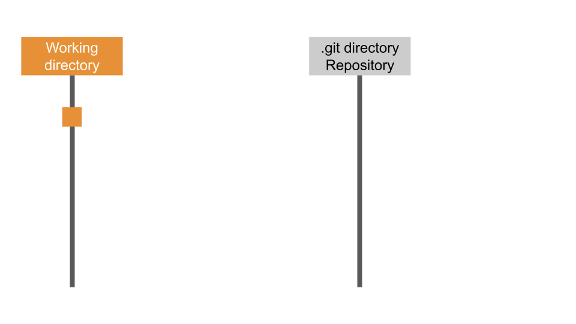 

 

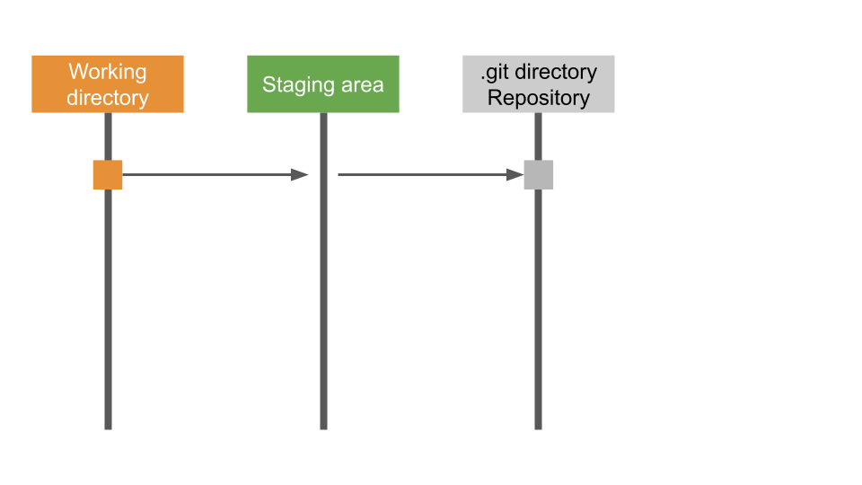 

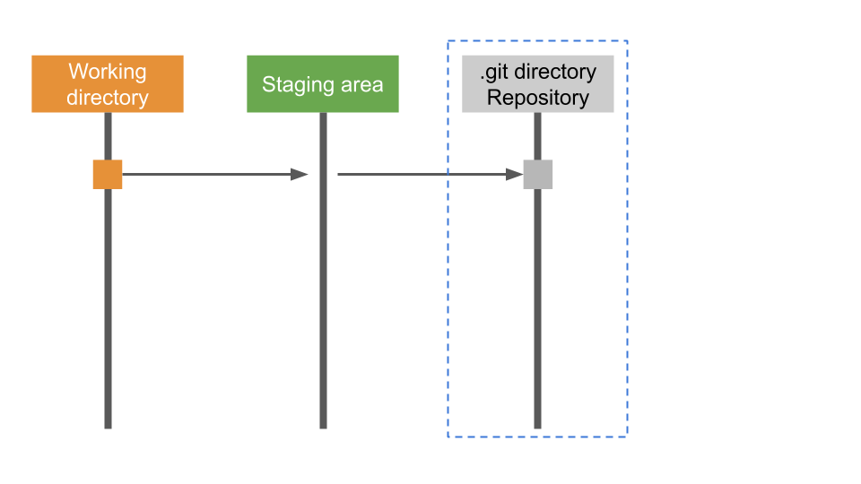 

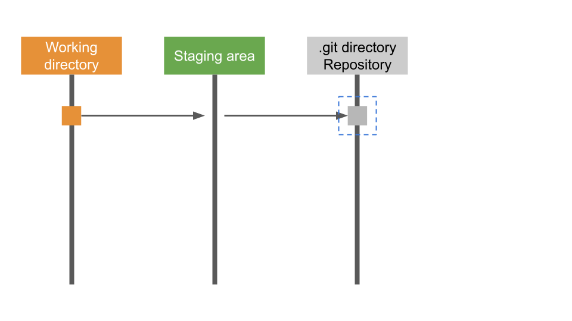 

 

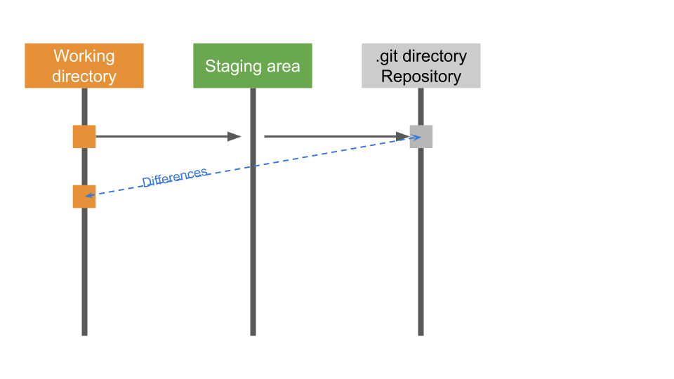 

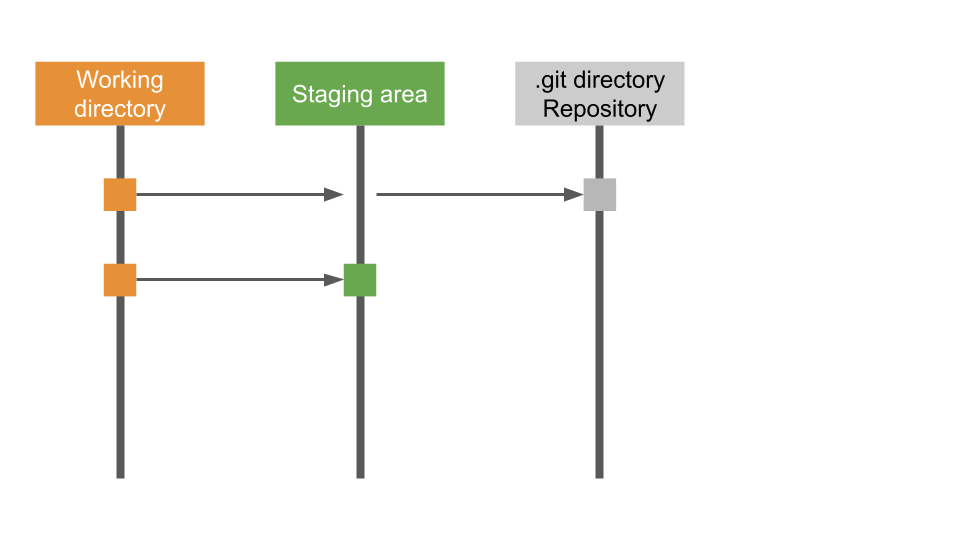 

 

 

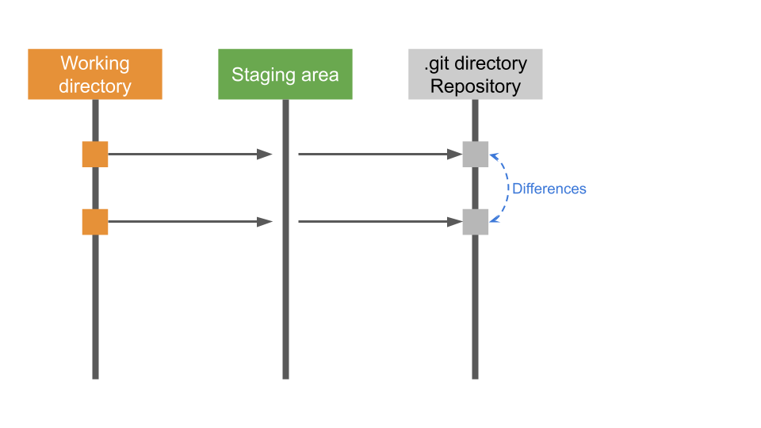 

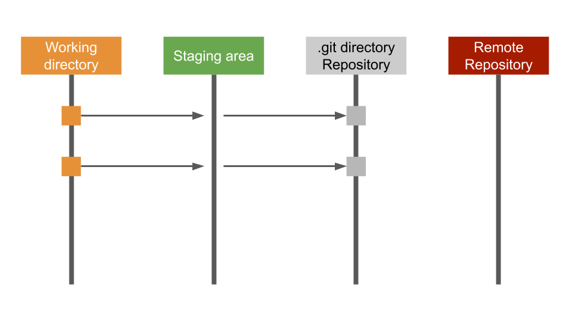 

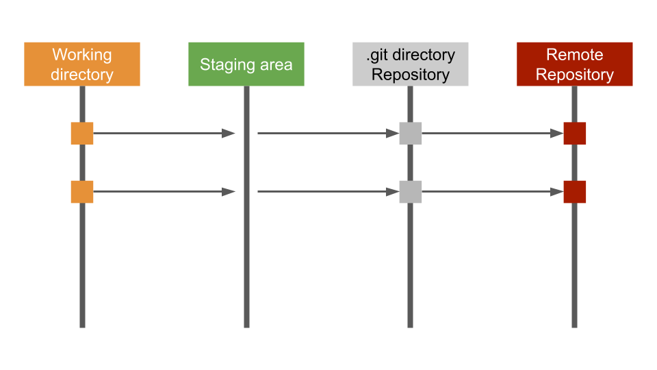 

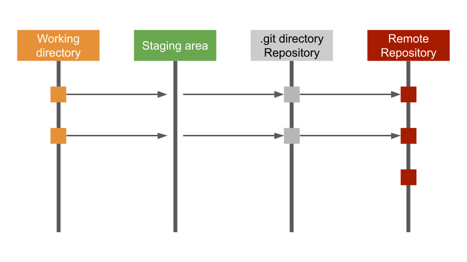 

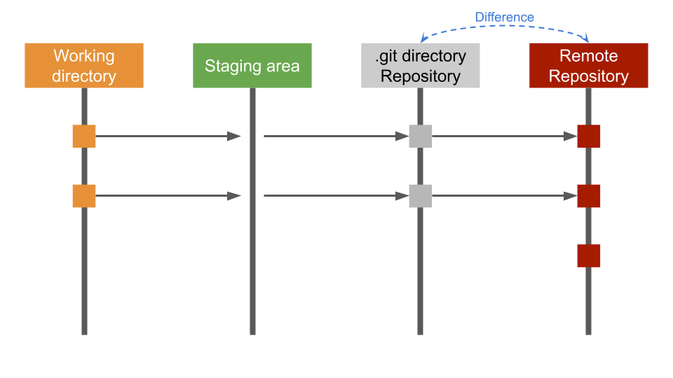 

 

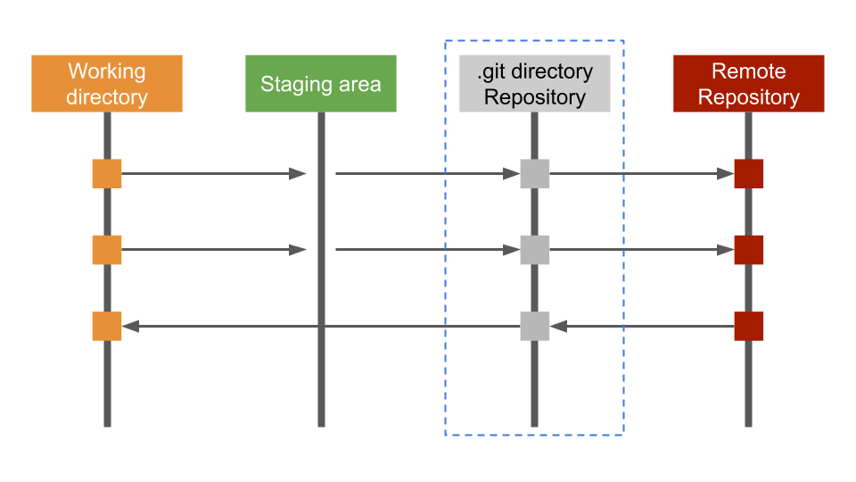 

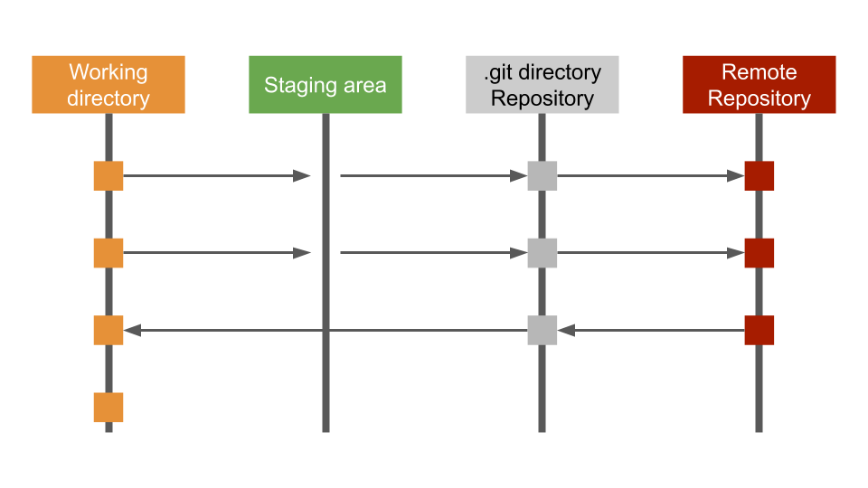 

 

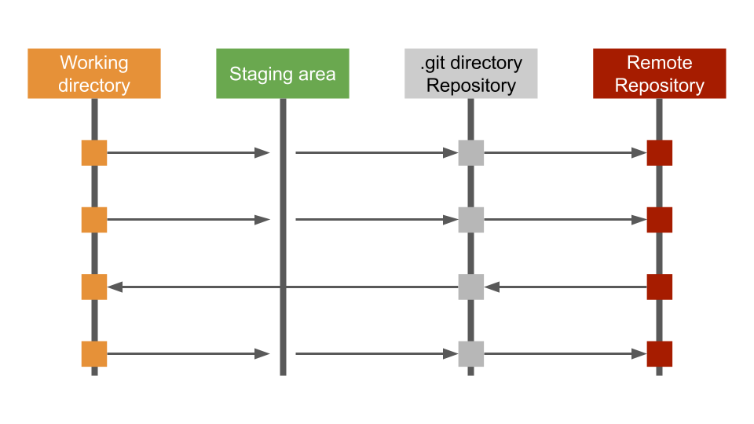 

 

## Intro to GitHub

## Collaborating with GitHub

## More Commands
