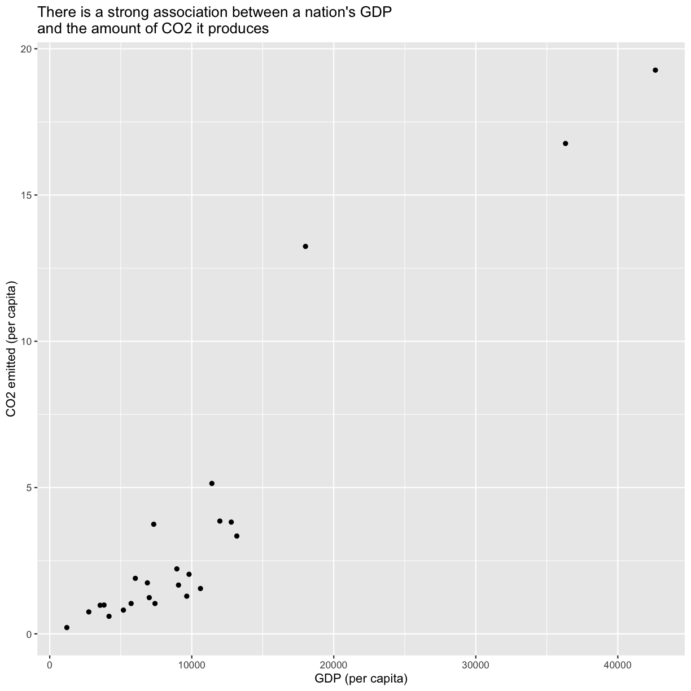
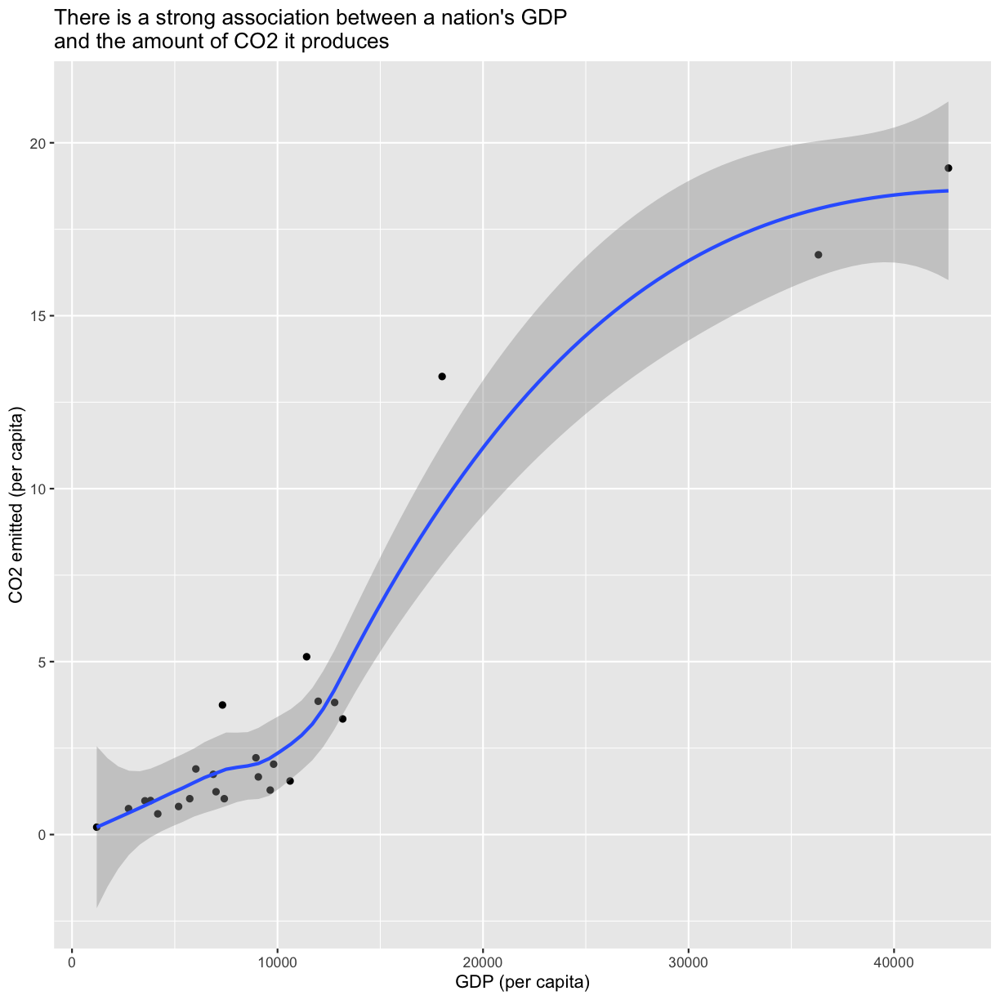
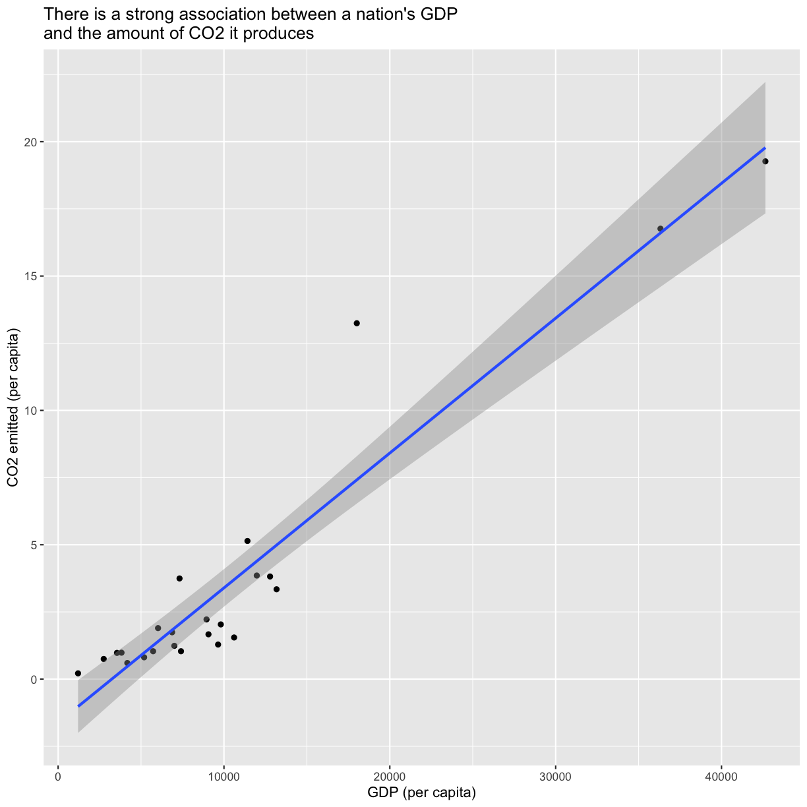

---
# Please do not edit this file directly; it is auto generated.
# Instead, please edit 04-r-data-analysis.md in _episodes_rmd/
title: "R for Data Analysis"
source: Rmd
teaching: 150
exercises: 15
questions:
- "How can I summarize my data in R?"
- "How can R help make my research more reproducible?"
- "How can I combine two datasets from different sources?"
- "How can data tidying facilitate answering analysis questions?"
objectives:
- "To become familiar with the functions of the `dplyr` and `tidyr` packages."
- "To be able to use `dplyr` and `tidyr` to prepare data for analysis."
- "To be able to combine two different data sources using joins."
- "To be able to create plots and summary tables to answer analysis questions."
keypoints:
- "Package loading is an important first step in preparing an R environment."
- "Data analsyis in R facilitates reproducible research."
- "There are many useful functions in the `tidyverse` packages that can aid in data analysis."
- "Assessing data source and structure is an important first step in analysis."
- "Preparing data for analysis can take significant effort and planning."
---


### Contents

1.  [Getting started](#getting-started)
    -   [Loading in the data](#loading-in-the-data)
2.  [An introduction to data analysis in R using `dplyr`](#intro-data-analysis)
    -   [Get stats fast with `summarize()`](#get-stats-fast-with-summarize)
    -   [Narrow down rows with `filter()`](#narrow-down-rows-with-filter)
    -   [Grouping rows using `group_by()`](#grouping-rows-using-group_by)
    -   [Make new variables with `mutate()`](#make-new-variables-with-mutate)
    -   [Subset columns using `select()`](#subset-columns-using-select)
    -   [Changing the shape of the data](#changing-the-shape-of-the-data)
3.  [Cleaning up data](#cleaning-up-data)
4.  [Joining data frames](#joining-data-frames)
5.  [Analyzing combined data](#analyzing-combined-data)
6.  [Finishing with Git and GitHub](#Finishing-with-Git-and-GitHub)

# Getting Started

First, navigate to the un-reports directory however you'd like and open `un-report.Rproj`.
This should open the un-report R project in RStudio.
You can check this by seeing if the Files in the bottom right of RStudio are the ones in your `un-report` directory.

Yesterday we spent a lot of time making plots in R using the ggplot2 package. Visualizing data using plots is a very powerful skill in R, but what if we would like to work with only a subset of our data? Or clean up messy data, calculate summary statistics, create a new variable, or join two datasets together? There are several different methods for doing this in R, and we will touch on a few today using functions the `dplyr` package.

First, we will create a new RScript file for our work. Open RStudio. Choose "File" \> "New File" \> "RScript". We will save this file as `un_data_analysis.R`

### Loading in the data

We will start by importing the complete gapminder dataset that we used yesterday into our fresh new R session. Yesterday we did this using a "point-and-click" commands. Today let's type them into the console ourselves: `gapminder_data <- read_csv("data/gapminder_data.csv")`

> ## Exercise
>
> If we look in the console now, we'll see we've received an error message saying that R "could not find the function `read_csv()`". *Hint: Packages...*
>
> > ## Solution
> >
> > What this means is that R cannot find the function we are trying to call. The reason for this usually is that we are trying to run a function from a package that we have not yet loaded. This is a very common error message that you will probably see a lot when using R. It's important to remember that you will need to load any packages you want to use into R each time you start a new session. The `read_csv` function comes from the `readr` package which is included in the `tidyverse` package so we will just load the `tidyverse` package and run the import code again.
> {: .solution}
{: .challenge}

Now that we know what's wrong, We will use the `read_csv()` function from the Tidyverse `readr` package. Load the `tidyverse` package and gapminder dataset using the code below.


~~~
library(tidyverse)
~~~
{: .language-r}


~~~
── Attaching packages ──────────────────────────────────────────────────────────────── tidyverse 1.3.1 ──
~~~
{: .output}


~~~
✔ ggplot2 3.3.5     ✔ purrr   0.3.4
✔ tibble  3.1.6     ✔ dplyr   1.0.7
✔ tidyr   1.1.4     ✔ stringr 1.4.0
✔ readr   2.1.1     ✔ forcats 0.5.1
~~~
{: .output}


~~~
── Conflicts ─────────────────────────────────────────────────────────────────── tidyverse_conflicts() ──
✖ dplyr::filter() masks stats::filter()
✖ dplyr::lag()    masks stats::lag()
~~~
{: .output}

The output in your console shows that by doing this, we attach several useful packages for data wrangling, including `readr`. Check out these packages and their documentation at [tidyverse.org](https://www.tidyverse.org)

> **Reminder:** Many of these packages, including `dplyr` , come with "Cheatsheets" found under the **Help** RStudio menu tab.

Reload your data:


~~~
gapminder_data <- read_csv("data/gapminder_data.csv")
~~~
{: .language-r}


~~~
Rows: 1704 Columns: 6
~~~
{: .output}


~~~
── Column specification ─────────────────────────────────────────────────────────────────────────────────
Delimiter: ","
chr (2): country, continent
dbl (4): year, pop, lifeExp, gdpPercap
~~~
{: .output}


~~~

ℹ Use `spec()` to retrieve the full column specification for this data.
ℹ Specify the column types or set `show_col_types = FALSE` to quiet this message.
~~~
{: .output}

Notice that the output of the `read_csv()` function is pretty informative. It tells us the name of all of our column headers as well as how it interpreted the data type. This birds-eye-view can help you take a quick look that everything is how we expect it to be.

Now we have the tools necessary to work through this lesson.

# An introduction to data analysis in R using `dplyr` {#intro-data-analysis}

## Get stats fast with `summarize()` {#get-stats-fast-with-summarize}

[*Back to top*](#contents)

Let's say we would like to know what is the mean (average) life expecteny in the dataset. R has a built in function function called `mean()` that will calculate this value for us. We can apply that function to our lifeExp column using the `summarize()` function. Here's what that looks like:

~~~
summarize(gapminder_data, averageLifeExp=mean(lifeExp))
~~~
{: .language-r}


~~~
# A tibble: 1 × 1
  averageLifeExp
           <dbl>
1           59.5
~~~
{: .output}

When we call `summarize()`, we can use any of the column names of our data object as values to pass to other functions. `summarize()` will return a new data object and our value will be returned as a column.

> **Note:** The `summarize()` and `summarise()` perform identical functions.

We name this new column so we can use in a future argument. So the `averageLifeExp=` part tells `summarize()` to use "averageLifeExp" as the name of the new column. Note that you don't have to quotes around this new name as long as it starts with a letter and doesn't include a space.

Instead of including the data as an argument, we can use the *pipe operator* `%>%` to pass the data value into the `summarize` function. 


~~~
gapminder_data %>% summarize(averageLifeExp=mean(lifeExp))
~~~
{: .language-r}


~~~
# A tibble: 1 × 1
  averageLifeExp
           <dbl>
1           59.5
~~~
{: .output}
 
This line of code will do the exact same thing as our first summary command, but the piping function tells R to use the `gapminder_data` dataframe as the first argument in the next function.

This lets us "chain" together multiple functions, which will be helpful later. Note that the pipe (`%>%`) is a bit different from using the ggplot plus (`+`). Pipes take the output from the left side and use it as input to the right side. Plusses layer on additional information (right side) to a preexisting plot (left side). 
 
We can also add an <kdb>Enter</kdb> to make it look nicer:  

~~~
gapminder_data %>%
  summarize(averageLifeExp=mean(lifeExp))
~~~
{: .language-r}


~~~
# A tibble: 1 × 1
  averageLifeExp
           <dbl>
1           59.5
~~~
{: .output}

Using the *pipe operator* `%>%` and enter command makes our code more readable. The  *pipe operator* `%>%` also helps to avoid using nested function and minimizes the need for new variables.

Since we use the pipe operator so often, there is a keyboard shortcut for it in RStudio. You can press <kdb>Ctrl</kdb>+<kdb>Shift</kdb>+<kdb>M<kdb> on Windows or <kdb>Cmd<kdb>+<kdb>Shift<kdb>+<kdb>M<kdb> on a Mac.

> ## Pro tip: Saving a new dataframe
> Notice that when we run the following code, we are not actually saving a new variable: 
> 
> ~~~
> gapminder_data %>%
>   summarize(averageLifeExp=mean(lifeExp))
> ~~~
> {: .language-r}
> This simply outputs what we have created, but does not change actually change `gapminder_data` or save a new dataframe. To save a new dataframe, we could run: 
> 
> ~~~
> gapminder_data_summarized <- gapminder_data %>%
>   summarize(averageLifeExp=mean(lifeExp))
> ~~~
> {: .language-r}
> Or if we want to change `gapminder_data` itself: 
> 
> ~~~
> gapminder_data <- gapminder_data %>%
>   summarize(averageLifeExp=mean(lifeExp))
> ~~~
> {: .language-r}
> IMPORTANT: This would overwrite the existing `gapminder_data` object. 
> 
> For now, we will not be saving dataframes, since we are just experimenting with `dyplr` functions, but it will be useful later on in this lesson. 
> 
{: .callout}

## Narrow down rows with `filter()` {#narrow-down-rows-with-filter}

[*Back to top*](#contents)

Let's take a look at the value we just calculated, which tells us the average life expectancy for all rows in the data was 59.5. That seems a bit low, doesn't it? What's going on?

Well, remember the dataset contains rows from many different years and many different countries. It's likely that life expectancy has increased overtime, so it may not make sense to average over all the years at the same time.

Use `summarize()` to find the most recent year in the data set. We can use the `max()` function to return the maximum value.

> ## Practice using the `%>%` to summarize data
>
> Find the mean population using the piping function.
>
> > ## Solution:
> >
> > 
> > ~~~
> > gapminder_data %>%  
> >  summarize(recent_year = max(year))
> > ~~~
> > {: .language-r}
> > 
> > 
> > 
> > ~~~
> > # A tibble: 1 × 1
> >   recent_year
> >         <dbl>
> > 1        2007
> > ~~~
> > {: .output}
> > 
> {: .solution}
{: .challenge}

So we see that the most recent year in the dataset is 2007. Let's calculate the life expectancy for all countries for only that year. To do that, we will use the `filter()` function to only use rows for that year before calculating the mean value.


~~~
gapminder_data %>%
  filter(year == 2007) %>%
  summarize(average=mean(lifeExp))
~~~
{: .language-r}


~~~
# A tibble: 1 × 1
  average
    <dbl>
1    67.0
~~~
{: .output}

> ## Filtering the dataset
>
> What is the average GDP per capita for the first year in the dataset? *Hint: the column headers identified by `read_csv()` showed us there was a column called gdpPercap in the dataset*
>
> > ## Solution
> >
> > Identify the earliest year in our dataset using `min()` and `summarize()`
> >
> > 
> > ~~~
> > gapminder_data %>%
> > summarize(first_year=min(year))
> > ~~~
> > {: .language-r}
> > 
> > 
> > 
> > ~~~
> > # A tibble: 1 × 1
> >   first_year
> >        <dbl>
> > 1       1952
> > ~~~
> > {: .output}
> >
> > We see here that the first year in the dataset is 1952. Filter to only 1952, and determin the average GDP per capita.
> >
> > 
> > ~~~
> > gapminder_data %>%
> > filter(year == 1952) %>%
> > summarize(average_gdp=mean(gdpPercap))
> > ~~~
> > {: .language-r}
> > 
> > 
> > 
> > ~~~
> > # A tibble: 1 × 1
> >   average_gdp
> >         <dbl>
> > 1       3725.
> > ~~~
> > {: .output}
> > {: .source}
> > By combining `filter()` and `summarize()` we were able to calculate the mean GDP per capita in the year 1952.
> {: .solution}
{: .challenge}

Notice how the pipe operator (`%>%`) allows us to combine these two simple steps into a more complicated data extraction?. We took the data, filtered out the rows, then took the mean value. The argument we pass to `filter()` needs to be some expression that will return TRUE or FALSE. We can use comparisons like `>` (greater than) and `<` (less than) for example. Here we tested for equality using a double equals sign `==`. You use `==` (double equals) when testing if two values are equal, and you use `=` (single equals) when naming arguments that you are passing to functions. Try changing it to use `filter(year = 2007)` and see what happens.

## Grouping rows using `group_by()` {#grouping-rows-using-group_by}

[*Back to top*](#contents)

We see that the life expectancy in 2007 is much larger than the value we got using all of the rows. It seems life expectancy is increasing which is good news. But now we might be interested in calculating the average for each year. Rather that doing a bunch of different `filter()` statements, we can instead use the `group_by()` function. The function allows us to tell the code to treat the rows in logical groups, so rather than summarizing over all the rows, we will get one summary value for each group. Here's what that will look like:


~~~
gapminder_data %>%
  group_by(year) %>%
  summarize(average=mean(lifeExp))
~~~
{: .language-r}


~~~
# A tibble: 12 × 2
    year average
   <dbl>   <dbl>
 1  1952    49.1
 2  1957    51.5
 3  1962    53.6
 4  1967    55.7
 5  1972    57.6
 6  1977    59.6
 7  1982    61.5
 8  1987    63.2
 9  1992    64.2
10  1997    65.0
11  2002    65.7
12  2007    67.0
~~~
{: .output}

The `group_by()` function expects you to pass in the name of a column (or multiple columns separated by comma) in your data. 

Note that you might get a message about the summarize function regrouping the output by 'year'. This simply indicates what the function is grouping by. 

> ## Grouping the data
>
> Try calculating the average life expectancy by continent.
>
> > ## Solution
> >
> > 
> > ~~~
> > gapminder_data %>%
> > group_by(continent) %>%
> > summarize(average=mean(lifeExp))
> > ~~~
> > {: .language-r}
> > 
> > 
> > 
> > ~~~
> > # A tibble: 5 × 2
> >   continent average
> >   <chr>       <dbl>
> > 1 Africa       48.9
> > 2 Americas     64.7
> > 3 Asia         60.1
> > 4 Europe       71.9
> > 5 Oceania      74.3
> > ~~~
> > {: .output}
> > {: .source}
> >
> > By combining `group_by()` and `summarize()` we are able to calculate the mean life expectancy by continent.
> {: .solution}
{: .challenge}

You can also create more than one new column when you call `summarize()`. To do so, you must separate your columns with a comma. Building on the code from the last exercise, let's add a new column that calculates the minimum life expectancy for each continent. 


~~~
gapminder_data %>%
  group_by(continent) %>%
  summarize(average=mean(lifeExp), min=min(lifeExp))
~~~
{: .language-r}


~~~
# A tibble: 5 × 3
  continent average   min
  <chr>       <dbl> <dbl>
1 Africa       48.9  23.6
2 Americas     64.7  37.6
3 Asia         60.1  28.8
4 Europe       71.9  43.6
5 Oceania      74.3  69.1
~~~
{: .output}


## Make new variables with `mutate()` {#make-new-variables-with-mutate}

[*Back to top*](#contents)

Each time we ran `summarize()`, we got back fewer rows than passed in. We either got one row back, or one row per group. But sometimes we want to create a new column in our data without changing the number of rows. The function we use to create new columns is called `mutate()`.

We have a column for the population and the GDP per capita. If we wanted to get the total GDP, we could multiply the per capita GDP values by the total population. Here's what such a `mutate()` command would look like:


~~~
gapminder_data %>%
  mutate(gdp = pop * gdpPercap)
~~~
{: .language-r}


~~~
# A tibble: 1,704 × 7
   country      year      pop continent lifeExp gdpPercap          gdp
   <chr>       <dbl>    <dbl> <chr>       <dbl>     <dbl>        <dbl>
 1 Afghanistan  1952  8425333 Asia         28.8      779.  6567086330.
 2 Afghanistan  1957  9240934 Asia         30.3      821.  7585448670.
 3 Afghanistan  1962 10267083 Asia         32.0      853.  8758855797.
 4 Afghanistan  1967 11537966 Asia         34.0      836.  9648014150.
 5 Afghanistan  1972 13079460 Asia         36.1      740.  9678553274.
 6 Afghanistan  1977 14880372 Asia         38.4      786. 11697659231.
 7 Afghanistan  1982 12881816 Asia         39.9      978. 12598563401.
 8 Afghanistan  1987 13867957 Asia         40.8      852. 11820990309.
 9 Afghanistan  1992 16317921 Asia         41.7      649. 10595901589.
10 Afghanistan  1997 22227415 Asia         41.8      635. 14121995875.
# … with 1,694 more rows
~~~
{: .output}

This will add a new column called "gdp" to our data. We use the column names as if they were regular values that we want to perform mathematical operations on and provide the name in front of an equals sign like we have done with `summarize()`

> ## `mutate()`
> We can also multiply by constants or other numbers using mutate - remember how in the plotting lesson we made a plot with population in millions? Try making a new column for this dataframe called popInMillions that is the population in million. 
> 
> > ## Solution: 
> > 
> > ~~~
> > gapminder_data %>%  
> > mutate(gdp = pop * gdpPercap, popInMillions = pop / 1000000)  
> > ~~~
> > {: .language-r}
> > 
> > 
> > 
> > ~~~
> > # A tibble: 1,704 × 8
> >    country      year      pop continent lifeExp gdpPercap      gdp popInMillions
> >    <chr>       <dbl>    <dbl> <chr>       <dbl>     <dbl>    <dbl>         <dbl>
> >  1 Afghanistan  1952  8425333 Asia         28.8      779.  6.57e 9          8.43
> >  2 Afghanistan  1957  9240934 Asia         30.3      821.  7.59e 9          9.24
> >  3 Afghanistan  1962 10267083 Asia         32.0      853.  8.76e 9         10.3 
> >  4 Afghanistan  1967 11537966 Asia         34.0      836.  9.65e 9         11.5 
> >  5 Afghanistan  1972 13079460 Asia         36.1      740.  9.68e 9         13.1 
> >  6 Afghanistan  1977 14880372 Asia         38.4      786.  1.17e10         14.9 
> >  7 Afghanistan  1982 12881816 Asia         39.9      978.  1.26e10         12.9 
> >  8 Afghanistan  1987 13867957 Asia         40.8      852.  1.18e10         13.9 
> >  9 Afghanistan  1992 16317921 Asia         41.7      649.  1.06e10         16.3 
> > 10 Afghanistan  1997 22227415 Asia         41.8      635.  1.41e10         22.2 
> > # … with 1,694 more rows
> > ~~~
> > {: .output}
> {: .solution}
{: .challenge}
 

## Subset columns using `select()` {#subset-columns-using-select}

[*Back to top*](#contents)

We use the `filter()` function to choose a subset of the rows from our data, but when we want to choose a subset of columns from our data we use `select()`. For example, if we only wanted to see the population ("pop") and year values, we can do:


~~~
gapminder_data %>%
  select(pop, year)
~~~
{: .language-r}


~~~
# A tibble: 1,704 × 2
        pop  year
      <dbl> <dbl>
 1  8425333  1952
 2  9240934  1957
 3 10267083  1962
 4 11537966  1967
 5 13079460  1972
 6 14880372  1977
 7 12881816  1982
 8 13867957  1987
 9 16317921  1992
10 22227415  1997
# … with 1,694 more rows
~~~
{: .output}

We can also use `select()` to drop/remove particular columns by putting a minus sign (`-`) in front of the column name. For example, if we want everything but the continent column, we can do:


~~~
gapminder_data %>%
  select(-continent)
~~~
{: .language-r}


~~~
# A tibble: 1,704 × 5
   country      year      pop lifeExp gdpPercap
   <chr>       <dbl>    <dbl>   <dbl>     <dbl>
 1 Afghanistan  1952  8425333    28.8      779.
 2 Afghanistan  1957  9240934    30.3      821.
 3 Afghanistan  1962 10267083    32.0      853.
 4 Afghanistan  1967 11537966    34.0      836.
 5 Afghanistan  1972 13079460    36.1      740.
 6 Afghanistan  1977 14880372    38.4      786.
 7 Afghanistan  1982 12881816    39.9      978.
 8 Afghanistan  1987 13867957    40.8      852.
 9 Afghanistan  1992 16317921    41.7      649.
10 Afghanistan  1997 22227415    41.8      635.
# … with 1,694 more rows
~~~
{: .output}

> ## selecting columns 
> Create a dataframe with only the `country`, `continent`, `year`, and `lifeExp` columns. 
> 
> > ## Solution: 
> > There are multiple ways to do this exercise. Here are two different possibilities. 
> > 
> > 
> > ~~~
> > gapminder_data %>%
> >   select(country, continent, year, lifeExp)
> > ~~~
> > {: .language-r}
> > 
> > 
> > 
> > ~~~
> > # A tibble: 1,704 × 4
> >    country     continent  year lifeExp
> >    <chr>       <chr>     <dbl>   <dbl>
> >  1 Afghanistan Asia       1952    28.8
> >  2 Afghanistan Asia       1957    30.3
> >  3 Afghanistan Asia       1962    32.0
> >  4 Afghanistan Asia       1967    34.0
> >  5 Afghanistan Asia       1972    36.1
> >  6 Afghanistan Asia       1977    38.4
> >  7 Afghanistan Asia       1982    39.9
> >  8 Afghanistan Asia       1987    40.8
> >  9 Afghanistan Asia       1992    41.7
> > 10 Afghanistan Asia       1997    41.8
> > # … with 1,694 more rows
> > ~~~
> > {: .output}
> > 
> > ~~~
> > gapminder_data %>%
> >   select(-pop, -gdpPercap)
> > ~~~
> > {: .language-r}
> > 
> > 
> > 
> > ~~~
> > # A tibble: 1,704 × 4
> >    country      year continent lifeExp
> >    <chr>       <dbl> <chr>       <dbl>
> >  1 Afghanistan  1952 Asia         28.8
> >  2 Afghanistan  1957 Asia         30.3
> >  3 Afghanistan  1962 Asia         32.0
> >  4 Afghanistan  1967 Asia         34.0
> >  5 Afghanistan  1972 Asia         36.1
> >  6 Afghanistan  1977 Asia         38.4
> >  7 Afghanistan  1982 Asia         39.9
> >  8 Afghanistan  1987 Asia         40.8
> >  9 Afghanistan  1992 Asia         41.7
> > 10 Afghanistan  1997 Asia         41.8
> > # … with 1,694 more rows
> > ~~~
> > {: .output}
> {: .solution}
{: .challenge}


> ## Bonus: Using helper functions with `select()`
>
> The `select()` function has a bunch of helper functions that are handy if you are working with a dataset that has a lot of columns. You can see these helper functions on the `?select` help page. For example, let's say we wanted to select the year column and all the columns that start with the letter "c". You can do that with:
> 
> 
> ~~~
> gapminder_data %>%
>   select(year, starts_with("c"))
> ~~~
> {: .language-r}
> 
> 
> 
> ~~~
> # A tibble: 1,704 × 3
>     year country     continent
>    <dbl> <chr>       <chr>    
>  1  1952 Afghanistan Asia     
>  2  1957 Afghanistan Asia     
>  3  1962 Afghanistan Asia     
>  4  1967 Afghanistan Asia     
>  5  1972 Afghanistan Asia     
>  6  1977 Afghanistan Asia     
>  7  1982 Afghanistan Asia     
>  8  1987 Afghanistan Asia     
>  9  1992 Afghanistan Asia     
> 10  1997 Afghanistan Asia     
> # … with 1,694 more rows
> ~~~
> {: .output}
> This returns just the three columns we are interested in. 
>
> > ## Using `select()` with a helper function
> >
> > Find a helper function on the help page that will choose all the columns that have "p" as their last letter (ie: "pop","lifeExp","gdpPerCap")
> >
> > > ## Solution
> > >
> > > The helper function `ends_with()` can help us here.
> > >
> > > 
> > > ~~~
> > > gapminder_data %>%
> > > select(ends_with("p"))
> > > ~~~
> > > {: .language-r}
> > > 
> > > 
> > > 
> > > ~~~
> > > # A tibble: 1,704 × 3
> > >         pop lifeExp gdpPercap
> > >       <dbl>   <dbl>     <dbl>
> > >  1  8425333    28.8      779.
> > >  2  9240934    30.3      821.
> > >  3 10267083    32.0      853.
> > >  4 11537966    34.0      836.
> > >  5 13079460    36.1      740.
> > >  6 14880372    38.4      786.
> > >  7 12881816    39.9      978.
> > >  8 13867957    40.8      852.
> > >  9 16317921    41.7      649.
> > > 10 22227415    41.8      635.
> > > # … with 1,694 more rows
> > > ~~~
> > > {: .output}
> > {: .solution}
> {: .challenge}
> 
{: .solution}


## Changing the shape of the data

[*Back to top*](#contents)

Data comes in many shapes and sizes, and one way we classify data is either "wide" or "long." Data that is "long" has one row per observation. The gapminder_data data is in a long format. We have one row for each country for each year and each different measurement for that country is in a different column. We might describe this data as "tidy" because it makes it easy to work with `ggplot2` and `dplyr` functions (this is where the "tidy" in "tidyverse" comes from). As tidy as it may be, sometimes we may want our data in a "wide" format. Typically in "wide" format each row represents a group of observations and each value is placed in a different column rather than a different row. For example maybe we want only one row per country and want to spread the life expectancy values into different columns (one for each year).

The `tidyr` package contains the functions `pivot_wider` and `pivot_longer` that make it easy to switch between the two formats. The `tidyr` package is included in the `tidyverse` package so we don't need to do anything to load it.


~~~
gapminder_data %>%
  select(country, continent, year, lifeExp) %>%
  pivot_wider(names_from = year, values_from = lifeExp )
~~~
{: .language-r}


~~~
# A tibble: 142 × 14
   country     continent `1952` `1957` `1962` `1967` `1972` `1977` `1982` `1987`
   <chr>       <chr>      <dbl>  <dbl>  <dbl>  <dbl>  <dbl>  <dbl>  <dbl>  <dbl>
 1 Afghanistan Asia        28.8   30.3   32.0   34.0   36.1   38.4   39.9   40.8
 2 Albania     Europe      55.2   59.3   64.8   66.2   67.7   68.9   70.4   72  
 3 Algeria     Africa      43.1   45.7   48.3   51.4   54.5   58.0   61.4   65.8
 4 Angola      Africa      30.0   32.0   34     36.0   37.9   39.5   39.9   39.9
 5 Argentina   Americas    62.5   64.4   65.1   65.6   67.1   68.5   69.9   70.8
 6 Australia   Oceania     69.1   70.3   70.9   71.1   71.9   73.5   74.7   76.3
 7 Austria     Europe      66.8   67.5   69.5   70.1   70.6   72.2   73.2   74.9
 8 Bahrain     Asia        50.9   53.8   56.9   59.9   63.3   65.6   69.1   70.8
 9 Bangladesh  Asia        37.5   39.3   41.2   43.5   45.3   46.9   50.0   52.8
10 Belgium     Europe      68     69.2   70.2   70.9   71.4   72.8   73.9   75.4
# … with 132 more rows, and 4 more variables: 1992 <dbl>, 1997 <dbl>,
#   2002 <dbl>, 2007 <dbl>
~~~
{: .output}

Notice here that we tell `pivot_wider()` which columns to pull the names we wish our new columns to be named from the year variable, and the values to populate those columns from the lifeExp variable. (Again, neither of which have to be in quotes in the code when there are no special characters or spaces - certainly an incentive not to use special characters or spaces!) We see that the resulting table has new columns by year, and the values populate it with our remaining variables dictating the rows.

Before we move on to more data cleaning, let's create the final gapminder dataframe we will be working with for the rest of the lesson! 

> ## Final Americas 2007 gapminder dataset
> Read in the `gapminder_data.csv` file, filter out the year 2007 and the continent "Americas." Then drop the `year` and `continent` columns from the dataframe. Then save the new dataframe into a variable called `gapminder_data_2007`. 
> 
> > ## Solution: 
> > 
> > ~~~
> > gapminder_data_2007 <- read_csv("data/gapminder_data.csv") %>%
> >   filter(year == 2007 & continent == "Americas") %>%
> >   select(-year, -continent)
> > ~~~
> > {: .language-r}
> > 
> > 
> > 
> > ~~~
> > Rows: 1704 Columns: 6
> > ~~~
> > {: .output}
> > 
> > 
> > 
> > ~~~
> > ── Column specification ─────────────────────────────────────────────────────────────────────────────────
> > Delimiter: ","
> > chr (2): country, continent
> > dbl (4): year, pop, lifeExp, gdpPercap
> > ~~~
> > {: .output}
> > 
> > 
> > 
> > ~~~
> > 
> > ℹ Use `spec()` to retrieve the full column specification for this data.
> > ℹ Specify the column types or set `show_col_types = FALSE` to quiet this message.
> > ~~~
> > {: .output}
> {: .solution}
{: .challenge}

Awesome! This is the dataframe we will be using later on in this lesson. 


## Reviewing Git and GitHub
Now that we have our gapminder data prepared, let's use what we learned about git and GitHub in the previous lesson to add, commit, and push our changes.  

Open Terminal/Git Bash, if you do not have it open already. First we'll need to navigate to our un-report directory.

Let's start by print our current working directory and listing the items in the directory, to see where we are. 
``` 
pwd
ls
```

Now, we'll navigate to the un-report directory. 
```
cd ~/Desktop/un-report  
ls
```

To start, let's pull to make sure our local repository is up to date. 
```
git status
git pull
```

Not let's add and commit our changes. 
```
git status
git add
git status "un_data_analysis.R"  
git commit -m "Create data analysis file"  
```

Finally, let's check our commits and then push the commits to GitHub. 
```
git status
git log --online  
git push 
git status
``` 

# Cleaning up data

[*Back to top*](#contents)

Researchers are often pulling data from several sources, and the process of making data compatible with one another and prepared for analysis can be a large undertaking. Luckily, there are many functions that allow us to do this in R. We've been working with the gapminder dataset, which contains population and GDP data by year. In this section, we practice cleaning and preparing a second dataset containing CO2 emissions data by country and year, sourced from [the UN](https://data.un.org/_Docs/SYB/CSV/SYB63_310_202009_Carbon%20Dioxide%20Emission%20Estimates.csv).

It's always good to go into data cleaning with a clear goal in mind. Here, we'd like to prepare the CO2 UN data to be compatible with our gapminder data so we can directly compare GDP to CO2 emissions. To make this work, we'd like a data frame that contains a column with the country name, and columns for different ways of measuring CO2 emissions. We will also want the data to be collected as close to 2007 as possible (the last year we have data for in gapminder). Let's start with reading the data in using `read_csv()`


~~~
read_csv("data/co2-un-data.csv")
~~~
{: .language-r}


~~~
New names:
* `` -> ...3
* `` -> ...4
* `` -> ...5
* `` -> ...6
* `` -> ...7
~~~
{: .output}


~~~
Rows: 2133 Columns: 7
~~~
{: .output}


~~~
── Column specification ─────────────────────────────────────────────────────────────────────────────────
Delimiter: ","
chr (7): T24, CO2 emission estimates, ...3, ...4, ...5, ...6, ...7
~~~
{: .output}


~~~

ℹ Use `spec()` to retrieve the full column specification for this data.
ℹ Specify the column types or set `show_col_types = FALSE` to quiet this message.
~~~
{: .output}


~~~
# A tibble: 2,133 × 7
   T24                 `CO2 emission estimates` ...3  ...4    ...5  ...6  ...7  
   <chr>               <chr>                    <chr> <chr>   <chr> <chr> <chr> 
 1 Region/Country/Area <NA>                     Year  Series  Value Foot… Source
 2 8                   Albania                  1975  Emissi… 4338… <NA>  Inter…
 3 8                   Albania                  1985  Emissi… 6929… <NA>  Inter…
 4 8                   Albania                  1995  Emissi… 1848… <NA>  Inter…
 5 8                   Albania                  2005  Emissi… 3825… <NA>  Inter…
 6 8                   Albania                  2010  Emissi… 3930… <NA>  Inter…
 7 8                   Albania                  2015  Emissi… 3824… <NA>  Inter…
 8 8                   Albania                  2016  Emissi… 3674… <NA>  Inter…
 9 8                   Albania                  2017  Emissi… 4342… <NA>  Inter…
10 8                   Albania                  1975  Emissi… 1.80… <NA>  Inter…
# … with 2,123 more rows
~~~
{: .output}

The output gives us a warning about missing column names being filled in with things like 'X3', 'X4', etc. Looking at the table that is outputted by `read_csv()` we can see that there appear to be two rows at the top of the file that contain information about the data in the table. The first is a header that tells us the table number and its name. Ideally, we'd skip that. We can do this using the `skip=` argument in read_csv by giving it a number of lines to skip.


~~~
read_csv("data/co2-un-data.csv", skip=1)
~~~
{: .language-r}


~~~
New names:
* `` -> ...2
~~~
{: .output}


~~~
Rows: 2132 Columns: 7
~~~
{: .output}


~~~
── Column specification ─────────────────────────────────────────────────────────────────────────────────
Delimiter: ","
chr (4): ...2, Series, Footnotes, Source
dbl (3): Region/Country/Area, Year, Value
~~~
{: .output}


~~~

ℹ Use `spec()` to retrieve the full column specification for this data.
ℹ Specify the column types or set `show_col_types = FALSE` to quiet this message.
~~~
{: .output}


~~~
# A tibble: 2,132 × 7
   `Region/Country/Area` ...2     Year Series       Value Footnotes Source      
                   <dbl> <chr>   <dbl> <chr>        <dbl> <chr>     <chr>       
 1                     8 Albania  1975 Emissions … 4.34e3 <NA>      Internation…
 2                     8 Albania  1985 Emissions … 6.93e3 <NA>      Internation…
 3                     8 Albania  1995 Emissions … 1.85e3 <NA>      Internation…
 4                     8 Albania  2005 Emissions … 3.83e3 <NA>      Internation…
 5                     8 Albania  2010 Emissions … 3.93e3 <NA>      Internation…
 6                     8 Albania  2015 Emissions … 3.82e3 <NA>      Internation…
 7                     8 Albania  2016 Emissions … 3.67e3 <NA>      Internation…
 8                     8 Albania  2017 Emissions … 4.34e3 <NA>      Internation…
 9                     8 Albania  1975 Emissions … 1.80e0 <NA>      Internation…
10                     8 Albania  1985 Emissions … 2.34e0 <NA>      Internation…
# … with 2,122 more rows
~~~
{: .output}

Now we get a similar Warning message as before, but the outputted table looks better.

> ## Warnings and Errors
> It's important to differentiate between Warnings and Errors in R. A warning tells us, "you might want to know about this issue, but R still did what you asked". An error tells us, "there's something wrong with your code or your data and R didn't do what you asked". You need to fix any errors that arise. Warnings, are probably best to resolve or at least understand why they are coming up.
{.callout}

We can resolve this warning by telling `read_csv()` what the column names should be with the `col_names()` argument where we give it the column names we want within the c() function separated by commas. If we do this, then we need to set skip to 2 to also skip the column headings. Let's also save this dataframe to `co2_emissions_dirty` so that we don't have to read it in every time we want to clean it even more.


~~~
co2_emissions_dirty <- read_csv("data/co2-un-data.csv", skip=2,
         col_names=c("region", "country", "year", "series", "value", "footnotes", "source"))
~~~
{: .language-r}


~~~
Rows: 2132 Columns: 7
~~~
{: .output}


~~~
── Column specification ─────────────────────────────────────────────────────────────────────────────────
Delimiter: ","
chr (4): country, series, footnotes, source
dbl (3): region, year, value
~~~
{: .output}


~~~

ℹ Use `spec()` to retrieve the full column specification for this data.
ℹ Specify the column types or set `show_col_types = FALSE` to quiet this message.
~~~
{: .output}


~~~
co2_emissions_dirty
~~~
{: .language-r}


~~~
# A tibble: 2,132 × 7
   region country  year series             value footnotes source               
    <dbl> <chr>   <dbl> <chr>              <dbl> <chr>     <chr>                
 1      8 Albania  1975 Emissions (thous… 4.34e3 <NA>      International Energy…
 2      8 Albania  1985 Emissions (thous… 6.93e3 <NA>      International Energy…
 3      8 Albania  1995 Emissions (thous… 1.85e3 <NA>      International Energy…
 4      8 Albania  2005 Emissions (thous… 3.83e3 <NA>      International Energy…
 5      8 Albania  2010 Emissions (thous… 3.93e3 <NA>      International Energy…
 6      8 Albania  2015 Emissions (thous… 3.82e3 <NA>      International Energy…
 7      8 Albania  2016 Emissions (thous… 3.67e3 <NA>      International Energy…
 8      8 Albania  2017 Emissions (thous… 4.34e3 <NA>      International Energy…
 9      8 Albania  1975 Emissions per ca… 1.80e0 <NA>      International Energy…
10      8 Albania  1985 Emissions per ca… 2.34e0 <NA>      International Energy…
# … with 2,122 more rows
~~~
{: .output}

> ## Bonus: Another way to deal with this error
> 
> There are often multiple ways to clean data. Here we  read in the table, get the warning and then fix the column names using the rename function.
> 
> 
> ~~~
> read_csv("data/co2-un-data.csv", skip=1) %>%
>   rename(country=X2)
> ~~~
> {: .language-r}
> 
> 
> 
> ~~~
> New names:
> * `` -> ...2
> ~~~
> {: .output}
> 
> 
> 
> ~~~
> Rows: 2132 Columns: 7
> ~~~
> {: .output}
> 
> 
> 
> ~~~
> ── Column specification ─────────────────────────────────────────────────────────────────────────────────
> Delimiter: ","
> chr (4): ...2, Series, Footnotes, Source
> dbl (3): Region/Country/Area, Year, Value
> ~~~
> {: .output}
> 
> 
> 
> ~~~
> 
> ℹ Use `spec()` to retrieve the full column specification for this data.
> ℹ Specify the column types or set `show_col_types = FALSE` to quiet this message.
> ~~~
> {: .output}
> 
> 
> 
> ~~~
> Error: Can't rename columns that don't exist.
> ✖ Column `X2` doesn't exist.
> ~~~
> {: .error}
>
> Many data analysts prefer to have their column headings and variable names be in all lower case. We can use a variation of `rename()`, which is `rename_all()` that allows us to set all of the column headings to lower case by giving it the name of the tolower function, which makes everything lowercase.
> 
> 
> ~~~
> read_csv("data/co2-un-data.csv", skip=1) %>%
>  rename_all(tolower)
> ~~~
> {: .language-r}
> 
> 
> 
> ~~~
> New names:
> * `` -> ...2
> ~~~
> {: .output}
> 
> 
> 
> ~~~
> Rows: 2132 Columns: 7
> ~~~
> {: .output}
> 
> 
> 
> ~~~
> ── Column specification ─────────────────────────────────────────────────────────────────────────────────
> Delimiter: ","
> chr (4): ...2, Series, Footnotes, Source
> dbl (3): Region/Country/Area, Year, Value
> ~~~
> {: .output}
> 
> 
> 
> ~~~
> 
> ℹ Use `spec()` to retrieve the full column specification for this data.
> ℹ Specify the column types or set `show_col_types = FALSE` to quiet this message.
> ~~~
> {: .output}
> 
> 
> 
> ~~~
> # A tibble: 2,132 × 7
>    `region/country/area` ...2     year series       value footnotes source      
>                    <dbl> <chr>   <dbl> <chr>        <dbl> <chr>     <chr>       
>  1                     8 Albania  1975 Emissions … 4.34e3 <NA>      Internation…
>  2                     8 Albania  1985 Emissions … 6.93e3 <NA>      Internation…
>  3                     8 Albania  1995 Emissions … 1.85e3 <NA>      Internation…
>  4                     8 Albania  2005 Emissions … 3.83e3 <NA>      Internation…
>  5                     8 Albania  2010 Emissions … 3.93e3 <NA>      Internation…
>  6                     8 Albania  2015 Emissions … 3.82e3 <NA>      Internation…
>  7                     8 Albania  2016 Emissions … 3.67e3 <NA>      Internation…
>  8                     8 Albania  2017 Emissions … 4.34e3 <NA>      Internation…
>  9                     8 Albania  1975 Emissions … 1.80e0 <NA>      Internation…
> 10                     8 Albania  1985 Emissions … 2.34e0 <NA>      Internation…
> # … with 2,122 more rows
> ~~~
> {: .output}
{: .solution}

We previously saw how we can subset columns from a data frame using the select function. There are a lot of columns with extraneous information in this dataset, let's subset out the columns we are interested in. 

> ## Reviewing selecting columns
> Select the country, year, series, and value columns from our dataset. 
> 
> > ## Solution: 
> > 
> > ~~~
> > co2_emissions_dirty %>%
> >   select(country, year, series, value)
> > ~~~
> > {: .language-r}
> > 
> > 
> > 
> > ~~~
> > # A tibble: 2,132 × 4
> >    country  year series                                                 value
> >    <chr>   <dbl> <chr>                                                  <dbl>
> >  1 Albania  1975 Emissions (thousand metric tons of carbon dioxide)   4338.  
> >  2 Albania  1985 Emissions (thousand metric tons of carbon dioxide)   6930.  
> >  3 Albania  1995 Emissions (thousand metric tons of carbon dioxide)   1849.  
> >  4 Albania  2005 Emissions (thousand metric tons of carbon dioxide)   3825.  
> >  5 Albania  2010 Emissions (thousand metric tons of carbon dioxide)   3930.  
> >  6 Albania  2015 Emissions (thousand metric tons of carbon dioxide)   3825.  
> >  7 Albania  2016 Emissions (thousand metric tons of carbon dioxide)   3674.  
> >  8 Albania  2017 Emissions (thousand metric tons of carbon dioxide)   4342.  
> >  9 Albania  1975 Emissions per capita (metric tons of carbon dioxide)    1.80
> > 10 Albania  1985 Emissions per capita (metric tons of carbon dioxide)    2.34
> > # … with 2,122 more rows
> > ~~~
> > {: .output}
> {: .solution}
{: .challenge}

The series column has two methods of quantifying CO2 emissions - "Emissions (thousand metric tons of carbon dioxide)" and "Emissions per capita (metric tons of carbon dioxide)". Those are long titles that we'd like to shorten to make them easier to work with. We can shorten them to "total_emissions" and "per_capita_emissions" using the recode function. We need to do this within the mutate function where we will mutate the series column. The syntax in the recode function is to tell recode which column we want to recode and then what the old value (e.g. "Emissions (thousand metric tons of carbon dioxide)") should equal after recoding (e.g. "total").


~~~
co2_emissions_dirty %>% 
  select(country, year, series, value) %>%
  mutate(series = recode(series, "Emissions (thousand metric tons of carbon dioxide)" = "total_emissions",
                         "Emissions per capita (metric tons of carbon dioxide)" = "per_capita_emissions"))
~~~
{: .language-r}


~~~
# A tibble: 2,132 × 4
   country  year series                 value
   <chr>   <dbl> <chr>                  <dbl>
 1 Albania  1975 total_emissions      4338.  
 2 Albania  1985 total_emissions      6930.  
 3 Albania  1995 total_emissions      1849.  
 4 Albania  2005 total_emissions      3825.  
 5 Albania  2010 total_emissions      3930.  
 6 Albania  2015 total_emissions      3825.  
 7 Albania  2016 total_emissions      3674.  
 8 Albania  2017 total_emissions      4342.  
 9 Albania  1975 per_capita_emissions    1.80
10 Albania  1985 per_capita_emissions    2.34
# … with 2,122 more rows
~~~
{: .output}

Recall that we'd like to have separate columns for the two ways that we CO2 emissions data. To achieve this, we'll use the pivot_wider function that we saw previously. The columns we want to spread out are series (i.e. names_from) and value (i.e. values_from).


~~~
co2_emissions_dirty %>%
  select(country, year, series, value) %>%
  mutate(series = recode(series, "Emissions (thousand metric tons of carbon dioxide)" = "total_emission",
                         "Emissions per capita (metric tons of carbon dioxide)" = "per_capita_emission")) %>%
  pivot_wider(names_from=series, values_from=value)
~~~
{: .language-r}


~~~
# A tibble: 1,066 × 4
   country  year total_emission per_capita_emission
   <chr>   <dbl>          <dbl>               <dbl>
 1 Albania  1975          4338.               1.80 
 2 Albania  1985          6930.               2.34 
 3 Albania  1995          1849.               0.58 
 4 Albania  2005          3825.               1.27 
 5 Albania  2010          3930.               1.35 
 6 Albania  2015          3825.               1.33 
 7 Albania  2016          3674.               1.28 
 8 Albania  2017          4342.               1.51 
 9 Algeria  1975         13553.               0.811
10 Algeria  1985         42073.               1.86 
# … with 1,056 more rows
~~~
{: .output}

Excellent! The last step before we can join this data frame is to get the most data that is for the year closest to 2007 so we can make a more direct comparison to the most recent data we have from gapminder. For the sake of time, we'll just tell you that we want data from 2005. 

> ## Bonus: How did we determine that 2005 is the closest year to 2007? 
> 
> We want to make sure we pick a year that is close to 2005, but also a year that has a decent amount of data to work with. One useful tool is the `count()` function, which will tell us how many times a value is repeated in a column of a data frame. Let's use this function on the year column to see which years we have data for and to tell us whether we have a good number of countries represented in that year.
> 
> 
> ~~~
> co2_emissions_dirty %>%
>  select(country, year, series, value) %>%
>  mutate(series = recode(series, "Emissions (thousand metric tons of carbon dioxide)" = "total",
>                         "Emissions per capita (metric tons of carbon dioxide)" = "per_capita")) %>%
>   pivot_wider(names_from=series, values_from=value) %>%
>  count(year)
> ~~~
> {: .language-r}
> 
> 
> 
> ~~~
> # A tibble: 8 × 2
>    year     n
>   <dbl> <int>
> 1  1975   111
> 2  1985   113
> 3  1995   136
> 4  2005   140
> 5  2010   140
> 6  2015   142
> 7  2016   142
> 8  2017   142
> ~~~
> {: .output}
> 
> It looks like we have data for 140 countries in 2005 and 2010. We chose 2005 because it is closer to 2007. 
{: .solution}


> ## Filtering rows and removing columns
> Filter out data from 2005 and then drop the year column. (Since we will have only data from one year, it is now irrelevant.)
> 
> > ## Solution: 
> > 
> > ~~~
> > co2_emissions_dirty %>%
> >  select(country, year, series, value) %>%
> >  mutate(series = recode(series, "Emissions (thousand metric tons of carbon dioxide)" = "total",
> >                         "Emissions per capita (metric tons of carbon dioxide)" = "per_capita")) %>%
> >  pivot_wider(names_from=series, values_from=value) %>%
> >  filter(year==2005) %>%
> >  select(-year)
> > ~~~
> > {: .language-r}
> > 
> > 
> > 
> > ~~~
> > # A tibble: 140 × 3
> >    country      total per_capita
> >    <chr>        <dbl>      <dbl>
> >  1 Albania      3825.      1.27 
> >  2 Algeria     77474.      2.33 
> >  3 Angola       6147.      0.314
> >  4 Argentina  149476.      3.82 
> >  5 Armenia      4130.      1.38 
> >  6 Australia  365515.     17.9  
> >  7 Austria     74764.      9.09 
> >  8 Azerbaijan  29018.      3.46 
> >  9 Bahrain     20565.     23.1  
> > 10 Bangladesh  31960.      0.223
> > # … with 130 more rows
> > ~~~
> > {: .output}
> {: .solution}
{: .challenge}


Finally, let's go ahead and assign the output of this code chunk, which is the cleaned dataframe, to a variable name:


~~~
co2_emissions <- co2_emissions_dirty %>%
  select(country, year, series, value) %>%
  mutate(series = recode(series, "Emissions (thousand metric tons of carbon dioxide)" = "total_emission",
                         "Emissions per capita (metric tons of carbon dioxide)" = "per_capita_emission")) %>%
  pivot_wider(names_from=series, values_from=value) %>%
  filter(year==2005) %>%
  select(-year)
~~~
{: .language-r}

> **Looking at your data:** You can get a look at your data-cleaning hard work by navigating to the **Environment** tab in RStudio and clicking the table icon next to the variable name. Notice when we do this, RStudio automatically runs the `View()` command. We've made a lot of progress!
{.callout}

# Joining data frames

[*Back to top*](#contents)


Now we're ready to join our CO2 emissions data to the gapminder data. Previously we saw that we could read in and filter the gapminder data like this to get the data from the Americas for 2007 so we can create a new dataframe with our filtered data:


~~~
gapminder_data_2007 <- read_csv("data/gapminder_data.csv") %>%
  filter(year == 2007 & continent == "Americas") %>%
  select(-year, -continent)
~~~
{: .language-r}


~~~
Rows: 1704 Columns: 6
~~~
{: .output}


~~~
── Column specification ─────────────────────────────────────────────────────────────────────────────────
Delimiter: ","
chr (2): country, continent
dbl (4): year, pop, lifeExp, gdpPercap
~~~
{: .output}


~~~

ℹ Use `spec()` to retrieve the full column specification for this data.
ℹ Specify the column types or set `show_col_types = FALSE` to quiet this message.
~~~
{: .output}

Look at the data in `co2_emissions` and `gapminder_data_2007`. If you had to merge these two data frames together, which column would you use to merge them together? If you said "country" - good job!

We'll call country our "key". Now, when we join them together, can you think of any problems we might run into when we merge things? We might not have CO2 emissions data for all of the countries in the gapminder dataset and vice versa. Also, a country might be represented in both data frames but not by the same name in both places. As an example, write down the name of the country that the University of Michigan is in - we'll come back to your answer shortly!

The dplyr package has a number of tools for joining data frames together depending on what we want to do with the rows of the data of countries that are not represented in both data frames. Here we'll be using `inner_join()` and `anti_join()`. 

In an "inner join", the new data frame only has those rows where the same key is found in both data frames. This is a very commonly used join.


> ## Bonus: Other dplyr join functions 
>
> Outer joins and can be performed using `left_join()`, `right_join()`, and `full_join()`. In a "left join", if the key is present in the left hand data frame, it will appear in the output, even if it is not found in the the right hand data frame. For a right join, the opposite is true. For a full join, all possible keys are included in the output data frame.
> 
> 
{: .solution}

Let's give the `inner_join()` function a try.

~~~
inner_join(gapminder_data, co2_emissions)
~~~
{: .language-r}


~~~
Joining, by = "country"
~~~
{: .output}


~~~
# A tibble: 1,188 × 8
   country  year     pop continent lifeExp gdpPercap total_emission
   <chr>   <dbl>   <dbl> <chr>       <dbl>     <dbl>          <dbl>
 1 Albania  1952 1282697 Europe       55.2     1601.          3825.
 2 Albania  1957 1476505 Europe       59.3     1942.          3825.
 3 Albania  1962 1728137 Europe       64.8     2313.          3825.
 4 Albania  1967 1984060 Europe       66.2     2760.          3825.
 5 Albania  1972 2263554 Europe       67.7     3313.          3825.
 6 Albania  1977 2509048 Europe       68.9     3533.          3825.
 7 Albania  1982 2780097 Europe       70.4     3631.          3825.
 8 Albania  1987 3075321 Europe       72       3739.          3825.
 9 Albania  1992 3326498 Europe       71.6     2497.          3825.
10 Albania  1997 3428038 Europe       73.0     3193.          3825.
# … with 1,178 more rows, and 1 more variable: per_capita_emission <dbl>
~~~
{: .output}

Do you see that we now have data from both data frames joined together in the same data frame? One thing to note about the output is that `inner_join()` tells us that that it joined by "country". We can make this explicit using the "by" argument in the join functions


~~~
inner_join(gapminder_data, co2_emissions, by="country")
~~~
{: .language-r}


~~~
# A tibble: 1,188 × 8
   country  year     pop continent lifeExp gdpPercap total_emission
   <chr>   <dbl>   <dbl> <chr>       <dbl>     <dbl>          <dbl>
 1 Albania  1952 1282697 Europe       55.2     1601.          3825.
 2 Albania  1957 1476505 Europe       59.3     1942.          3825.
 3 Albania  1962 1728137 Europe       64.8     2313.          3825.
 4 Albania  1967 1984060 Europe       66.2     2760.          3825.
 5 Albania  1972 2263554 Europe       67.7     3313.          3825.
 6 Albania  1977 2509048 Europe       68.9     3533.          3825.
 7 Albania  1982 2780097 Europe       70.4     3631.          3825.
 8 Albania  1987 3075321 Europe       72       3739.          3825.
 9 Albania  1992 3326498 Europe       71.6     2497.          3825.
10 Albania  1997 3428038 Europe       73.0     3193.          3825.
# … with 1,178 more rows, and 1 more variable: per_capita_emission <dbl>
~~~
{: .output}

One thing to notice is that gapminder data had 25 rows, but the output of our join only had 21. Let's investigate. It appears that there must have been countries in the gapminder data that did not appear in our co2_emissions data frame. 

Let's use `anti_join()` for this - this will show us the data for the keys on the left that are missing from the data frame on the right. 


~~~
anti_join(gapminder_data, co2_emissions, by="country")
~~~
{: .language-r}


~~~
# A tibble: 516 × 6
   country      year      pop continent lifeExp gdpPercap
   <chr>       <dbl>    <dbl> <chr>       <dbl>     <dbl>
 1 Afghanistan  1952  8425333 Asia         28.8      779.
 2 Afghanistan  1957  9240934 Asia         30.3      821.
 3 Afghanistan  1962 10267083 Asia         32.0      853.
 4 Afghanistan  1967 11537966 Asia         34.0      836.
 5 Afghanistan  1972 13079460 Asia         36.1      740.
 6 Afghanistan  1977 14880372 Asia         38.4      786.
 7 Afghanistan  1982 12881816 Asia         39.9      978.
 8 Afghanistan  1987 13867957 Asia         40.8      852.
 9 Afghanistan  1992 16317921 Asia         41.7      649.
10 Afghanistan  1997 22227415 Asia         41.8      635.
# … with 506 more rows
~~~
{: .output}
We can see that the co2_emissions data were missing for Bolivia, Puerto Rico, United States, and Venezuela. 

If we look at the co2_emissions data with `View()`, we will see that Bolivia, United States, and Venezuela are called different things in the co2_emissions data frame. They're called "Bolivia (Plurin. State of)", "United States of America", and "Venezuela (Boliv. Rep. of)". Puerto Rico isn't a country; it's part of the United States. Using `mutate()` and `recode()`, we can re-import the co2_emissions data so that the country names for Bolivia, United States, and Venezuela, match those in the gapminder data.


~~~
co2_emissions <- read_csv("data/co2-un-data.csv", skip=2,
                          col_names=c("region", "country", "year",
                                      "series", "value", "footnotes", "source")) %>%
  select(country, year, series, value) %>%
  mutate(series = recode(series, "Emissions (thousand metric tons of carbon dioxide)" = "total",
                         "Emissions per capita (metric tons of carbon dioxide)" = "per_capita")) %>%
  pivot_wider(names_from=series, values_from=value) %>%
  filter(year==2005) %>%
  select(-year) %>%
  mutate(country=recode(country,
                        "Bolivia (Plurin. State of)" = "Bolivia",
                        "United States of America" = "United States",
                        "Venezuela (Boliv. Rep. of)" = "Venezuela")
  )
~~~
{: .language-r}


~~~
Rows: 2132 Columns: 7
~~~
{: .output}


~~~
── Column specification ─────────────────────────────────────────────────────────────────────────────────
Delimiter: ","
chr (4): country, series, footnotes, source
dbl (3): region, year, value
~~~
{: .output}


~~~

ℹ Use `spec()` to retrieve the full column specification for this data.
ℹ Specify the column types or set `show_col_types = FALSE` to quiet this message.
~~~
{: .output}


~~~
anti_join(gapminder_data, co2_emissions, by="country")
~~~
{: .language-r}


~~~
# A tibble: 480 × 6
   country      year      pop continent lifeExp gdpPercap
   <chr>       <dbl>    <dbl> <chr>       <dbl>     <dbl>
 1 Afghanistan  1952  8425333 Asia         28.8      779.
 2 Afghanistan  1957  9240934 Asia         30.3      821.
 3 Afghanistan  1962 10267083 Asia         32.0      853.
 4 Afghanistan  1967 11537966 Asia         34.0      836.
 5 Afghanistan  1972 13079460 Asia         36.1      740.
 6 Afghanistan  1977 14880372 Asia         38.4      786.
 7 Afghanistan  1982 12881816 Asia         39.9      978.
 8 Afghanistan  1987 13867957 Asia         40.8      852.
 9 Afghanistan  1992 16317921 Asia         41.7      649.
10 Afghanistan  1997 22227415 Asia         41.8      635.
# … with 470 more rows
~~~
{: .output}

Now we see that our recode enabled the join for all countries in the gapminder, and we are left with Puerto Rico. In the next exercise, let's recode Puerto Rico as United States in the gapminder data and then use `group_by()` and `summarize()` to aggregate the data; we'll use the population data to weight the life expectancy and GDP values.


In the gapminder data, let's recode Puerto Rico as United States. 

~~~
gapminder_data <- read_csv("data/gapminder_data.csv") %>%
filter(year == 2007 & continent == "Americas") %>%
select(-year, -continent) %>%
mutate(country = recode(country, "Puerto Rico" = "United States")) 
~~~
{: .language-r}


~~~
Rows: 1704 Columns: 6
~~~
{: .output}


~~~
── Column specification ─────────────────────────────────────────────────────────────────────────────────
Delimiter: ","
chr (2): country, continent
dbl (4): year, pop, lifeExp, gdpPercap
~~~
{: .output}


~~~

ℹ Use `spec()` to retrieve the full column specification for this data.
ℹ Specify the column types or set `show_col_types = FALSE` to quiet this message.
~~~
{: .output}

Now we have to group Puerto Rico and the US together, aggregating and calculating the data for all of the other columns. This is a little tricky - we will need a weighted average of lifeExp and gdpPercap. 


~~~
gapminder_data <- read_csv("data/gapminder_data.csv") %>%
  filter(year == 2007 & continent == "Americas") %>%
  select(-year, -continent) %>%
  mutate(country = recode(country, "Puerto Rico" = "United States")) %>%
  group_by(country) %>%
  summarize(lifeExp = sum(lifeExp * pop)/sum(pop),
            gdpPercap = sum(gdpPercap * pop)/sum(pop),
            pop = sum(pop)
  )
~~~
{: .language-r}


~~~
Rows: 1704 Columns: 6
~~~
{: .output}


~~~
── Column specification ─────────────────────────────────────────────────────────────────────────────────
Delimiter: ","
chr (2): country, continent
dbl (4): year, pop, lifeExp, gdpPercap
~~~
{: .output}


~~~

ℹ Use `spec()` to retrieve the full column specification for this data.
ℹ Specify the column types or set `show_col_types = FALSE` to quiet this message.
~~~
{: .output}

Let's check to see if it worked! 

~~~
anti_join(gapminder_data, co2_emissions, by="country")
~~~
{: .language-r}


~~~
# A tibble: 0 × 4
# … with 4 variables: country <chr>, lifeExp <dbl>, gdpPercap <dbl>, pop <dbl>
~~~
{: .output}
Now our `anti_join()` returns an empty data frame, which tells us that we have reconciled all of the keys from the gapminder data with the data in the co2_emissions data frame.

Finally, let's use the `inner_join()` to create a new data frame:


~~~
gapminder_co2 <- inner_join(gapminder_data, co2_emissions, by="country")
~~~
{: .language-r}

One last thing! What if we're interested in distinguishing between countries in North America and South America? We want to create two groups - Canada, the United States, and Mexico in one and the other countries in another.  

We can create a grouping variable using `mutate()` combined with an `if_else()` function - a very useful pairing.  
 

~~~
gapminder_co2 %>%  
mutate(region = if_else(country == "Canada" | country == "United States" | country == "Mexico", "north", "south"))  
~~~
{: .language-r}


~~~
# A tibble: 24 × 7
   country            lifeExp gdpPercap       pop   total per_capita region
   <chr>                <dbl>     <dbl>     <dbl>   <dbl>      <dbl> <chr> 
 1 Argentina             75.3    12779.  40301927 149476.      3.82  south 
 2 Bolivia               65.6     3822.   9119152   8976.      0.984 south 
 3 Brazil                72.4     9066. 190010647 311624.      1.67  south 
 4 Canada                80.7    36319.  33390141 540431.     16.8   north 
 5 Chile                 78.6    13172.  16284741  54435.      3.34  south 
 6 Colombia              72.9     7007.  44227550  53585.      1.24  south 
 7 Costa Rica            78.8     9645.   4133884   5463.      1.29  south 
 8 Cuba                  78.3     8948.  11416987  25051.      2.22  south 
 9 Dominican Republic    72.2     6025.   9319622  17522.      1.90  south 
10 Ecuador               75.0     6873.  13755680  23927.      1.74  south 
# … with 14 more rows
~~~
{: .output}
Let's look at the output - see how the Canada, US, and Mexico rows are all labeled as "north" and everything else is labeled as "south"  

We have reached our data cleaning goals! One of the best aspects of doing all of these steps coded in R is that our efforts are reproducible, and the raw data is maintained. With good documentation of data cleaning and analysis steps, we could easily share our work with another researcher who would be able to repeat what we've done. However, it's also nice to have a saved `csv` copy of our clean data. That way we can access it later without needing to redo our data cleaning, and we can also share the cleaned data with collaborators. To save our dataframe, we'll use `write_csv()`. 


~~~
write_csv(gapminder_co2, "data/gapminder_co2.csv")
~~~
{: .language-r}

Great - Now we can move on to the analysis! 

# Analyzing combined data

[*Back to top*](#contents)

For our analysis, we have two questions we'd like to answer. First, is there a relationship between the GDP of a country and the amount of CO2 emitted (per capita)? Second, Canada, the United States, and Mexico account for nearly half of the population of the Americas. What percent of the total CO2 production do they account for?

To answer the first question, we'll plot the CO2 emitted (on a per capita basis) against the GDP (on a per capita basis) using a scatter plot:


~~~
ggplot(gapminder_co2, aes(x=gdpPercap, y=per_capita)) +
  geom_point() +
  labs(x="GDP (per capita)",
       y="CO2 emitted (per capita)",
       title="There is a strong association between a nation's GDP \nand the amount of CO2 it produces"
  )
~~~
{: .language-r}



*Tip:* Notice we used the `\n` in our title to get a new line to prevent it from getting cut off.

To help clarify the association, we can add a fit line through the data using `geom_smooth()`


~~~
ggplot(gapminder_co2, aes(x=gdpPercap, y=per_capita)) +
  geom_point() +
  labs(x="GDP (per capita)",
       y="CO2 emitted (per capita)",
       title="There is a strong association between a nation's GDP \nand the amount of CO2 it produces"
  ) +
  geom_smooth()
~~~
{: .language-r}


~~~
`geom_smooth()` using method = 'loess' and formula 'y ~ x'
~~~
{: .output}



We can force the line to be straight using `method="lm"` as an argument to `geom_smooth`


~~~
ggplot(gapminder_co2, aes(x=gdpPercap, y=per_capita)) +
  geom_point() +
  labs(x="GDP (per capita)",
       y="CO2 emitted (per capita)",
       title="There is a strong association between a nation's GDP \nand the amount of CO2 it produces"
  ) +
  geom_smooth(method="lm")
~~~
{: .language-r}


~~~
`geom_smooth()` using formula 'y ~ x'
~~~
{: .output}



To answer our first question, as the title of our plot indicates there is indeed a strong association between a nation's GDP and the amount of CO2 it produces.

For the second question, we want to create two groups - Canada, the United States, and Mexico in one and the other countries in another.

We can create a grouping variable using `mutate()` combined with an `if_else()` function - a very useful pairing.


~~~
gapminder_co2 %>%
  mutate(region = if_else(country == "Canada" | country == "United States" | country == "Mexico", "north", "south"))
~~~
{: .language-r}


~~~
# A tibble: 24 × 7
   country            lifeExp gdpPercap       pop   total per_capita region
   <chr>                <dbl>     <dbl>     <dbl>   <dbl>      <dbl> <chr> 
 1 Argentina             75.3    12779.  40301927 149476.      3.82  south 
 2 Bolivia               65.6     3822.   9119152   8976.      0.984 south 
 3 Brazil                72.4     9066. 190010647 311624.      1.67  south 
 4 Canada                80.7    36319.  33390141 540431.     16.8   north 
 5 Chile                 78.6    13172.  16284741  54435.      3.34  south 
 6 Colombia              72.9     7007.  44227550  53585.      1.24  south 
 7 Costa Rica            78.8     9645.   4133884   5463.      1.29  south 
 8 Cuba                  78.3     8948.  11416987  25051.      2.22  south 
 9 Dominican Republic    72.2     6025.   9319622  17522.      1.90  south 
10 Ecuador               75.0     6873.  13755680  23927.      1.74  south 
# … with 14 more rows
~~~
{: .output}

Now we can use this column to repeat our `group_by()` and `summarize()` steps


~~~
gapminder_co2 %>%
  mutate(region = if_else(country == "Canada" |
                            country == "United States" |
                            country == "Mexico", "north", "south")) %>%
  group_by(region) %>%
  summarize(sumtotal = sum(total),
            sumpop = sum(pop))
~~~
{: .language-r}


~~~
# A tibble: 2 × 3
  region sumtotal    sumpop
  <chr>     <dbl>     <dbl>
1 north  6656037. 447173470
2 south   889332. 451697714
~~~
{: .output}

The `if_else()` statement reads like, "if country equals "Canada" OR `|` "United states" OR "Mexico", the new variable region should be "north", else "south"". It's worth exploring logical operators for "or" `|`, "and" `&&`, and "not" `!`, which opens up a great deal of possibilities for writing code to do what you want.

We see that although Canada, the United States, and Mexico account for close to half the population of the Americas, they account for 88% of the CO2 emitted. We just did this math quickly by plugging the numbers from our table into the console to get the percentages. Can we make that a little more reproducible by calculating percentages for population (pop) and total emissions (total) into our data before summarizing?


## Finishing with Git and GitHub

Awesome work! Let's make sure it doesn't go to waste. Time to add, commit, and push our changes to GitHub again - do you remember how?

> ## changing directories
> Print your current working directory and list the items in the directory to check where you are. If you are not in the un-report directory, navigate there. 
> > ## Solution: 
> > ```
> > pwd  
> > ls 
> > cd ~/Desktop/un-report  
> > ls
> > ```
> {: .solution}
{: .challenge}

> ## reviewing git and GitHub
> 
> Pull to make sure our local repository is up to date. Then add, commit, and push your commits to GitHub. Don't forget to check your git status periodically to make sure everything is going as expected! 
> 
> > ## Solution: 
> > ```
> > git status 
> > git pull
> > git status 
> > git add "data-analysis.R"  
> > git status 
> > git commit -m "Create data analysis file"  
> > git status 
> > git log --online  
> > git push
> > git status 
> > ```
> {: .solution}
{: .challenge}


# Bonus 

## Bonus content

### Sort data with `arrange()`

The `arrange()` function allows us to sort our data by some value. Let's use the `gapminder_data` dataframe. We will take the average value for each continent in 2007 and then sort it so the continents with the longest life expectancy are on top. Which continent might you guess has be highest life expectancy before running the code?

The helper function `ends_with()` can help us here.

~~~
gapminder_data %>%
 filter(year==2007) %>%
 group_by(continent) %>%
 summarise(average= mean(lifeExp)) %>%
 arrange(desc(average))
~~~
{: .language-r}


~~~
Error: Problem with `filter()` input `..1`.
ℹ Input `..1` is `year == 2007`.
✖ object 'year' not found
~~~
{: .error}

Notice there that we can use the column created the in the `summarize()` step ("average") later in the `arrange()` step. We also use the `desc()` function here to sort the values in a descending order so the largest values are on top. The default is to put the smallest values on top.


## Bonus exercises

> ## Calculating percent
>
> What percentage of the population and CO2 emissions in the Americas does the United States make up? What percentage of the population and CO2 emission does North America make up? 
>
> > ## Solution
> >
> > Create a new variable using `mutate()` that calculates percentages for the pop and total variables.
> >
> > 
> > ~~~
> > gapminder_co2 %>%
> >   mutate(region = if_else(country == "Canada" | country == "United States" | country == "Mexico", "north", "south")) %>%
> >   mutate(totalPercent = total/sum(total)*100,
> >          popPercent = pop/sum(pop)*100)
> > ~~~
> > {: .language-r}
> > 
> > 
> > 
> > ~~~
> > # A tibble: 24 × 9
> >    country       lifeExp gdpPercap     pop  total per_capita region totalPercent
> >    <chr>           <dbl>     <dbl>   <dbl>  <dbl>      <dbl> <chr>         <dbl>
> >  1 Argentina        75.3    12779.  4.03e7 1.49e5      3.82  south        1.98  
> >  2 Bolivia          65.6     3822.  9.12e6 8.98e3      0.984 south        0.119 
> >  3 Brazil           72.4     9066.  1.90e8 3.12e5      1.67  south        4.13  
> >  4 Canada           80.7    36319.  3.34e7 5.40e5     16.8   north        7.16  
> >  5 Chile            78.6    13172.  1.63e7 5.44e4      3.34  south        0.721 
> >  6 Colombia         72.9     7007.  4.42e7 5.36e4      1.24  south        0.710 
> >  7 Costa Rica       78.8     9645.  4.13e6 5.46e3      1.29  south        0.0724
> >  8 Cuba             78.3     8948.  1.14e7 2.51e4      2.22  south        0.332 
> >  9 Dominican Re…    72.2     6025.  9.32e6 1.75e4      1.90  south        0.232 
> > 10 Ecuador          75.0     6873.  1.38e7 2.39e4      1.74  south        0.317 
> > # … with 14 more rows, and 1 more variable: popPercent <dbl>
> > ~~~
> > {: .output}
> >
> > This table shows that the United states makes up 33% of the population of the Americas, but accounts for 77% of total emissions. Now let's take a look at population and emission for the two different continents: 
> >
> > 
> > ~~~
> > gapminder_co2 %>%
> >   mutate(region = if_else(country == "Canada" | country == "United States" | country == "Mexico", "north", "south")) %>%
> >   mutate(totalPercent = total/sum(total)*100,
> >          popPercent = pop/sum(pop)*100) %>%
> >   group_by(region) %>%
> >   summarize(sumTotalPercent = sum(totalPercent),
> >             sumPopPercent = sum(popPercent))
> > ~~~
> > {: .language-r}
> > 
> > 
> > 
> > ~~~
> > # A tibble: 2 × 3
> >   region sumTotalPercent sumPopPercent
> >   <chr>            <dbl>         <dbl>
> > 1 north             88.2          49.7
> > 2 south             11.8          50.3
> > ~~~
> > {: .output}
> > 
> {: .solution}
{: .challenge}


> ## CO2 bar plot
> Create a bar plot of the percent of emissions for each country, colored by north and south america (HINT: use geom_col())  
> > ## Solution 
> > 
> > ~~~
> > gapminder_co2 %>% ggplot(aes(x = country, y = total_emissionsPercent, fill = region)) +  
> > geom_col()  
> > ~~~
> > {: .language-r}
> > 
> > 
> > 
> > ~~~
> > Error in FUN(X[[i]], ...): object 'total_emissionsPercent' not found
> > ~~~
> > {: .error}
> > 
> > 
> {: .solution}
> 
> Now rotate the x-labels by 90 degrees (if you don't remember how, google it again or look at our code from the ggplot lesson)  
> 
> > ## Solution 
> > 
> > ~~~
> > gapminder_co2 %>% ggplot(aes(x = country, y = total_emissionsPercent, fill = region)) +  
> > geom_col() +  
> > theme(axis.text.x = element_text(angle = 90, hjust = 1, vjust = 0.5)) 
> > ~~~
> > {: .language-r}
> > 
> > 
> > 
> > ~~~
> > Error in FUN(X[[i]], ...): object 'total_emissionsPercent' not found
> > ~~~
> > {: .error}
> > 
> > 
> {: .solution}
> 
> Reorder the bars in descending order. **Hint:** try Googling how to use the `reorder()` function with ggplot.
> > ## Solution 
> > 
> > ~~~
> > gapminder_co2 %>% ggplot(aes(x = reorder(country, - total_emissionsPercent), y = total_emissionsPercent, fill = region)) +  
> > geom_col() +  
> > theme(axis.text.x = element_text(angle = 90, hjust = 1, vjust = 0.5)) 
> > ~~~
> > {: .language-r}
> > 
> > 
> > 
> > ~~~
> > Error in tapply(X = X, INDEX = x, FUN = FUN, ...): object 'total_emissionsPercent' not found
> > ~~~
> > {: .error}
> > 
> > 
> {: .solution}
> 
> Practice making it look pretty! 
{: .challenge}


> ## low emissions
> Find the 3 countries with lowest per capita emissions. **Hint:** use the `arrange()` function. 
> 
> > ## Solution 
> > 
> > ~~~
> > gapminder_co2 %>% arrange(per_capita_emissions)  
> > ~~~
> > {: .language-r}
> > 
> > 
> > 
> > ~~~
> > Error: arrange() failed at implicit mutate() step. 
> > * Problem with `mutate()` column `..1`.
> > ℹ `..1 = per_capita_emissions`.
> > ✖ object 'per_capita_emissions' not found
> > ~~~
> > {: .error}
> {: .solution}
> 
> Create a bar chart for the per capita emissions for just those three countries. 
> > ## Solution 
> > 
> > ~~~
> > gapminder_co2 %>% filter(country == "Haiti" | country == "Paraguay" | country == "Nicaragua") %>%  
> > ggplot(aes(x = country, y = per_capita_emissions)) +  
> > geom_col() 
> > ~~~
> > {: .language-r}
> > 
> > 
> > 
> > ~~~
> > Error in FUN(X[[i]], ...): object 'per_capita_emissions' not found
> > ~~~
> > {: .error}
> > 
> > 
> {: .solution}
> 
> Reorder them in descending order. **Hint:** use the `reorder()` function. 
> > ## Solution 
> > 
> > ~~~
> > gapminder_co2 %>% filter(country == "Haiti" | country == "Paraguay" | country == "Nicaragua") %>%  
> > ggplot(aes(x = reorder(country, - per_capita_emissions), y = per_capita_emissions)) +  
> > geom_col() 
> > ~~~
> > {: .language-r}
> > 
> > 
> > 
> > ~~~
> > Error in tapply(X = X, INDEX = x, FUN = FUN, ...): object 'per_capita_emissions' not found
> > ~~~
> > {: .error}
> > 
> > 
> {: .solution}
{: .challenge}
