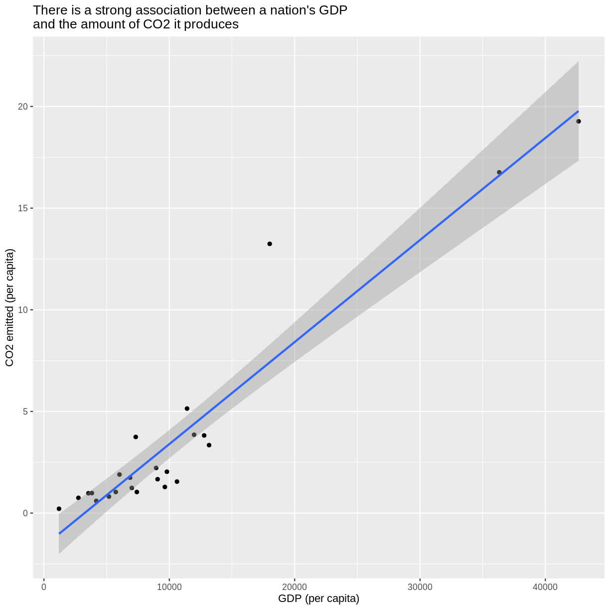

---
# Please do not edit this file directly; it is auto generated.
# Instead, please edit 04-r-data-analysis.md in _episodes_rmd/
title: "R for Data Analysis"
source: Rmd
teaching: 150
exercises: 15
questions: 
- "How can I summarize my data in R?"
- "How can R help make my research more reproducible?"
- "How can I combine two datasets from different sources?"
- "How can data tidying facilitate answering analysis questions?"
objectives: 
- "To become familiar with the functions of the `dplyr` package."
- "To be able to use `dplyr` to prepare data for analysis."
- "To be able to combine two different data sources using joins."
- "To be able to create plots and summary tables to answer analysis questions."
keypoints:
- "Package loading is an important first step in preparing an R environment."
- "Data analsyis in R facilitates reproducible research."
- "There are many useful functions in the `tidyverse` packages that can aid in data analysis."
- "Assessing data source and structure is an important first step in analysis."
- "Preparing data for analysis can take significant effort and planning."
---

### Contents {#contents}

1.  [Getting started](#getting-started)
    -   [Loading in the data](#loading-in-the-data)
2.  [An introduction to data analysis in R using `dplyr`]
    -   [Get stats fast with `summarize()`](#get-stats-fast-with-summarize)
    -   [Narrow down rows with `filter()`](#narrow-down-rows-with-filter)
    -   [Grouping rows using `group_by()`](#grouping-rows-using-group_by)
    -   [Sort data with `arrange()`](#sort-data-with-arrange)
    -   [Make new variables with `mutate()`](#make-new-variables-with-mutate)
    -   [Subset columns using `select()`](#subset-columns-using-select)
    -   [Changing the shape of the data]
3.  [Cleaning up data](#cleaning-up-data)
4.  [Joining data frames](#joining-data-frames)
5.  [Analyzing combined data](#analyzing-combined-data)
6.  [Putting it all together](#putting-it-all-together)

# Getting Started {#getting-started}

Yesterday we spent a lot of time making plots in R using the ggplot2 package. Visualizing data using plots is a very powerful skill in R, but what if we would like to work with only a subset of our data? Or clean up messy data, calculate summary statistics, create a new variable, or join two datasets together? There are several different methods for doing this in R, and we will touch on a few today using functions the `dplyr` package.

First, we will create a new RScript file for our work. Open RStudio. Choose "File" \> "New File" \> "RScript".

### Loading in the data {#loading-in-the-data}

We will start by importing the complete gapminder dataset that we used yesterday into our fresh new R session. Yesterday we did this using a "point-and-click" commands. Today let's type them into the console ourselves: `gapminder_data <- read_csv("../data/gapminder_data.csv")`

> ## Assessment
>
> If we look in the console now, we'll see we've received an error message saying that R "could not find the function `read_csv()`". *Hint: Packages...*
>
> > ## Solution
> >
> > What this means is that R cannot find the function we are trying to call. The reason for this usually is that we are trying to run a function from a package that we have not yet loaded. This is a very common error message that you will probably see a lot when using R. It's important to remember that you will need to load any packages you want to use into R each time you start a new session. The `read_csv` function comes from the `readr` package which is included in the `tidyverse` package so we will just load the `tidyverse` package and run the import code again. {: .source} {: .keypoints}

Now that we know what's wrong, We will use the `read_csv()` function from the Tidyverse `readr` package. Load the `tidyverse` package and gapminder dataset using the code below.

~~~
library(tidyverse)
~~~
{: .language-r}

~~~
── Attaching packages ─────────────────────────────────────── tidyverse 1.3.0 ──
~~~
{: .output}

~~~
✔ ggplot2 3.3.3     ✔ purrr   0.3.4
✔ tibble  3.0.4     ✔ dplyr   1.0.2
✔ tidyr   1.1.2     ✔ stringr 1.4.0
✔ readr   1.4.0     ✔ forcats 0.5.0
~~~
{: .output}

~~~
── Conflicts ────────────────────────────────────────── tidyverse_conflicts() ──
✖ dplyr::filter() masks stats::filter()
✖ dplyr::lag()    masks stats::lag()
~~~
{: .output}

The output in your console shows that by doing this, we attach several useful packages for data wrangling, including `readr`. Check out these packages and their documentation at [tidyverse.org](https://www.tidyverse.org)

> **Reminder:** Many of these packages, including `dplyr` , come with "Cheatsheets" found under the **Help** RStudio menu tab.

Reload your data:

~~~
gapminder_data <- read_csv("../data/gapminder_data.csv")
~~~
{: .language-r}

~~~

── Column specification ────────────────────────────────────────────────────────
cols(
  country = col_character(),
  year = col_double(),
  pop = col_double(),
  continent = col_character(),
  lifeExp = col_double(),
  gdpPercap = col_double()
)
~~~
{: .output}

Notice that the output of the `read_csv()` function is pretty informative. It tells us the name of all of our column headers as how it interpreted the data type. This birds-eye-view can help you take a quick look that everything is how we expect it to be.

Now we have the tools necessary to work through this lesson.

# An introduction to data analysis in R using `dplyr`

## Get stats fast with `summarize()` {#get-stats-fast-with-summarize}

[*Back to top*](#contents)

Let's say we would like to know what is the mean (average) life expecteny in the dataset. R has a built in function function called `mean()` that will calculate this value for us. We can apply that function to our lifeExp column using the `summarize()` function. Here's what that looks like:

~~~
gapminder_data %>%
  summarize(average=mean(lifeExp))
~~~
{: .language-r}

~~~
# A tibble: 1 x 1
  average
    <dbl>
1    59.5
~~~
{: .output}

This command is made of several parts. First, we start with our data object (gapminder_data). Then, we use a special operator called the *pipe operator* `%>%` to pass the data value into the `summarize` function. The pipe operator allows us to "chain" together multiple function calls so that the output of the first function becomes the input to the next function.

> ## Exercise: Practice using the `%>%`
>
> Write the last line of code without using the pipe operator.
>
> > ## Solution:
> >
> > You could also write the above code in the following way:
> >
> > 
> > ~~~
> >   summarize(gapminder_data, average=mean(lifeExp))
> > ~~~
> > {: .language-r}
> > 
> > 
> > 
> > ~~~
> > # A tibble: 1 x 1
> >   average
> >     <dbl>
> > 1    59.5
> > ~~~
> > {: .output}
> >
> > Here we pass the data directly to `summarize()` as an argument rather than piping the value. But as soon as we start writing more functions, we will see that using pipes makes this easier to read. Since we use the pipe operator so often, there is a keyboard shortcut for it in RStudio. You can press <kdb>Ctrl</kdb>+<kdb>Shift</kdb>+<kdb>M<kdb> on Windows or <kdb>Cmd<kdb>+<kdb>Shift<kdb>+<kdb>M<kdb> on a Mac. {: .source} {: .challenge}

When we call `summarize()`, we can use any of the column names of our data object as values to pass to other functions. `summarize()` will return a new data object and our value will be returned as a column.

We name this new column so we can use in a future argument. So the `average=` part tells `summarize()` to use "average" as the name of the new column.

Note that you don't have to quotes around this new name as long as it starts with a letter and doesn't include a space.

> ## Exercise: Variable names with characters or spaces
>
> What would our code look like if we wanted to have a new column name be "Average Life Expectancy"?
>
> > ## Solution:
> >
> > If you do want to use spaces or other characters, You should wrap the name in quotes.
> >
> > 
> > ~~~
> >  summarize(gapminder_data, "Average Life Expectancy"=mean(lifeExp))
> > ~~~
> > {: .language-r}
> > 
> > 
> > 
> > ~~~
> > # A tibble: 1 x 1
> >   `Average Life Expectancy`
> >                       <dbl>
> > 1                      59.5
> > ~~~
> > {: .output}
> >
> > {: .source} {: .callout}

## Narrow down rows with `filter()` {#narrow-down-rows-with-filter}

[*Back to top*](#contents)

Let's take a look at the value we just calculated, which tells us the average life expectancy for all rows in the data was 59.5. That seems a bit low, doesn't it? What's going on?

Well, remember the dataset contains rows from many different years and many different countries. It's likely that life expectancy has increased overtime, so it may not make sense to average over all the years at the same time.

Use `summarize()` to find the most recent year in the data set. We can use the `max()` function to return the maximum value.

~~~
gapminder_data %>%
     summarize(recent_year=max(year))
~~~
{: .language-r}

~~~
# A tibble: 1 x 1
  recent_year
        <dbl>
1        2007
~~~
{: .output}

So we see that the most recent year in the dataset is 2007. Let's calculate the life expectancy for all countries for only that year. To do that, we will use the `filter()` function to only use rows for that year before calculating the mean value.

~~~
gapminder_data %>%
  filter(year == 2007) %>%
  summarize(average=mean(lifeExp))
~~~
{: .language-r}

~~~
# A tibble: 1 x 1
  average
    <dbl>
1    67.0
~~~
{: .output}

> ## Exercise: Filtering the dataset
>
> What is the average GDP per capita for the first year in the dataset? *Hint: the column headers identified by `read_csv()` showed us there was a column called gdpPercap in the dataset*
>
> > ## Solution
> >
> > Identify the earliest year in our dataset using `min()` and `summarize()`
> >
> > 
> > ~~~
> >  gapminder_data %>%
> >      summarize(first_year=min(year))
> > ~~~
> > {: .language-r}
> > 
> > 
> > 
> > ~~~
> > # A tibble: 1 x 1
> >   first_year
> >        <dbl>
> > 1       1952
> > ~~~
> > {: .output}
> >
> > We see here that the first year in the dataset is 1952. Filter to only 1952, and determin the average GDP per capita.
> >
> > 
> > ~~~
> >  gapminder_data %>%
> >  filter(year == 1952) %>%
> >  summarize(average_gdp=mean(gdpPercap))
> > ~~~
> > {: .language-r}
> > 
> > 
> > 
> > ~~~
> > # A tibble: 1 x 1
> >   average_gdp
> >         <dbl>
> > 1       3725.
> > ~~~
> > {: .output}
> >
> > By combining `filter()` and `summarize()` we were able to calculate the mean GDP per capita in the year 1952. {: .source} {: .callout}

Notice how the pipe operator (`%>%`) allows us to combine these two simple steps into a more complicated data extraction?. We took the data, filtered out the rows, then took the mean value. The argument we pass to `filter()` needs to be some expression that will return TRUE or FALSE. We can use comparisons like `>` (greater than) and `<` (less than) for example. Here we tested for equality using a double equals sign `==`. You use `==` (double equals) when testing if two values are equal, and you use `=` (single equals) when naming arguments that you are passing to functions). Try changing it to use `filter(year = 2007)` and see what happens.

## Grouping rows using `group_by()` {#grouping-rows-using-group_by}

[*Back to top*](#contents)

We see that the life expectancy in 2007 is much larger than the value we got using all of the rows. It seems life expectancy is increasing which is good news. But now we might be interested in calculating the average for each year. Rather that doing a bunch of different `filter()` statements, we can instead use the `group_by()` function. The function allows us to tell the code to treat the rows in logical groups, so rather than summarizing over all the rows, we will get one summary value for each group. Here's what that will look like:

~~~
gapminder_data %>%
  group_by(year) %>%
  summarize(average=mean(lifeExp))
~~~
{: .language-r}

~~~
`summarise()` ungrouping output (override with `.groups` argument)
~~~
{: .output}

~~~
# A tibble: 12 x 2
    year average
   <dbl>   <dbl>
 1  1952    49.1
 2  1957    51.5
 3  1962    53.6
 4  1967    55.7
 5  1972    57.6
 6  1977    59.6
 7  1982    61.5
 8  1987    63.2
 9  1992    64.2
10  1997    65.0
11  2002    65.7
12  2007    67.0
~~~
{: .output}

The `group_by()` function expects you to pass in the name of a column (or multiple columns separated by comma) in your data.

> ## Exercise: Grouping the data
>
> Try calculating the average life expectancy by continent.
>
> > ## Solution
> >
> > 
> > ~~~
> >  gapminder_data %>%
> >  group_by(continent) %>%
> >  summarize(average=mean(lifeExp))
> > ~~~
> > {: .language-r}
> > 
> > 
> > 
> > ~~~
> > `summarise()` ungrouping output (override with `.groups` argument)
> > ~~~
> > {: .output}
> > 
> > 
> > 
> > ~~~
> > # A tibble: 5 x 2
> >   continent average
> >   <chr>       <dbl>
> > 1 Africa       48.9
> > 2 Americas     64.7
> > 3 Asia         60.1
> > 4 Europe       71.9
> > 5 Oceania      74.3
> > ~~~
> > {: .output}
> >
> > By combining `group_by()` and `summarize()` we are able to calculate the mean life expectancy by continent. {: .source} {: .challenge}

You can also create more than one new column when you call `summarize()`. To do so, you must separate your columns with a comma. Let's calculate the minimum and maximum life expectancy for each year using the `min()` and `max()` functions

~~~
gapminder_data %>%
  group_by(year) %>%
  summarize(min=min(lifeExp), max=max(lifeExp))
~~~
{: .language-r}

~~~
`summarise()` ungrouping output (override with `.groups` argument)
~~~
{: .output}

~~~
# A tibble: 12 x 3
    year   min   max
   <dbl> <dbl> <dbl>
 1  1952  28.8  72.7
 2  1957  30.3  73.5
 3  1962  32.0  73.7
 4  1967  34.0  74.2
 5  1972  35.4  74.7
 6  1977  31.2  76.1
 7  1982  38.4  77.1
 8  1987  39.9  78.7
 9  1992  23.6  79.4
10  1997  36.1  80.7
11  2002  39.2  82  
12  2007  39.6  82.6
~~~
{: .output}

We can now see just how large a gap there is between different years.

## Sort data with `arrange()` {#sort-data-with-arrange}

[*Back to top*](#contents)

The `arrange()` function allows us to sort our data by some value. Let's take the average value for each continent in 2007 and then sort it so the continents with the longest life expectancy are on top. Which continent might you guess has be highest life expectancy before running the code?

~~~
gapminder_data %>%
  filter(year==2007) %>%
  group_by(continent) %>%
  summarise(average= mean(lifeExp)) %>%
  arrange(desc(average))
~~~
{: .language-r}

~~~
`summarise()` ungrouping output (override with `.groups` argument)
~~~
{: .output}

~~~
# A tibble: 5 x 2
  continent average
  <chr>       <dbl>
1 Oceania      80.7
2 Europe       77.6
3 Americas     73.6
4 Asia         70.7
5 Africa       54.8
~~~
{: .output}

Notice there that we can use the column created the in the `summarize()` step ("average") later in the `arrange()` step. We also use the `desc()` function here to sort the values in a descending order so the largest values are on top. The default is to put the smallest values on top.

## Make new variables with `mutate()` {#make-new-variables-with-mutate}

[*Back to top*](#contents)

Each time we ran `summarize()`, we got back fewer rows than passed in. We either got one row back, or one row per group. But sometimes we want to create a new column in our data without changing the number of rows. The function we use to create new columns is called `mutate()`.

We have a column for the population and the GDP per capita. If we wanted to get the total GDP, we could multiply the per capita GDP values by the total population. Here's what such a `mutate()` command would look like:

~~~
gapminder_data %>%
  mutate(gdp = pop * gdpPercap)
~~~
{: .language-r}

~~~
# A tibble: 1,704 x 7
   country      year      pop continent lifeExp gdpPercap          gdp
   <chr>       <dbl>    <dbl> <chr>       <dbl>     <dbl>        <dbl>
 1 Afghanistan  1952  8425333 Asia         28.8      779.  6567086330.
 2 Afghanistan  1957  9240934 Asia         30.3      821.  7585448670.
 3 Afghanistan  1962 10267083 Asia         32.0      853.  8758855797.
 4 Afghanistan  1967 11537966 Asia         34.0      836.  9648014150.
 5 Afghanistan  1972 13079460 Asia         36.1      740.  9678553274.
 6 Afghanistan  1977 14880372 Asia         38.4      786. 11697659231.
 7 Afghanistan  1982 12881816 Asia         39.9      978. 12598563401.
 8 Afghanistan  1987 13867957 Asia         40.8      852. 11820990309.
 9 Afghanistan  1992 16317921 Asia         41.7      649. 10595901589.
10 Afghanistan  1997 22227415 Asia         41.8      635. 14121995875.
# … with 1,694 more rows
~~~
{: .output}

This will add a new column called "gdp" to our data. We use the column names as if they were regular values that we want to perform mathematical operations on and provide the name in front of an equals sign like we have done with `summarize()`

## Subset columns using `select()` {#subset-columns-using-select}

[*Back to top*](#contents)

We use the `filter()` function to choose a subset of the rows from our data, but when we want to choose a subset of columns from our data we use `select()`. For example, if we only wanted to see the population ("pop") and year values, we can do:

~~~
gapminder_data %>%
  select(pop, year)
~~~
{: .language-r}

~~~
# A tibble: 1,704 x 2
        pop  year
      <dbl> <dbl>
 1  8425333  1952
 2  9240934  1957
 3 10267083  1962
 4 11537966  1967
 5 13079460  1972
 6 14880372  1977
 7 12881816  1982
 8 13867957  1987
 9 16317921  1992
10 22227415  1997
# … with 1,694 more rows
~~~
{: .output}

The `select()` function has a bunch of helper functions that are handy if you are working with a dataset that has a lot of columns. You can see these helper functions on the `?select` help page. For example, let's say we wanted to select the year column and all the columns that start with the letter "c". You can do that with:

~~~
gapminder_data %>%
  select(year, starts_with("c"))
~~~
{: .language-r}

~~~
# A tibble: 1,704 x 3
    year country     continent
   <dbl> <chr>       <chr>    
 1  1952 Afghanistan Asia     
 2  1957 Afghanistan Asia     
 3  1962 Afghanistan Asia     
 4  1967 Afghanistan Asia     
 5  1972 Afghanistan Asia     
 6  1977 Afghanistan Asia     
 7  1982 Afghanistan Asia     
 8  1987 Afghanistan Asia     
 9  1992 Afghanistan Asia     
10  1997 Afghanistan Asia     
# … with 1,694 more rows
~~~
{: .output}

This returns just the three columns we are interested in. We can also use `select()` to drop/remove particular columns by putting a minus sign (`-`) in front of the column name. For example, if we want everything but the continent column, we can do:

~~~
gapminder_data %>%
  select(-continent)
~~~
{: .language-r}

~~~
# A tibble: 1,704 x 5
   country      year      pop lifeExp gdpPercap
   <chr>       <dbl>    <dbl>   <dbl>     <dbl>
 1 Afghanistan  1952  8425333    28.8      779.
 2 Afghanistan  1957  9240934    30.3      821.
 3 Afghanistan  1962 10267083    32.0      853.
 4 Afghanistan  1967 11537966    34.0      836.
 5 Afghanistan  1972 13079460    36.1      740.
 6 Afghanistan  1977 14880372    38.4      786.
 7 Afghanistan  1982 12881816    39.9      978.
 8 Afghanistan  1987 13867957    40.8      852.
 9 Afghanistan  1992 16317921    41.7      649.
10 Afghanistan  1997 22227415    41.8      635.
# … with 1,694 more rows
~~~
{: .output}

> ## Exercise: Using `select()` with a helper function
>
> Find a helper function on the help page that will choose all the columns that have "p" as their last letter (ie: "pop","lifeExp","gdpPerCap")
>
> > ## Solution
> >
> > The helper function `ends_with()` can help us here.
> >
> > 
> > ~~~
> >  gapminder_data %>%
> >      select(ends_with("p"))
> > ~~~
> > {: .language-r}
> > 
> > 
> > 
> > ~~~
> > # A tibble: 1,704 x 3
> >         pop lifeExp gdpPercap
> >       <dbl>   <dbl>     <dbl>
> >  1  8425333    28.8      779.
> >  2  9240934    30.3      821.
> >  3 10267083    32.0      853.
> >  4 11537966    34.0      836.
> >  5 13079460    36.1      740.
> >  6 14880372    38.4      786.
> >  7 12881816    39.9      978.
> >  8 13867957    40.8      852.
> >  9 16317921    41.7      649.
> > 10 22227415    41.8      635.
> > # … with 1,694 more rows
> > ~~~
> > {: .output}
> >
> > {: .source} {: .challenge}

## Changing the shape of the data

[*Back to top*](#contents)

Data comes in many shapes and sizes, and one way we classify data is either "wide" or "long." Data that is "long" has one row per observation. The gapminder_data data is in a long format. We have one row for each country for each year and each different measurement for that country is in a different column. We might describe this data as "tidy" because it makes it easy to work with `ggplot2` and `dplyr` functions (this is where the "tidy" in "tidyverse" comes from). As tidy as it may be, sometimes we may want our data in a "wide" format. Typically in "wide" format each row represents a group of observations and each value is placed in a different column rather than a different row. For example maybe we want only one row per country and want to spread the life expectancy values into different columns (one for each year).

The `tidyr` package contains the functions `pivot_wider` and `pivot_longer` that make it easy to switch between the two formats. The `tidyr` package is included in the `tidyverse` package so we don't need to do anything to load it.

~~~
gapminder_data %>%
  select(country, continent, year, lifeExp) %>%
  pivot_wider(names_from = year, values_from = lifeExp )
~~~
{: .language-r}

~~~
# A tibble: 142 x 14
   country continent `1952` `1957` `1962` `1967` `1972` `1977` `1982` `1987`
   <chr>   <chr>      <dbl>  <dbl>  <dbl>  <dbl>  <dbl>  <dbl>  <dbl>  <dbl>
 1 Afghan… Asia        28.8   30.3   32.0   34.0   36.1   38.4   39.9   40.8
 2 Albania Europe      55.2   59.3   64.8   66.2   67.7   68.9   70.4   72  
 3 Algeria Africa      43.1   45.7   48.3   51.4   54.5   58.0   61.4   65.8
 4 Angola  Africa      30.0   32.0   34     36.0   37.9   39.5   39.9   39.9
 5 Argent… Americas    62.5   64.4   65.1   65.6   67.1   68.5   69.9   70.8
 6 Austra… Oceania     69.1   70.3   70.9   71.1   71.9   73.5   74.7   76.3
 7 Austria Europe      66.8   67.5   69.5   70.1   70.6   72.2   73.2   74.9
 8 Bahrain Asia        50.9   53.8   56.9   59.9   63.3   65.6   69.1   70.8
 9 Bangla… Asia        37.5   39.3   41.2   43.5   45.3   46.9   50.0   52.8
10 Belgium Europe      68     69.2   70.2   70.9   71.4   72.8   73.9   75.4
# … with 132 more rows, and 4 more variables: `1992` <dbl>, `1997` <dbl>,
#   `2002` <dbl>, `2007` <dbl>
~~~
{: .output}

Notice here that we tell `pivot_wider()` which columns to pull the names we wish our new columns to be named from the year variable, and the values to populate those columns from the lifeExp variable. (Again, neither of which have to be in quotes in the code when there are no special characters or spaces - certainly an incentive not to use special characters or spaces!) We see that the resulting tables have new columns by year, and the values populate it with our remaining variables dictating the rows.

# Cleaning up data {#cleaning-up-data}

[*Back to top*](#contents)

Researchers are often pulling data from several sources, and the process of making data compatible with one another and prepared for analysis can be a large undertaking. Luckily, there are many functions that allow us to do this in R. We've been working with the gapminder dataset, which contains population and GDP data by year. In this section, we practice cleaning and preparing a second dataset containing CO2 emissions data by country and year, sourced from [the UN](https://data.un.org/_Docs/SYB/CSV/SYB63_310_202009_Carbon%20Dioxide%20Emission%20Estimates.csv).

It's always good to go into data cleaning with a clear goal in mind. Here, we'd like to prepare the CO2 UN data to be compatible with our gapminder data so we can directly compare GDP to CO2 emissions. To make this work, we'd like a data frame that contains a column with the country name, and columns for different ways of measuring CO2 emissions. We will also want the data to be collected as close to 2007 as possible (the last year we have data for in gapminder). Let's start with reading the data in using `read_csv()`

~~~
read_csv("../data/co2-un-data.csv")
~~~
{: .language-r}

~~~
Warning: Missing column names filled in: 'X3' [3], 'X4' [4], 'X5' [5], 'X6' [6],
'X7' [7]
~~~
{: .warning}

~~~

── Column specification ────────────────────────────────────────────────────────
cols(
  T24 = col_character(),
  `CO2 emission estimates` = col_character(),
  X3 = col_character(),
  X4 = col_character(),
  X5 = col_character(),
  X6 = col_character(),
  X7 = col_character()
)
~~~
{: .output}

~~~
# A tibble: 2,133 x 7
   T24      `CO2 emission est… X3    X4            X5    X6    X7               
   <chr>    <chr>              <chr> <chr>         <chr> <chr> <chr>            
 1 Region/… NA                 Year  Series        Value Foot… Source           
 2 8        Albania            1975  Emissions (t… 4338… NA    International En…
 3 8        Albania            1985  Emissions (t… 6929… NA    International En…
 4 8        Albania            1995  Emissions (t… 1848… NA    International En…
 5 8        Albania            2005  Emissions (t… 3825… NA    International En…
 6 8        Albania            2010  Emissions (t… 3930… NA    International En…
 7 8        Albania            2015  Emissions (t… 3824… NA    International En…
 8 8        Albania            2016  Emissions (t… 3674… NA    International En…
 9 8        Albania            2017  Emissions (t… 4342… NA    International En…
10 8        Albania            1975  Emissions pe… 1.80… NA    International En…
# … with 2,123 more rows
~~~
{: .output}

The output gives us a warning about missing column names being filled in with things like 'X3', 'X4', etc. Looking at the table that is outputted by `read_csv()` we can see that there appear to be two rows at the top of the file that contain information about the data in the table. The first is a header that tells us the table number and its name. Ideally, we'd skip that. We can do this using the `skip=` argument in read_csv by giving it a number of lines to skip.

~~~
read_csv("../data/co2-un-data.csv", skip=1)
~~~
{: .language-r}

~~~
Warning: Missing column names filled in: 'X2' [2]
~~~
{: .warning}

~~~

── Column specification ────────────────────────────────────────────────────────
cols(
  `Region/Country/Area` = col_double(),
  X2 = col_character(),
  Year = col_double(),
  Series = col_character(),
  Value = col_double(),
  Footnotes = col_character(),
  Source = col_character()
)
~~~
{: .output}

~~~
# A tibble: 2,132 x 7
   `Region/Country/… X2      Year Series        Value Footnotes Source          
               <dbl> <chr>  <dbl> <chr>         <dbl> <chr>     <chr>           
 1                 8 Alban…  1975 Emissions (… 4.34e3 NA        International E…
 2                 8 Alban…  1985 Emissions (… 6.93e3 NA        International E…
 3                 8 Alban…  1995 Emissions (… 1.85e3 NA        International E…
 4                 8 Alban…  2005 Emissions (… 3.83e3 NA        International E…
 5                 8 Alban…  2010 Emissions (… 3.93e3 NA        International E…
 6                 8 Alban…  2015 Emissions (… 3.82e3 NA        International E…
 7                 8 Alban…  2016 Emissions (… 3.67e3 NA        International E…
 8                 8 Alban…  2017 Emissions (… 4.34e3 NA        International E…
 9                 8 Alban…  1975 Emissions p… 1.80e0 NA        International E…
10                 8 Alban…  1985 Emissions p… 2.34e0 NA        International E…
# … with 2,122 more rows
~~~
{: .output}

Now we get a similar Warning message as before, but the outputted table looks better.

> **Warnings and Errors:**It's important to differentiate between Warnings and Errors in R. A warning tells us, "you might want to know about this issue, but R still did what you asked". An error tells us, "there's something wrong with your code or your data and R didn't do what you asked". You need to fix any errors that arise. Warnings, are probably best to resolve or at least understand why they are coming up.

We can resolve this warning by one of two methods. First, we can tell `read_csv()` what the column names should be with the `col_names()` argument where we give it the column names we want within the c() function separated by commas. If we do this, then we need to set skip to 2 to also skip the column headings.

~~~
read_csv("../data/co2-un-data.csv", skip=2,
         col_names=c("region", "country", "year", "series", "value", "footnotes", "source"))
~~~
{: .language-r}

~~~

── Column specification ────────────────────────────────────────────────────────
cols(
  region = col_double(),
  country = col_character(),
  year = col_double(),
  series = col_character(),
  value = col_double(),
  footnotes = col_character(),
  source = col_character()
)
~~~
{: .output}

~~~
# A tibble: 2,132 x 7
   region country  year series             value footnotes source               
    <dbl> <chr>   <dbl> <chr>              <dbl> <chr>     <chr>                
 1      8 Albania  1975 Emissions (thous… 4.34e3 NA        International Energy…
 2      8 Albania  1985 Emissions (thous… 6.93e3 NA        International Energy…
 3      8 Albania  1995 Emissions (thous… 1.85e3 NA        International Energy…
 4      8 Albania  2005 Emissions (thous… 3.83e3 NA        International Energy…
 5      8 Albania  2010 Emissions (thous… 3.93e3 NA        International Energy…
 6      8 Albania  2015 Emissions (thous… 3.82e3 NA        International Energy…
 7      8 Albania  2016 Emissions (thous… 3.67e3 NA        International Energy…
 8      8 Albania  2017 Emissions (thous… 4.34e3 NA        International Energy…
 9      8 Albania  1975 Emissions per ca… 1.80e0 NA        International Energy…
10      8 Albania  1985 Emissions per ca… 2.34e0 NA        International Energy…
# … with 2,122 more rows
~~~
{: .output}

As an alternative, we can read in the table, get the warning and then fix the column names using the rename function.

~~~
read_csv("../data/co2-un-data.csv", skip=1) %>%
  rename(country=X2)
~~~
{: .language-r}

~~~
Warning: Missing column names filled in: 'X2' [2]
~~~
{: .warning}

~~~

── Column specification ────────────────────────────────────────────────────────
cols(
  `Region/Country/Area` = col_double(),
  X2 = col_character(),
  Year = col_double(),
  Series = col_character(),
  Value = col_double(),
  Footnotes = col_character(),
  Source = col_character()
)
~~~
{: .output}

~~~
# A tibble: 2,132 x 7
   `Region/Country/… country  Year Series        Value Footnotes Source         
               <dbl> <chr>   <dbl> <chr>         <dbl> <chr>     <chr>          
 1                 8 Albania  1975 Emissions (… 4.34e3 NA        International …
 2                 8 Albania  1985 Emissions (… 6.93e3 NA        International …
 3                 8 Albania  1995 Emissions (… 1.85e3 NA        International …
 4                 8 Albania  2005 Emissions (… 3.83e3 NA        International …
 5                 8 Albania  2010 Emissions (… 3.93e3 NA        International …
 6                 8 Albania  2015 Emissions (… 3.82e3 NA        International …
 7                 8 Albania  2016 Emissions (… 3.67e3 NA        International …
 8                 8 Albania  2017 Emissions (… 4.34e3 NA        International …
 9                 8 Albania  1975 Emissions p… 1.80e0 NA        International …
10                 8 Albania  1985 Emissions p… 2.34e0 NA        International …
# … with 2,122 more rows
~~~
{: .output}

Many data analysts prefer to have their column headings and variable names be in all lower case. We can use a variation of `rename()`, which is `rename_all()` that allows us to set all of the column headings to lower case by giving it the name of the tolower function, which makes everything lowercase.

~~~
read_csv("../data/co2-un-data.csv", skip=1) %>%
  rename_all(tolower)
~~~
{: .language-r}

~~~
Warning: Missing column names filled in: 'X2' [2]
~~~
{: .warning}

~~~

── Column specification ────────────────────────────────────────────────────────
cols(
  `Region/Country/Area` = col_double(),
  X2 = col_character(),
  Year = col_double(),
  Series = col_character(),
  Value = col_double(),
  Footnotes = col_character(),
  Source = col_character()
)
~~~
{: .output}

~~~
# A tibble: 2,132 x 7
   `region/country/… x2      year series        value footnotes source          
               <dbl> <chr>  <dbl> <chr>         <dbl> <chr>     <chr>           
 1                 8 Alban…  1975 Emissions (… 4.34e3 NA        International E…
 2                 8 Alban…  1985 Emissions (… 6.93e3 NA        International E…
 3                 8 Alban…  1995 Emissions (… 1.85e3 NA        International E…
 4                 8 Alban…  2005 Emissions (… 3.83e3 NA        International E…
 5                 8 Alban…  2010 Emissions (… 3.93e3 NA        International E…
 6                 8 Alban…  2015 Emissions (… 3.82e3 NA        International E…
 7                 8 Alban…  2016 Emissions (… 3.67e3 NA        International E…
 8                 8 Alban…  2017 Emissions (… 4.34e3 NA        International E…
 9                 8 Alban…  1975 Emissions p… 1.80e0 NA        International E…
10                 8 Alban…  1985 Emissions p… 2.34e0 NA        International E…
# … with 2,122 more rows
~~~
{: .output}

Both of these strategies are useful for helping us to clean up our data. Which you ultimately use for this project is a matter of personal preference. We'll go with the first option where we used col_names so that we don't have to worry about the Warning message.

~~~
read_csv("../data/co2-un-data.csv", skip=2,
         col_names=c("region", "country", "year", "series", "value", "footnotes", "source"))
~~~
{: .language-r}

~~~

── Column specification ────────────────────────────────────────────────────────
cols(
  region = col_double(),
  country = col_character(),
  year = col_double(),
  series = col_character(),
  value = col_double(),
  footnotes = col_character(),
  source = col_character()
)
~~~
{: .output}

~~~
# A tibble: 2,132 x 7
   region country  year series             value footnotes source               
    <dbl> <chr>   <dbl> <chr>              <dbl> <chr>     <chr>                
 1      8 Albania  1975 Emissions (thous… 4.34e3 NA        International Energy…
 2      8 Albania  1985 Emissions (thous… 6.93e3 NA        International Energy…
 3      8 Albania  1995 Emissions (thous… 1.85e3 NA        International Energy…
 4      8 Albania  2005 Emissions (thous… 3.83e3 NA        International Energy…
 5      8 Albania  2010 Emissions (thous… 3.93e3 NA        International Energy…
 6      8 Albania  2015 Emissions (thous… 3.82e3 NA        International Energy…
 7      8 Albania  2016 Emissions (thous… 3.67e3 NA        International Energy…
 8      8 Albania  2017 Emissions (thous… 4.34e3 NA        International Energy…
 9      8 Albania  1975 Emissions per ca… 1.80e0 NA        International Energy…
10      8 Albania  1985 Emissions per ca… 2.34e0 NA        International Energy…
# … with 2,122 more rows
~~~
{: .output}

We previously saw how we can subset columns from a data frame using the select function. Let's get the country, year, series, and value columns:

~~~
read_csv("../data/co2-un-data.csv", skip=2,
         col_names=c("region", "country", "year", "series", "value", "footnotes", "source")) %>%
  select(country, year, series, value)
~~~
{: .language-r}

~~~

── Column specification ────────────────────────────────────────────────────────
cols(
  region = col_double(),
  country = col_character(),
  year = col_double(),
  series = col_character(),
  value = col_double(),
  footnotes = col_character(),
  source = col_character()
)
~~~
{: .output}

~~~
# A tibble: 2,132 x 4
   country  year series                                                 value
   <chr>   <dbl> <chr>                                                  <dbl>
 1 Albania  1975 Emissions (thousand metric tons of carbon dioxide)   4338.  
 2 Albania  1985 Emissions (thousand metric tons of carbon dioxide)   6930.  
 3 Albania  1995 Emissions (thousand metric tons of carbon dioxide)   1849.  
 4 Albania  2005 Emissions (thousand metric tons of carbon dioxide)   3825.  
 5 Albania  2010 Emissions (thousand metric tons of carbon dioxide)   3930.  
 6 Albania  2015 Emissions (thousand metric tons of carbon dioxide)   3825.  
 7 Albania  2016 Emissions (thousand metric tons of carbon dioxide)   3674.  
 8 Albania  2017 Emissions (thousand metric tons of carbon dioxide)   4342.  
 9 Albania  1975 Emissions per capita (metric tons of carbon dioxide)    1.80
10 Albania  1985 Emissions per capita (metric tons of carbon dioxide)    2.34
# … with 2,122 more rows
~~~
{: .output}

The series column has two methods of quantifying CO2 emissions - "Emissions (thousand metric tons of carbon dioxide)" and "Emissions per capita (metric tons of carbon dioxide)". Those are long titles that we'd like to shorten to make them easier to work with. We can shorten them to "total" and "per_capita" using the recode function. We need to do this within the mutate function where we will mutate the series column. The syntax in the recode function is to tell recode which column we want to recode and then what the old value (e.g. "Emissions (thousand metric tons of carbon dioxide)") should equal after recoding (e.g. "total").

~~~
read_csv("../data/co2-un-data.csv", skip=2,
         col_names=c("region", "country", "year", "series", "value", "footnotes", "source")) %>%
  select(country, year, series, value) %>%
  mutate(series = recode(series, "Emissions (thousand metric tons of carbon dioxide)" = "total",
                         "Emissions per capita (metric tons of carbon dioxide)" = "per_capita"))
~~~
{: .language-r}

~~~

── Column specification ────────────────────────────────────────────────────────
cols(
  region = col_double(),
  country = col_character(),
  year = col_double(),
  series = col_character(),
  value = col_double(),
  footnotes = col_character(),
  source = col_character()
)
~~~
{: .output}

~~~
# A tibble: 2,132 x 4
   country  year series       value
   <chr>   <dbl> <chr>        <dbl>
 1 Albania  1975 total      4338.  
 2 Albania  1985 total      6930.  
 3 Albania  1995 total      1849.  
 4 Albania  2005 total      3825.  
 5 Albania  2010 total      3930.  
 6 Albania  2015 total      3825.  
 7 Albania  2016 total      3674.  
 8 Albania  2017 total      4342.  
 9 Albania  1975 per_capita    1.80
10 Albania  1985 per_capita    2.34
# … with 2,122 more rows
~~~
{: .output}

Recall that we'd like to have separate columns for the two ways that we CO2 emissions data. To achieve this, we'll use the pivot_wider function that we saw previously. The columns we want to spread out are series (i.e. names_from) and value (i.e. values_from).

~~~
read_csv("../data/co2-un-data.csv", skip=2,
         col_names=c("region", "country", "year", "series", "value", "footnotes", "source")) %>%
  select(country, year, series, value) %>%
  mutate(series = recode(series, "Emissions (thousand metric tons of carbon dioxide)" = "total",
                         "Emissions per capita (metric tons of carbon dioxide)" = "per_capita")) %>%
  pivot_wider(names_from=series, values_from=value)
~~~
{: .language-r}

~~~

── Column specification ────────────────────────────────────────────────────────
cols(
  region = col_double(),
  country = col_character(),
  year = col_double(),
  series = col_character(),
  value = col_double(),
  footnotes = col_character(),
  source = col_character()
)
~~~
{: .output}

~~~
# A tibble: 1,066 x 4
   country  year  total per_capita
   <chr>   <dbl>  <dbl>      <dbl>
 1 Albania  1975  4338.      1.80 
 2 Albania  1985  6930.      2.34 
 3 Albania  1995  1849.      0.580
 4 Albania  2005  3825.      1.27 
 5 Albania  2010  3930.      1.35 
 6 Albania  2015  3825.      1.33 
 7 Albania  2016  3674.      1.28 
 8 Albania  2017  4342.      1.51 
 9 Algeria  1975 13553.      0.811
10 Algeria  1985 42073.      1.86 
# … with 1,056 more rows
~~~
{: .output}

Excellent! The last step before we can join this data frame is to get the most data that is for the year closest to 2007 so we can make a more direct comparison to the most recent data we have from gapminder. One useful tool is the `count()` function, which will tell us how many times a value is repeated in a column of a data frame. Let's use this function on the year column to see which years we have data for and to tell us whether we have a good number of countries represented in that year.

~~~
read_csv("../data/co2-un-data.csv", skip=2,
         col_names=c("region", "country", "year", "series", "value", "footnotes", "source")) %>%
  select(country, year, series, value) %>%
  mutate(series = recode(series, "Emissions (thousand metric tons of carbon dioxide)" = "total",
                         "Emissions per capita (metric tons of carbon dioxide)" = "per_capita")) %>%
  pivot_wider(names_from=series, values_from=value) %>%
  count(year)
~~~
{: .language-r}

~~~

── Column specification ────────────────────────────────────────────────────────
cols(
  region = col_double(),
  country = col_character(),
  year = col_double(),
  series = col_character(),
  value = col_double(),
  footnotes = col_character(),
  source = col_character()
)
~~~
{: .output}

~~~
# A tibble: 8 x 2
   year     n
  <dbl> <int>
1  1975   111
2  1985   113
3  1995   136
4  2005   140
5  2010   140
6  2015   142
7  2016   142
8  2017   142
~~~
{: .output}

It looks like we have data for 140 countries in 2005 and 2010. Let's filter our data to get the rows that correspond to 2005. Also, because we will only have data from one year, we can drop the year column from our data frame by giving it year with a minus sign before it.

~~~
read_csv("../data/co2-un-data.csv", skip=2,
         col_names=c("region", "country", "year", "series", "value", "footnotes", "source")) %>%
  select(country, year, series, value) %>%
  mutate(series = recode(series, "Emissions (thousand metric tons of carbon dioxide)" = "total",
                         "Emissions per capita (metric tons of carbon dioxide)" = "per_capita")) %>%
  pivot_wider(names_from=series, values_from=value) %>%
  filter(year==2005) %>%
  select(-year)
~~~
{: .language-r}

~~~

── Column specification ────────────────────────────────────────────────────────
cols(
  region = col_double(),
  country = col_character(),
  year = col_double(),
  series = col_character(),
  value = col_double(),
  footnotes = col_character(),
  source = col_character()
)
~~~
{: .output}

~~~
# A tibble: 140 x 3
   country      total per_capita
   <chr>        <dbl>      <dbl>
 1 Albania      3825.      1.27 
 2 Algeria     77474.      2.33 
 3 Angola       6147.      0.314
 4 Argentina  149476.      3.82 
 5 Armenia      4130.      1.38 
 6 Australia  365515.     17.9  
 7 Austria     74764.      9.09 
 8 Azerbaijan  29018.      3.46 
 9 Bahrain     20565.     23.1  
10 Bangladesh  31960.      0.223
# … with 130 more rows
~~~
{: .output}

Finally, let's go ahead and assign the output of this code chunk to a variable name:

~~~
co2_emissions <- read_csv("../data/co2-un-data.csv", skip=2,
                          col_names=c("region", "country", "year", "series", "value", "footnotes", "source")) %>%
  select(country, year, series, value) %>%
  mutate(series = recode(series, "Emissions (thousand metric tons of carbon dioxide)" = "total",
                         "Emissions per capita (metric tons of carbon dioxide)" = "per_capita")) %>%
  pivot_wider(names_from=series, values_from=value) %>%
  filter(year==2005) %>%
  select(-year)
~~~
{: .language-r}

~~~

── Column specification ────────────────────────────────────────────────────────
cols(
  region = col_double(),
  country = col_character(),
  year = col_double(),
  series = col_character(),
  value = col_double(),
  footnotes = col_character(),
  source = col_character()
)
~~~
{: .output}

> **Looking at your data:** You can get a look at your data-cleaning hard work by navigating to the **Environment** tab in RStudio and clicking the table icon next to the variable name. Notice when we do this, RStudio automatically runs the `View()` command. We've made a lot of progress!

# Joining data frames {#joining-data-frames}

[*Back to top*](#contents)

Now we're ready to join our CO2 emissions data to the gapminder data. Previously we saw that we could read in and filter the gapminder data like this to get the data from the Americas for 2007 (this will overwrite our previous gapminder_data:

~~~
gapminder_data <- read_csv("../data/gapminder_data.csv") %>%
  filter(year == 2007 & continent == "Americas") %>%
  select(-year, -continent)
~~~
{: .language-r}

~~~

── Column specification ────────────────────────────────────────────────────────
cols(
  country = col_character(),
  year = col_double(),
  pop = col_double(),
  continent = col_character(),
  lifeExp = col_double(),
  gdpPercap = col_double()
)
~~~
{: .output}

Look at the data in co2_emissions and gapminder_data. If you had to merge these two data frames together, which column would you use to merge them together? If you said "country" - good job!

We'll call country our "key". Now, when we join them together, can you think of any problems we might run into when we merge things? We might not have CO2 emissions data for all of the countries in the gapminder dataset and vice versa. Also, a country might be represented in both data frames but not by the same name in both places. As an example, write down the name of the country that the University of Michigan is in - we'll come back to you answer shortly!

The dplyr package has a number of tools for joining data frames together depending on what we want to do with the rows of the data of countries that are not represented in both data frames. Let's look at some cartoon examples and then come back to our own data.

The first join we'll discuss is achieved using `inner_join()`. In an "inner join", the new data frame only has those rows where the same key is found in both data frames. This is a very commonly used join.

The second group of joins are called outer joins and can be performed using `left_join()`, `right_join()`, and `full_join()`. In a "left join", if the key is present in the left hand data frame, it will appear in the output, even if it is not found in the the right hand data frame. For a right join, the opposite is true. For a full join, all possible keys are included in the output data frame.

For our data, which join do you think we'd want to use? Most likely, we'd like to use `inner_join()` or a `left_join()` where the gapminder data frame is on the left and the CO2 emissions data frame is on the right. The advantage of these joins over the others is that because our gapminder data is filtered only to represent the Americas, then only the countries from the Americas will be represented in the CO2 emissions data. Let's give the `inner_join()` function a try.

~~~
inner_join(gapminder_data, co2_emissions)
~~~
{: .language-r}

~~~
Joining, by = "country"
~~~
{: .output}

~~~
# A tibble: 21 x 6
   country                  pop lifeExp gdpPercap   total per_capita
   <chr>                  <dbl>   <dbl>     <dbl>   <dbl>      <dbl>
 1 Argentina           40301927    75.3    12779. 149476.       3.82
 2 Brazil             190010647    72.4     9066. 311624.       1.67
 3 Canada              33390141    80.7    36319. 540431.      16.8 
 4 Chile               16284741    78.6    13172.  54435.       3.34
 5 Colombia            44227550    72.9     7007.  53585.       1.24
 6 Costa Rica           4133884    78.8     9645.   5463.       1.29
 7 Cuba                11416987    78.3     8948.  25051.       2.22
 8 Dominican Republic   9319622    72.2     6025.  17522.       1.90
 9 Ecuador             13755680    75.0     6873.  23927.       1.74
10 El Salvador          6939688    71.9     5728.   6253.       1.04
# … with 11 more rows
~~~
{: .output}

Do you see that we now have data from both data frames joined together in the same data frame? One thing to note about the output is that `inner_join()` tells us that that it joined by "country". We can make this explicit using the "by" argument in the join functions

~~~
inner_join(gapminder_data, co2_emissions, by="country")
~~~
{: .language-r}

~~~
# A tibble: 21 x 6
   country                  pop lifeExp gdpPercap   total per_capita
   <chr>                  <dbl>   <dbl>     <dbl>   <dbl>      <dbl>
 1 Argentina           40301927    75.3    12779. 149476.       3.82
 2 Brazil             190010647    72.4     9066. 311624.       1.67
 3 Canada              33390141    80.7    36319. 540431.      16.8 
 4 Chile               16284741    78.6    13172.  54435.       3.34
 5 Colombia            44227550    72.9     7007.  53585.       1.24
 6 Costa Rica           4133884    78.8     9645.   5463.       1.29
 7 Cuba                11416987    78.3     8948.  25051.       2.22
 8 Dominican Republic   9319622    72.2     6025.  17522.       1.90
 9 Ecuador             13755680    75.0     6873.  23927.       1.74
10 El Salvador          6939688    71.9     5728.   6253.       1.04
# … with 11 more rows
~~~
{: .output}

One thing to notice is that gapminder data had 25 rows, but the output of our join only had 21. Let's investigate. It appears that there must have been countries in the gapminder data that did not appear in our co2_emissions data frame. We could look at which countries are missing using `left_join()` and piping the output to `View()`

~~~
left_join(gapminder_data, co2_emissions, by="country") %>%
View()
~~~
{: .language-r}

~~~
Warning in View(.): unable to open display
~~~
{: .warning}

~~~
Error in .External2(C_dataviewer, x, title): unable to start data viewer
~~~
{: .error}

We can see that the co2_emissions data were missing for Bolivia, Puerto Rico, United States, and Venezuela. Another way to get the same information a bit more directly is to use an `anti_join()`. This will show us the data for the keys on the left that are missing from the data frame on the right

~~~
anti_join(gapminder_data, co2_emissions, by="country")
~~~
{: .language-r}

~~~
# A tibble: 4 x 4
  country             pop lifeExp gdpPercap
  <chr>             <dbl>   <dbl>     <dbl>
1 Bolivia         9119152    65.6     3822.
2 Puerto Rico     3942491    78.7    19329.
3 United States 301139947    78.2    42952.
4 Venezuela      26084662    73.7    11416.
~~~
{: .output}

If we look at the co2_emissions data with `View()`, we will see that Bolivia, United States, and Venezuela are called different things in the co2_emissions data frame. They're called "Bolivia (Plurin. State of)", "United States of America", and "Venezuela (Boliv. Rep. of)". Puerto Rico isn't a country; it's part of the United States. Using `mutate()` and `recode()`, we can re-import the co2_emissions data so that the country names for Bolivia, United States, and Venezuela, match those in the gapminder data.

~~~
co2_emissions <- read_csv("../data/co2-un-data.csv", skip=2,
                          col_names=c("region", "country", "year", 
                                      "series", "value", "footnotes", "source")) %>%
  select(country, year, series, value) %>%
  mutate(series = recode(series, "Emissions (thousand metric tons of carbon dioxide)" = "total",
                         "Emissions per capita (metric tons of carbon dioxide)" = "per_capita")) %>%
  pivot_wider(names_from=series, values_from=value) %>%
  filter(year==2005) %>%
  select(-year) %>%
  mutate(country=recode(country,
                        "Bolivia (Plurin. State of)" = "Bolivia",
                        "United States of America" = "United States",
                        "Venezuela (Boliv. Rep. of)" = "Venezuela")
  )
~~~
{: .language-r}

~~~

── Column specification ────────────────────────────────────────────────────────
cols(
  region = col_double(),
  country = col_character(),
  year = col_double(),
  series = col_character(),
  value = col_double(),
  footnotes = col_character(),
  source = col_character()
)
~~~
{: .output}

~~~
anti_join(gapminder_data, co2_emissions, by="country")
~~~
{: .language-r}

~~~
# A tibble: 1 x 4
  country         pop lifeExp gdpPercap
  <chr>         <dbl>   <dbl>     <dbl>
1 Puerto Rico 3942491    78.7    19329.
~~~
{: .output}

Now we see that our recode enabled the join for all countries in the gapminder, and we are left with Puerto Rico. In the next exercise, Let's recode Puerto Rico as United States in the gapminder data and then use `group_by()` and `summarize()` to aggregate the data; we'll use the population data to weight the life expectancy and GDP values.

> ## Exercise: Data cleaning to facilitate a join
>
> In the gapminder data, Recode Puerto Rico as United States, aggregate the two, and calculate life expectancy and GDP values weighted by population data.
>
> > ## Solution
> >
> > we can use the `mutate()` and `recode()` functions like we did earlier when altering the values of the "series" column.
> >
> > 
> > ~~~
> > gapminder_data <- read_csv("../data/gapminder_data.csv") %>%
> >   filter(year == 2007 & continent == "Americas") %>%
> >   select(-year, -continent) %>%
> >   mutate(country = recode(country, "Puerto Rico" = "United States")) %>%
> >   group_by(country) %>%
> >   summarize(lifeExp = sum(lifeExp * pop)/sum(pop),
> >             gdpPercap = sum(gdpPercap * pop)/sum(pop),
> >             pop = sum(pop)
> >   )
> > ~~~
> > {: .language-r}
> > 
> > 
> > 
> > ~~~
> > 
> > ── Column specification ────────────────────────────────────────────────────────
> > cols(
> >   country = col_character(),
> >   year = col_double(),
> >   pop = col_double(),
> >   continent = col_character(),
> >   lifeExp = col_double(),
> >   gdpPercap = col_double()
> > )
> > ~~~
> > {: .output}
> > 
> > 
> > 
> > ~~~
> > `summarise()` ungrouping output (override with `.groups` argument)
> > ~~~
> > {: .output}
> > 
> > 
> > 
> > ~~~
> > anti_join(gapminder_data, co2_emissions, by="country")
> > ~~~
> > {: .language-r}
> > 
> > 
> > 
> > ~~~
> > # A tibble: 0 x 4
> > # … with 4 variables: country <chr>, lifeExp <dbl>, gdpPercap <dbl>, pop <dbl>
> > ~~~
> > {: .output}
> >
> > {: .source} {: .challenge}

Run the code from the exercise solution above. Now our `anti_join()` returns an empty data frame, which tells us that we have reconciled all of the keys from the gapminder data with the data in the co2_emissions data frame.

Finally, let's use the `inner_join()` to create a new data frame:

~~~
gapminder_co2 <- inner_join(gapminder_data, co2_emissions, by="country")
~~~
{: .language-r}

We have reached our data cleaning goals and can now move on to the analysis! One of the best aspects of doing all of these steps coded in R is that our efforts are reproducible, and the raw data is maintained. With good documentation of data cleaning and analysis steps, we could easily share our work with another researcher who would be able to repeat what we've done.

# Analyzing combined data {#analyzing-combined-data}

[*Back to top*](#contents)

For our analysis, we have two questions we'd like to answer. First, is there a relationship between the GDP of a country and the amount of CO2 emitted (per capita)? Second, Canada, the United States, and Mexico account for nearly half of the population of the Americas. What percent of the total CO2 production do they account for?

To answer the first question, we'll plot the CO2 emitted (on a per capita basis) against the GDP (on a per capita basis) using a scatter plot:

~~~
ggplot(gapminder_co2, aes(x=gdpPercap, y=per_capita)) +
  geom_point() +
  labs(x="GDP (per capita)",
       y="CO2 emitted (per capita)",
       title="There is a strong association between a nation's GDP \nand the amount of CO2 it produces"
  )
~~~
{: .language-r}

*Tip:* Notice we used the `\n` in our title to get a new line to prevent it from getting cut off.

To help clarify the association, we can add a fit line through the data using `geom_smooth()`

~~~
ggplot(gapminder_co2, aes(x=gdpPercap, y=per_capita)) +
  geom_point() +
  labs(x="GDP (per capita)",
       y="CO2 emitted (per capita)",
       title="There is a strong association between a nation's GDP \nand the amount of CO2 it produces"
  ) +
  geom_smooth()
~~~
{: .language-r}

~~~
`geom_smooth()` using method = 'loess' and formula 'y ~ x'
~~~
{: .output}

We can force the line to be straight using `method="lm"` as an argument to `geom_smooth`

~~~
ggplot(gapminder_co2, aes(x=gdpPercap, y=per_capita)) +
  geom_point() +
  labs(x="GDP (per capita)",
       y="CO2 emitted (per capita)",
       title="There is a strong association between a nation's GDP \nand the amount of CO2 it produces"
  ) +
  geom_smooth(method="lm")
~~~
{: .language-r}

~~~
`geom_smooth()` using formula 'y ~ x'
~~~
{: .output}

To answer our first question, as the title of our plot indicates there is indeed a strong association between a nation's GDP and the amount of CO2 it produces.

For the second question, we want to create two groups - Canada, the United States, and Mexico in one and the other countries in another.

We can create a grouping variable using `mutate()` combined with an `if_else()` function - a very useful pairing.

~~~
gapminder_co2 %>%
  mutate(region = if_else(country == "Canada" | country == "United States" | country == "Mexico", "north", "south"))
~~~
{: .language-r}

~~~
# A tibble: 24 x 7
   country            lifeExp gdpPercap       pop   total per_capita region
   <chr>                <dbl>     <dbl>     <dbl>   <dbl>      <dbl> <chr> 
 1 Argentina             75.3    12779.  40301927 149476.      3.82  south 
 2 Bolivia               65.6     3822.   9119152   8976.      0.984 south 
 3 Brazil                72.4     9066. 190010647 311624.      1.67  south 
 4 Canada                80.7    36319.  33390141 540431.     16.8   north 
 5 Chile                 78.6    13172.  16284741  54435.      3.34  south 
 6 Colombia              72.9     7007.  44227550  53585.      1.24  south 
 7 Costa Rica            78.8     9645.   4133884   5463.      1.29  south 
 8 Cuba                  78.3     8948.  11416987  25051.      2.22  south 
 9 Dominican Republic    72.2     6025.   9319622  17522.      1.90  south 
10 Ecuador               75.0     6873.  13755680  23927.      1.74  south 
# … with 14 more rows
~~~
{: .output}

Now we can use this column to repeat our `group_by()` and `summarize()` steps

~~~
gapminder_co2 %>%
  mutate(region = if_else(country == "Canada" | 
                            country == "United States" | 
                            country == "Mexico", "north", "south")) %>%
  group_by(region) %>%
  summarize(sumtotal = sum(total),
            sumpop = sum(pop))
~~~
{: .language-r}

~~~
`summarise()` ungrouping output (override with `.groups` argument)
~~~
{: .output}

~~~
# A tibble: 2 x 3
  region sumtotal    sumpop
  <chr>     <dbl>     <dbl>
1 north  6656037. 447173470
2 south   889332. 451697714
~~~
{: .output}

The `if_else()` statment reads like, "if country equals "Canada" OR (\|) "United states" OR "Mexico", The new variable region should be "north", else "south"". It's worth exploring logical operators for "or" `|`, "and" `&&`, and "not" `!`, which opens up a great deal of possibilities for writing code to do what you want.

We see that although Canada, the United States, and Mexico account for close to half the population of the Americas, they account for 88% of the CO2 emitted. We just did this math quickly by plugging the numbers from our table into the console to get the percentages. Can we make that a little more reproducible by calculating percentages for population (pop) and total emissions (total) into our data before summarizing?

> ## Exercise: Calculating percent
>
> What percentage of the population and CO2 emissions does the United States makeup? Summarized by region?
>
> > ## Solution
> >
> > Create a new variable using `mutate()` that caluclates percentages for the pop and total variables.
> >
> > 
> > ~~~
> > gapminder_co2 %>%
> >   mutate(region = if_else(country == "Canada" | country == "United States" | country == "Mexico", "north", "south")) %>%
> >   mutate(totalPercent = total/sum(total)*100,
> >          popPercent = pop/sum(pop)*100)
> > ~~~
> > {: .language-r}
> > 
> > 
> > 
> > ~~~
> > # A tibble: 24 x 9
> >    country lifeExp gdpPercap    pop  total per_capita region totalPercent
> >    <chr>     <dbl>     <dbl>  <dbl>  <dbl>      <dbl> <chr>         <dbl>
> >  1 Argent…    75.3    12779. 4.03e7 1.49e5      3.82  south        1.98  
> >  2 Bolivia    65.6     3822. 9.12e6 8.98e3      0.984 south        0.119 
> >  3 Brazil     72.4     9066. 1.90e8 3.12e5      1.67  south        4.13  
> >  4 Canada     80.7    36319. 3.34e7 5.40e5     16.8   north        7.16  
> >  5 Chile      78.6    13172. 1.63e7 5.44e4      3.34  south        0.721 
> >  6 Colomb…    72.9     7007. 4.42e7 5.36e4      1.24  south        0.710 
> >  7 Costa …    78.8     9645. 4.13e6 5.46e3      1.29  south        0.0724
> >  8 Cuba       78.3     8948. 1.14e7 2.51e4      2.22  south        0.332 
> >  9 Domini…    72.2     6025. 9.32e6 1.75e4      1.90  south        0.232 
> > 10 Ecuador    75.0     6873. 1.38e7 2.39e4      1.74  south        0.317 
> > # … with 14 more rows, and 1 more variable: popPercent <dbl>
> > ~~~
> > {: .output}
> >
> > This table shows that the United states makes up 33% of the population of the Americas, but accounts for 77% of total emissions. That's a big proportion of the northern region's emissions, as summarized below:
> >
> > 
> > ~~~
> > gapminder_co2 %>%
> >   mutate(region = if_else(country == "Canada" | country == "United States" | country == "Mexico", "north", "south")) %>%
> >   mutate(totalPercent = total/sum(total)*100,
> >          popPercent = pop/sum(pop)*100) %>%
> >   group_by(region) %>%
> >   summarize(sumTotalPercent = sum(totalPercent),
> >             sumPopPercent = sum(popPercent))
> > ~~~
> > {: .language-r}
> > 
> > 
> > 
> > ~~~
> > `summarise()` ungrouping output (override with `.groups` argument)
> > ~~~
> > {: .output}
> > 
> > 
> > 
> > ~~~
> > # A tibble: 2 x 3
> >   region sumTotalPercent sumPopPercent
> >   <chr>            <dbl>         <dbl>
> > 1 north             88.2          49.7
> > 2 south             11.8          50.3
> > ~~~
> > {: .output}
> >
> > {: .source} {: .challenge}

# Putting it all together {#putting-it-all-together}

[*Back to top*](#contents)

We've gone through many steps of cleaning, joining, and analyzing our data. As a challenge, create an RScript file that contains the code to clean up the gapminder and CO2 emissions data, joins the two data frames, and builds the plot and summary table comparing Canada, the United States, and Mexico to the rest of the Americas. You can even practice some of the `ggplot` skills you learned earlier to move that plot beyond the ggplot2 defaults.

~~~
# Load and prepare gapminder data
gapminder_data <- read_csv("../data/gapminder_data.csv") %>%
  filter(year == 2007 & continent == "Americas") %>%
  select(-year, -continent) %>%
  mutate(country = recode(country, "Puerto Rico" = "United States")) %>%
  group_by(country) %>%
  summarize(lifeExp = sum(lifeExp * pop)/sum(pop),
            gdpPercap = sum(gdpPercap * pop)/sum(pop),
            pop = sum(pop)
  )
~~~
{: .language-r}

~~~

── Column specification ────────────────────────────────────────────────────────
cols(
  country = col_character(),
  year = col_double(),
  pop = col_double(),
  continent = col_character(),
  lifeExp = col_double(),
  gdpPercap = col_double()
)
~~~
{: .output}

~~~
`summarise()` ungrouping output (override with `.groups` argument)
~~~
{: .output}

~~~
# Load and prepare co2 emissions data
co2_emissions <- read_csv("../data/co2-un-data.csv", skip=2,
                          col_names=c("region", "country", "year", "series", "value", "footnotes", "source")) %>%
  select(country, year, series, value) %>%
  mutate(series = recode(series, "Emissions (thousand metric tons of carbon dioxide)" = "total",
                         "Emissions per capita (metric tons of carbon dioxide)" = "per_capita")) %>%
  pivot_wider(names_from=series, values_from=value) %>%
  filter(year==2005) %>%
  select(-year) %>%
  mutate(country=recode(country,
                        "Bolivia (Plurin. State of)" = "Bolivia",
                        "United States of America" = "United States",
                        "Venezuela (Boliv. Rep. of)" = "Venezuela")
  )
~~~
{: .language-r}

~~~

── Column specification ────────────────────────────────────────────────────────
cols(
  region = col_double(),
  country = col_character(),
  year = col_double(),
  series = col_character(),
  value = col_double(),
  footnotes = col_character(),
  source = col_character()
)
~~~
{: .output}

~~~
# Join the two data frames
gapminder_co2 <- inner_join(gapminder_data, co2_emissions, by="country")

# Plot
ggplot(gapminder_co2, aes(x=gdpPercap, y=per_capita)) +
  geom_point() +
  labs(x="GDP (per capita)",
       y="CO2 emitted (per capita)",
       title="There is a strong association between a nation's GDP \nand the amount of CO2 it produces"
  ) +
  geom_smooth(method="lm")
~~~
{: .language-r}

~~~
`geom_smooth()` using formula 'y ~ x'
~~~
{: .output}

~~~
# Table
gapminder_co2 %>%
  mutate(region = if_else(country == "Canada" | country == "United States" | country == "Mexico", "north", "south")) %>%
  mutate(totalPercent = total/sum(total)*100,
         popPercent = pop/sum(pop)*100) %>%
  group_by(region) %>%
  summarize(sumTotalPercent = sum(totalPercent),
            sumPopPercent = sum(popPercent))
~~~
{: .language-r}

~~~
`summarise()` ungrouping output (override with `.groups` argument)
~~~
{: .output}

~~~
# A tibble: 2 x 3
  region sumTotalPercent sumPopPercent
  <chr>            <dbl>         <dbl>
1 north             88.2          49.7
2 south             11.8          50.3
~~~
{: .output}
