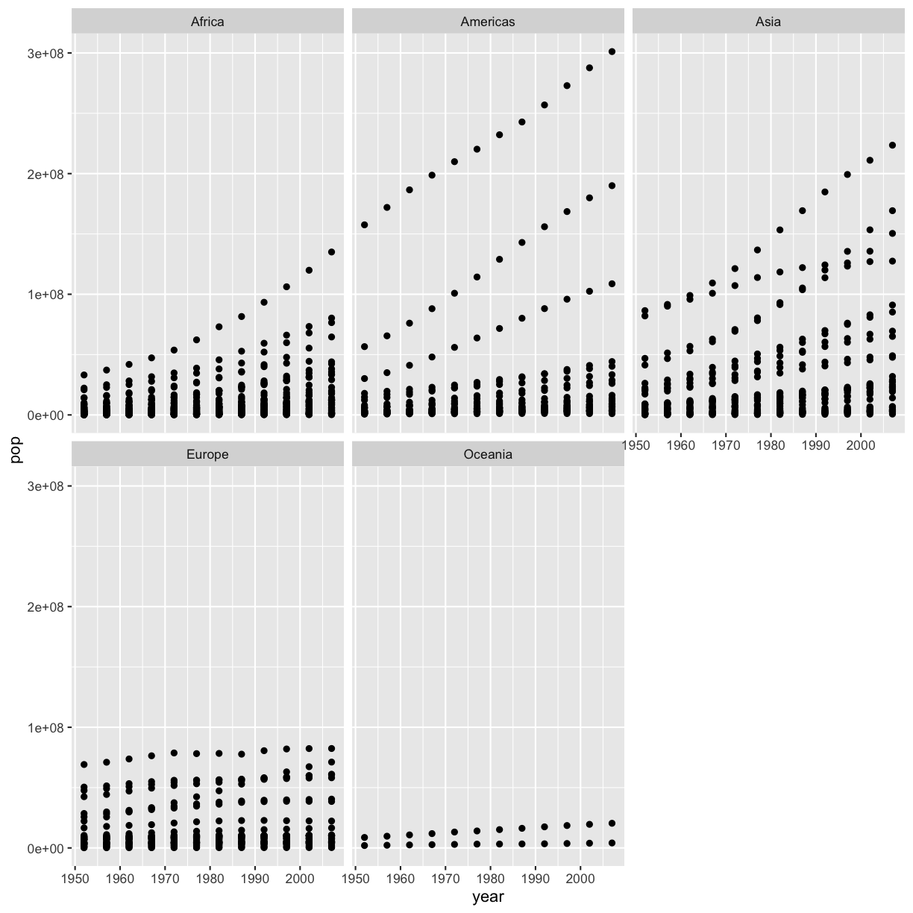
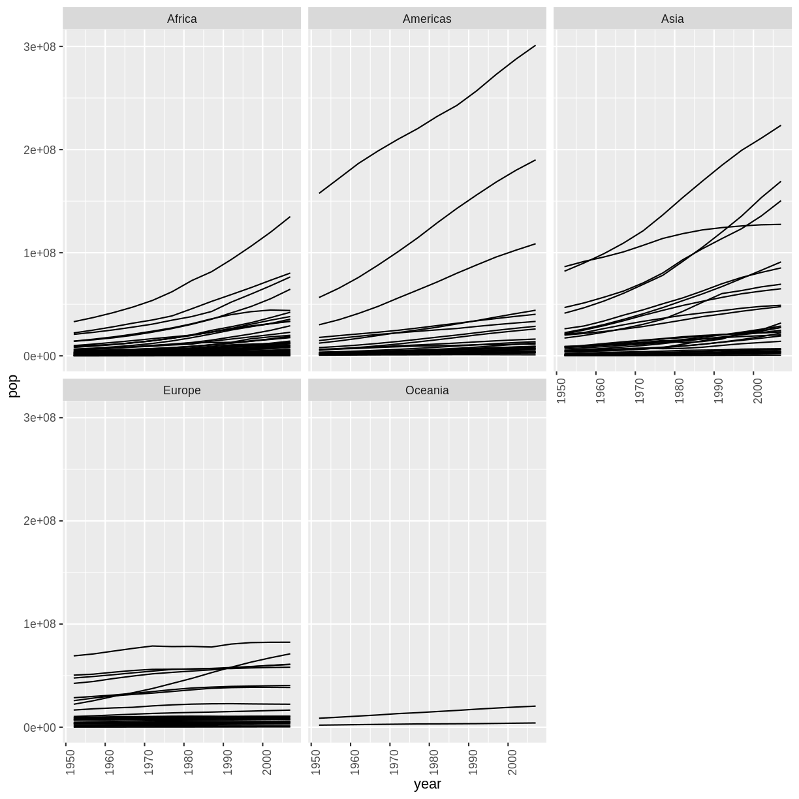
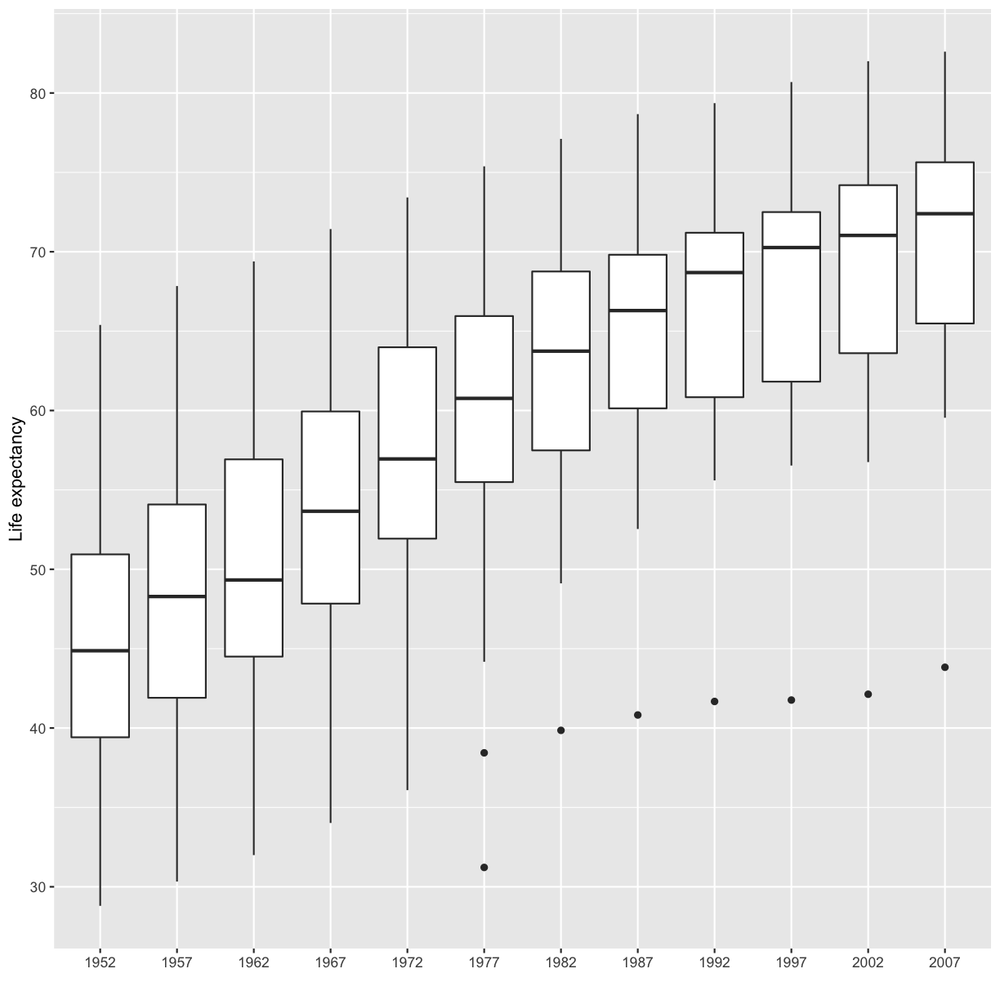
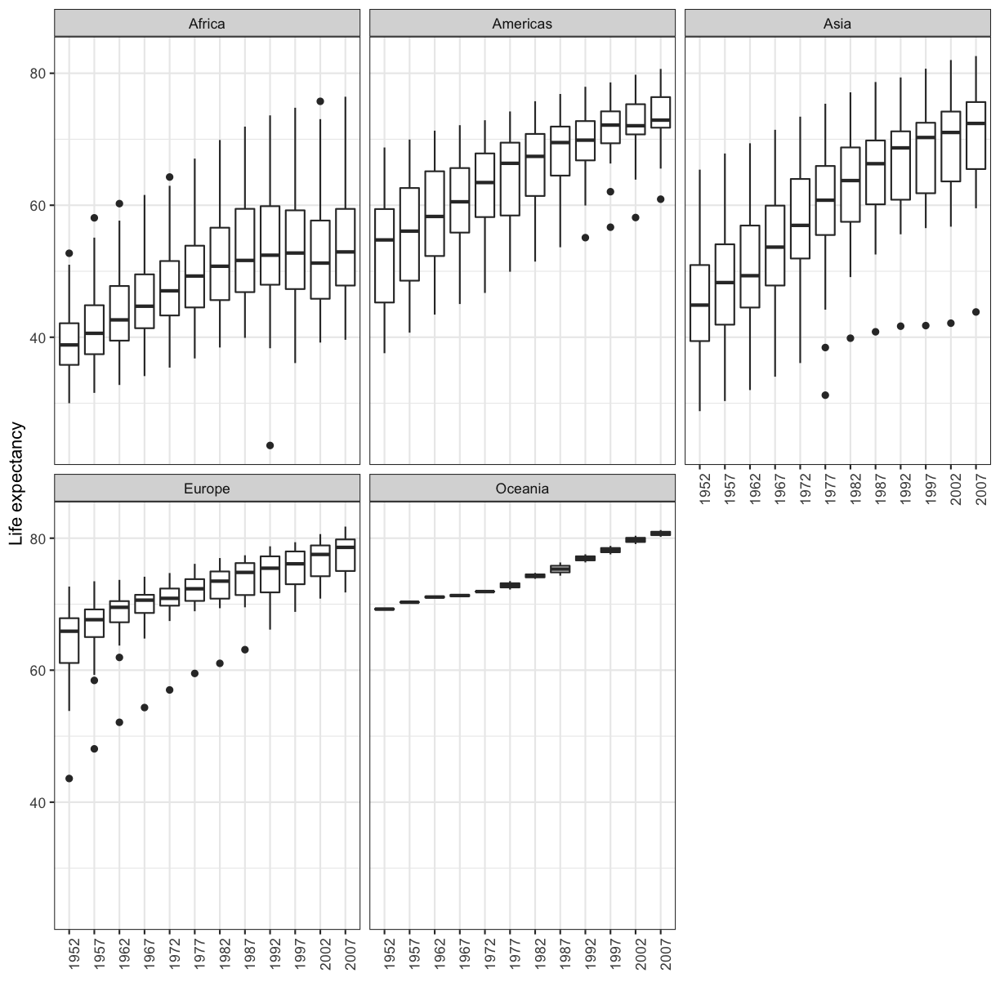
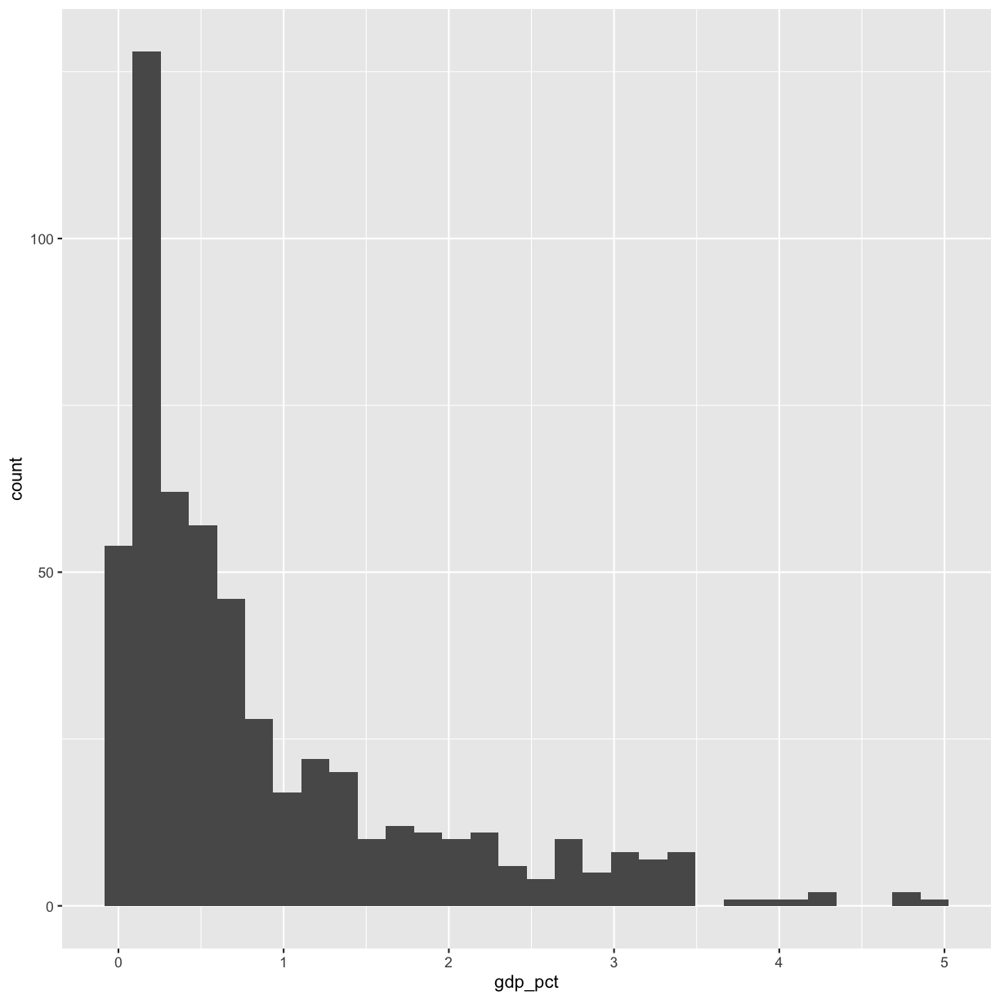
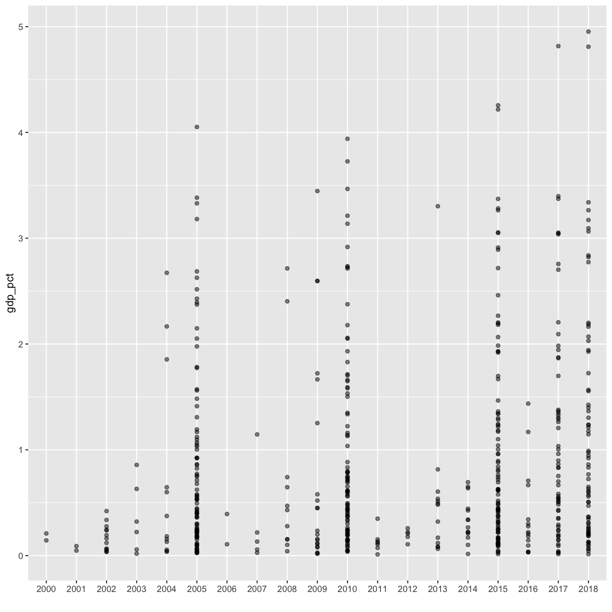
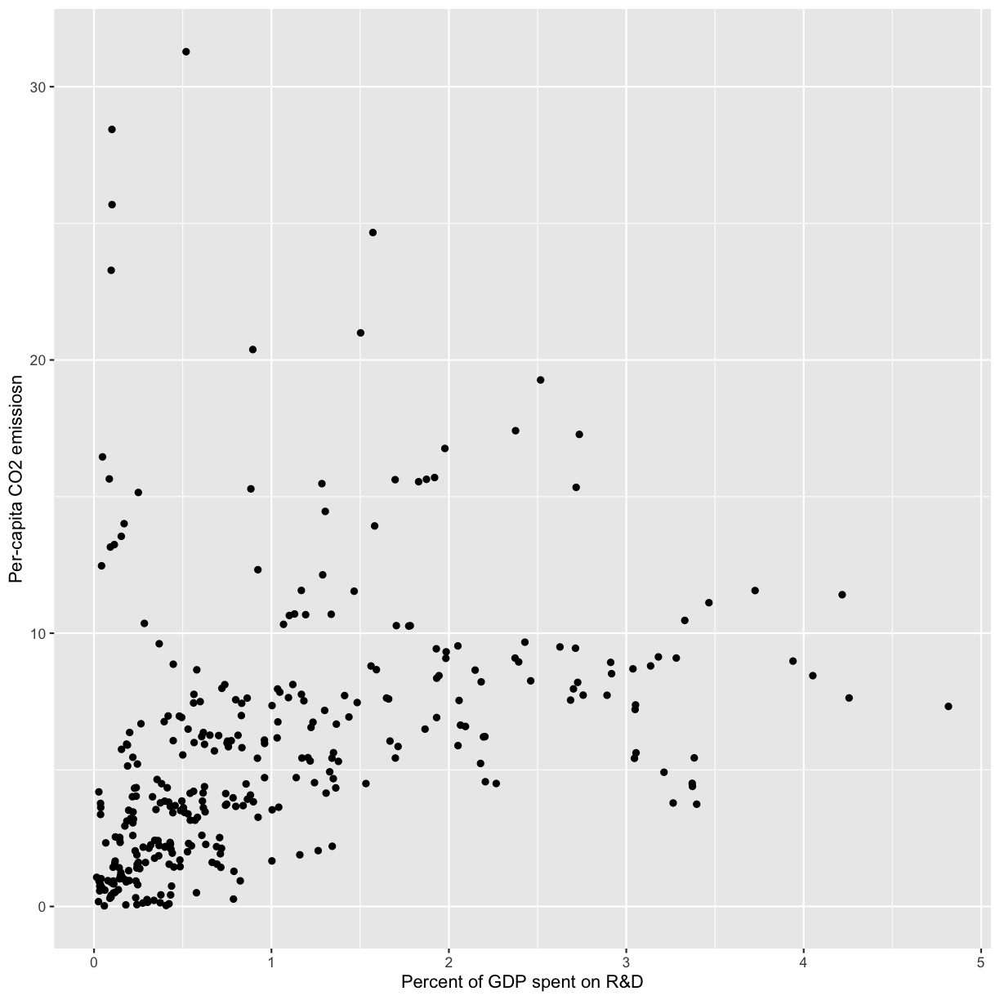
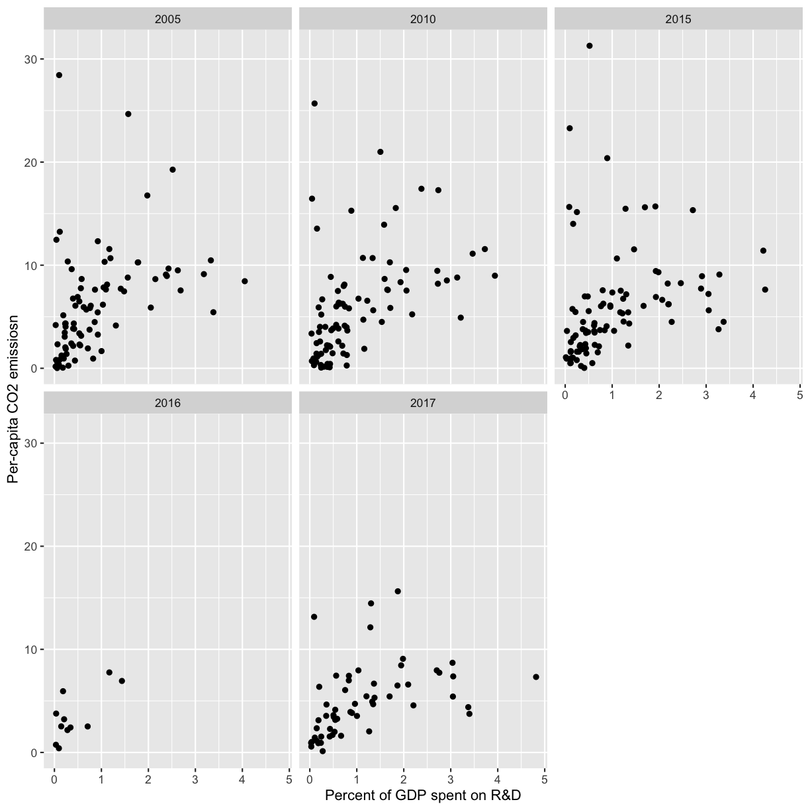
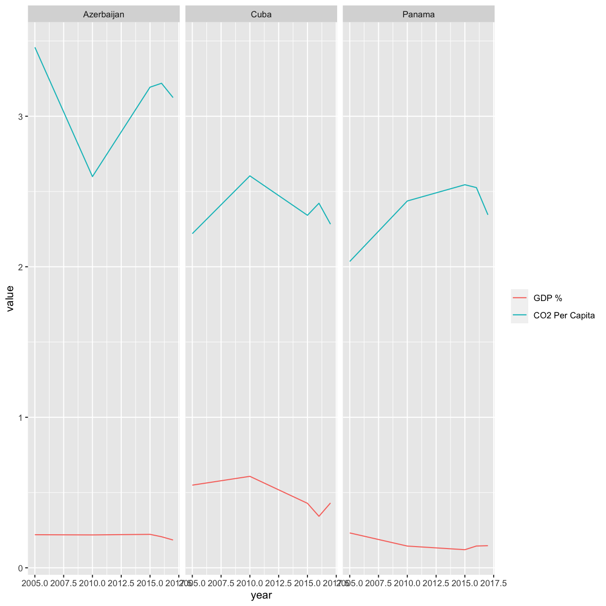

---
# Please do not edit this file directly; it is auto generated.
# Instead, please edit 05-r-markdown.md in _episodes_rmd/
source: Rmd
title: "Writing Reports with R Markdown"
teaching: 105
exercises: 30
questions:
- "How can I make reproducible reports using R Markdown?"
- "How do I format text using Markdown?"
objectives:
- "To create a report in R Markdown that combines text, code, and figures."
- "To use Markdown to format our report."
- "To understand how to use R code chunks to include or hide code, figures, and messages."
- "To be aware of the various report formats that can be rendered using R Markdown."
- "To practice using the Unix Shell, Github, and R through paired programming exercises. "
keypoints:
  - "R Markdown is an easy way to create a report that integrates text, code, and figures."
  - "Options such as `include` and `echo` determine what parts of an R code chunk are included in the R Markdown report. "
  - "R Markdown can render HTML, PDF, and Microsoft Word outputs."
---


### Contents
1. [What is R Markdown and why use it?](#why-use-r-markdown)
1. [Creating a reports directory](#creating-a-reports-directory)
1. [Creating an R Markdown file](#creating-an-r-markdown-file)
1. [Basic components of R Markdown](#basic-components-of-r-markdown)
    + [Header](#header)
    + [Code chunks](#code-chunks)
    + [Text](#text)
1. [Starting the report](#starting-the-report)
1. [Formatting](#formatting)
1. [Integrating it all together: Paired exercise](#integrating-it-all-together-paired-exercise)

Recall that our  goal is to generate a report to the United Nations on how a country's life expectancy is related to GDP.

> ## Discusion
> How do you usually share data analyses with your collaborators? Many people share them through a Word or PDF document, a spreadsheet, slides, a  graphic, etc.
{: .discussion}

## What is R Markdown and why use it? {##why-use-r-markdown}
_[Back to top](#contents)_

In R Markdown, you can incorporate ordinary text (ex. experimental methods, analysis and discussion of results) alongside code and figures! (Some people write entire manuscripts in R Markdown.) This is useful for writing reproducible reports and publications, sharing work with collaborators, writing up homework, and keeping a bioinformatics notebook. Because the code is emedded in the document, the tables and figures are *reproducible*. Anyone can run the code and get the same results. If you find an error or want to add more to the report, you can just re-run the document and you'll have updated tables and figures! This concept of combining text and code is called "literate programming". To do this we use R Markdown, which combines Markdown (renders plain text) with R. You can output an html, PDF, or Word document that you can share with others. In fact, this webpage is an example of a rendered R markdown file!

(If you are familiar with Jupyter notebooks in the Python programming environment, R Markdown is  R's equivalent of a Jupyter notebook.)

## Creating a reports directory
_[Back to top](#contents)_

To get started, let's use the Unix Shell to create a directory within `un-report` called `reports` where we will write our reports to the UN.
First, open the Unix Shell and `cd` to `un-report`:

~~~
pwd
mkdir reports
~~~
{: .source}

~~~
/home/USERNAME/Desktop/un-report/reports/
~~~
{: .output}

Note that there is an option to use the terminal from R Studio (tab next to Console), but on Windows computers this terminal might not be a Unix Shell. 


## Creating an R Markdown file
_[Back to top](#contents)_

Now that we have a better understanding of what we can use R Markdown files for, let's start writing a report!

To create an R Markdown file:
- Open RStudio
- Go to File &rarr; New File &rarr; R Markdown
- Give your document a title, something like "A UN Report on the Relationship between GDP and Life Expectancy" (Note: this is not the same as the file name - it's just a title that will appear at the top of your report)
- Keep the default output format as HTML.
- R Markdown files always end in `.Rmd`

> ## R Markdown Outputs
> The default output for an R Markdown report is HTML, but you can also use R Markdown to [output other report formats](https://rmarkdown.rstudio.com/lesson-9.html). For example, you can generate PDF reports using R Markdown, but you must [install TeX](https://www.latex-project.org/get/) to do this.
>
{: .callout}


## Basic components of R Markdown
_[Back to top](#contents)_

### Header
_[Back to top](#contents)_

The first part is a *header* at the top of the file between the lines of `---`. This contains instructions for R to specify the type of document to be created and options to choose (ex., title, author, date). These are in the form of key-value pairs (`key: value`; YAML).

Here's an example:

```
---
title: 'Writing Reports with R Markdown'
author: "Zena Lapp"
date: "11/18/2020"
output: html_document
---
```

### Code chunks
_[Back to top](#contents)_

The next section is a *code chunk*, or embedded R code, that sets up options for all code chunks. Here is the default when you create a new R Markdown file:


~~~
```{r setup, include=FALSE}
knitr::opts_knit$set(root.dir = normalizePath("..")
```
~~~
{: .output}


~~~
```{r setup, include=FALSE}
knitr::opts_chunk$set(echo = TRUE)
```
~~~
{: .output}

All code chunks have this format:


~~~
```{r}
# Your code here
```
~~~
{: .output}

All of the code is enclosed in 3 back ticks (), and the `{r}` part indicates that it's a chunk of R code.

You can also include other information within the curly brackets to indicate different information about that code chunk.
For instance, the first code block is named "setup", and `include=FALSE` prevents code and results from showing up in the output file.

Inside the code chunk, you can put any R code that you want to run, and you can have as many code chunks as you want in your file.

As we mentioned above, in the first code chunk you set options for the entire file.
`echo = TRUE` means that you want your code to be shown in the output file. If you change this to `echo = FALSE`, then the code will be hidden and only the output of the code chunks will be seen in the output file.
There are also [many other options that you can change](https://rmarkdown.rstudio.com/lesson-3.html), but we won't go into those details in this workshop.


### Text
_[Back to top](#contents)_

Finally, you can include text in your R Markdown file.
This is any text or explanation you want to include, and it's formatted with Markdown.
We'll learn more about Markdown formatting soon!

## Starting the report
_[Back to top](#contents)_

Let's return to the new R Markdown file you created and delete everything below the setup code chunk. (That stuff is just examples and reminders of how to use R Markdown.)

Next, let's save our R markdown file to the `reports` directory.
You can do this by clicking the save icon in the top left or using <kbd>control</kbd> + <kbd>s</kbd> (<kbd>command</kbd> + <kbd>s</kbd>  on a Mac).

There's one other thing that we need to do before we get started with our report.
To render our documents into html format, we can "knit" them in R Studio.
Usually, R Markdown renders documents from the directory where the document is saved (the location of the `.Rmd` file), but we want it to render from the main project directory where our `.Rproj` file is.
This is because that's where all of our relative paths are from and it's good practice to have all of your relative paths from the main project directory.
To change this default, click on the down arrow next to the "Knit" button at the top left of R Studio, go to "Knit Directory" and click "Project Directory".
Now it will assume all of your relative paths for reading and writing files are from the `un-report` directory, rather than the `reports` directory.

Now that we have that set up, let's start on the report!

We're going to use the code you generated yesterday to plot GDP vs. Life Expectancy to include in the report. Recall that we needed a couple R packages to generate these plots. We can create a new code chunk to load the needed packages. You could also include this in the previous setup chunk, it's up to your personal preference.


~~~
```{r packages}
library(tidyverse)
```
~~~
{: .output}

Now, in a real report this is when we would type out the background and purpose of our analysis to provide context to our readers. However, since writing is not a focus of this workshop we will avoid lengthy prose and stick to short descriptions. You can copy the following text  into your own report below the package code chunk.

```
This report was prepared to the attention of the United Nations. It analyzes the relationship between a country's GDP, its life expectancy and CO2 emissions. Our goal is to determine to what degree a country’s economic strength or weakness may be related to its public health status and impact on climate pollution. We hypothesize that both life expectancy and CO2 emissions increase with a country's GDP.
```

Now, since we want to show our results comparing GDP and life expectancy by country, we need to read in this data so we can regenerate our plot. We will add another code chunk to prepare the data.


~~~
```{r data}
gapminder_1997 <- read_csv("data/gapminder_1997.csv")
```
~~~
{: .output}

Now that we have the data, we need to produce the plot. Let's create it!


~~~
```{r gdp_lifeexp_1997}
ggplot(data = gapminder_1997) + 

  aes(x = gdpPercap, y = lifeExp, color=continent, size=pop/1000000) +

  geom_point() +

  labs(x = "GDP Per Capita", y = "Life Expectancy",

       title= "Do people in wealthy countries live longer?", size="Population (in millions)")
```
~~~
{: .output}

Now we can knit our document to see how our report looks! Use the <kbd>knit</kbd> button in the top left of the screen.


Amazing! We've created a report! Let's push this to GitHub to make sure we preserve this document.

Returning to the command line:

1. Check the status of our repository with the `git status`. This will tell us which files just changed.  
1. Add the new files that we want tracked by git up with `git add <filename(s)>`.  This adds any file(s) we list to version control.  
1. Commit the file or changes with `git commit -m "<your commit message>"` and add a message with the commit to describe the changes you are committing and it adds them to the git log.  
1. Push those changes from our local computer to our github repo with `git push`. This will upload the changes to the git directory on the remote server.  
If you don't remember how to do this, you can review the [git lesson]({{ page.root }}/03-intro-git-github.md).

It's looking pretty good, but there seem to be a few extra bits that we don't need in the report. For example, the report shows that we load the tidyverse package and the accompanying messages.


To get rid of this, we can revise our packages code chunk by adding `include=FALSE` just like in the setup chunk to prevent code and messages in this chunk from showing up in our report.


~~~
```{r packages, include=FALSE}
library(tidyverse)
```
~~~
{: .output}

We can also see the code that was used to generate the plot. Depending on the purpose and audience for your report, you may want to include the code. If you don't want the code to appear, how can you prevent it? What happens if we add `include=FALSE` to the plot code chunk, too? Try rendering the R Markdown report with this change.


Oops! Now the plot doesn't show up in our report at all. This is because setting `include=FALSE` prevents anything in the code chunk from appearing in the report. Instead we can add `echo=FALSE`  to tell this code chunk that we don't want to see the code but just the output.


~~~
```{r gdp_lifeexp_1997, echo=FALSE}
ggplot(data = gapminder_1997) + 

  aes(x = gdpPercap, y = lifeExp, color=continent, size=pop/1000000) +

  geom_point() +

  labs(x = "GDP Per Capita", y = "Life Expectancy",

       title= "Do people in wealthy countries live longer?", size="Population (in millions)")
```
~~~
{: .output}

When we knit this again, our plot is back!


Before we finalize our report, let's look at a few other cool features. Sometimes, you want to describe your data or results (like our plot) to the audience in text but the data and results may still change as you work things out. R Markdown offers an easy way to do this dynamically, so that the text updates as your data or results change. Here is how to do this.

First, let's create a code chunk that summarizes features of our data that we can use to describe our plot to  our audience. Note that we set `include=FALSE` because we only want this step to happen in the background. For our purposes, we will calculate how many countries were included in the analysis, as well as the minimum and maximum GDP per capita values:


~~~
gapminder_1997 <- read_csv("data/gapminder_1997.csv")

nCountries <- gapminder_1997 %>%
  select(country) %>%
  n_distinct()

minGDP <- gapminder_1997 %>%
  summarise(round(min(gdpPercap))) %>%
  pull()

maxGDP <- gapminder_1997 %>%
  summarise(round(max(gdpPercap))) %>%
  pull()
~~~
{: .language-r}

Now, all we need to do is reference the values we just computed to describe our
plot. To do this, we enclose each value in one set of backticks 
(`` `r some_R_variable_name ` ``), while the ``r`` part once again
indicates that it's a chunk of R code. When we knit our report, R will
automatically fill in the values we just created in the above code chunk. Note
that R will automatically update these values every time our data might change
(if we were to decide to drop or add countries to this  analysis, for example).

```
The above plot shows the relationship between GDP per capita and life expectancy
for a total of `r nCountries ` countries. For this set of countries,
economic wealth ranged from a minimum of USD `r minGDP`
to a maximum of USD `r maxGDP` per capita.
```
{: .code}

In addition to reporting specific values in the text, we may also want to show a table of values. With R Markdown there are multiple ways to product tables. One way to generate smaller tables is manually. Using a special format we can generate a table in our output. Note that this does not get generated in a code chunk because it is markdown formatting not R code.

```
|HEADER 1|HEADER 2|
|-------------|-------------|
|row 1, column1|row 1, column 2|
|row 2, column1|row 2, column 2|
```
Columns are separated by the pipe key <kbd>|</kbd> located above <kbd>Enter</kbd> on the keyboard. The dashes distinguish the header row from the rest of the table. This header could be a name for each column or a header for the whole table. Now that we know the basic structure we can fill in our table. This is how we could present the same numbers from the previous paragraph as a table instead, again using in-line code.
When we knit the report again, the code above will render like this:


Here's the text that we need to include to creata summary table of our data:


~~~
```
|Summary of Data|
|------|------|
|Number of Countries|`r nCountries`|
|Minimum GDP per capita|`r minGDP`|
|Maximum GDP per capita|`r maxGDP`|

```
~~~
{: .output}


This will render like this:


This is useful if we are reporting a few values, but can get tedious for larger tables. Another way we can add tables to our reports is using an R function called `kable()`. Since this is an R function, we will use it within a code chunk. We can give the `kable()` function a data table and it will format it to a nice looking table in the report. For example, we could use the following code to generate a table of all the countries in Oceania. The rendered version should look almost exactly as it does on this webpage. 


~~~
# load library
library(knitr)

# print kable
gapminder_1997 %>%
  filter(continent == "Oceania") %>%
  kable()
~~~
{: .language-r}


|country     |      pop|continent | lifeExp| gdpPercap|
|:-----------|--------:|:---------|-------:|---------:|
|Australia   | 18565243|Oceania   |   78.83|  26997.94|
|New Zealand |  3676187|Oceania   |   77.55|  21050.41|

Now that we have a report we are happy with, let's push the changes to GitHub.

## Formatting
_[Back to top](#contents)_

We now know how to create a report with R Markdown. Maybe we also want to format the report a little bit to structure our thought process in a useful way (e.g., sections) and make it visually appealing?
Markdown is a very simple programming language when it comes to syntax.
Let's try to figure out some syntax together. Suppose we wanted to create sections in our report.

> ## R Markdown headers
> Try googling how to create sections by using headers and subheaders using R Markdown. What do you find?
>
> > ## Solution
> > We can easily create headers and subheaders by using the `#` pound/hash sign. Our main headers have one `#` (e.g. `# Main Header Here`) and to create subheaders we add additinal `#`s (e.g. `## First subheader` and `### Second subheader`)
> {: .solution}
{: .challenge}

OK, now that we know how to make headers, let's practice some more Markdown syntax.

> ## R Markdown syntax
> Go ahead and do some online searches on how to do the following:
> * create a bullet point list with three items
> * as the first item, write the name of your currently favorite programming language in bold
> * as the second item, write  the name of a function you have so far found most useful in italics
> * as the third item, write one thing you want to learn next on your programming journey in bold and italics
> * turn your bullet point list into a numbered list
> * create a fourth list item and find an online guide and/or cheat sheet for basic Markdown syntax, write its name down here and hyperlink its url
>
> > ## Solution
> > [This link](https://rmarkdown.rstudio.com/authoring_basics.html) has some helpful basic R Markdown syntax.
> {: .solution}
{: .challenge}


## Integrating it all together: Paired exercise
_[Back to top](#contents)_

You've learned so much in the past two days - how to use the Unix Shell to move around your computer, how to use git for version control and GitHub for collaborating with others on code, how to make pretty plots and do data analysis in R, and how to incorporate it all into a report.
Now, you're going to work in pairs to practice everything you learned. Ideally, you'll have the same pair as for the git/GitHub lesson.
Don't worry - if you have questions, the instructor and helpers are here to help you out!

Only one of the people in your pair is going to create the R Markdown file. The other person is going to collaborate with that person using GitHub. So the first step is to choose one person in your pair to create/host the R Markdown file.

**For the person who is going to host the new R Markdown file:**
1. Make a new R Markdown file.
1. Give it an informative title.
1. Delete all the unnecessary Markdown and R code (everything below the setup R chunk).
1. Save it to the `reports` directory using an informative file name.

**For the person who is going to collaborate with the host of the R Markdown file:**

If you don't already have your partner's GitHub repo cloned from the git/GitHub lesson, clone their repo to your Desktop under the name `USERNAME-un-report`. If you don't remember how to do this, you can review the [git lesson]({{ page.root }}/03-intro-git-github).

The way you will collaborate with each other is as follows:
1. For each exercise, both people will be thinking about how to answer the question, but only one person will be writing the code.
This is called _paired programming_.
1. Once you have completed 3 exercises, the person working on the exercises will add, commit, and push the changes to GitHub.
1. Then the other person will pull the changes from GitHub.
1. The person who pulled changes will code for the next exercise.
1. Repeat the process for as many exercises as you can finish in the remaining time.

Don't worry if you don't finish all of the exercises, and it's not a race between groups!
This is just a way for you to practice what you've learned.
Also, you can switch off more or less frequently depending on how much you want to practice pushing and pulling to/from GitHub.

**One note:** It may be helpful to copy and paste the questions into the R Markdown file as you go.

### Exercises using the gapminder data
_[Back to top](#contents)_

First we're going to start out with a few questions about the gapminder dataset.

[1] The very first step is to read in the gapminder dataset, so do that first! Also load the `tidyverse` package.

> ## Solution
> 
> ~~~
> library(tidyverse)
> gapminder <- read_csv('data/gapminder_data.csv')
> ~~~
> {: .language-r}
> 
> 
> 
> ~~~
> Rows: 1704 Columns: 6
> ~~~
> {: .output}
> 
> 
> 
> ~~~
> ── Column specification ─────────────────────────────────────────────────────────────────────────────────
> Delimiter: ","
> chr (2): country, continent
> dbl (4): year, pop, lifeExp, gdpPercap
> ~~~
> {: .output}
> 
> 
> 
> ~~~
> 
> ℹ Use `spec()` to retrieve the full column specification for this data.
> ℹ Specify the column types or set `show_col_types = FALSE` to quiet this message.
> ~~~
> {: .output}
{: .solution}

#### Investigating population over time.
_[Back to top](#contents)_

[2] Make a scatter plot of year vs. population, separated into a plot for each contient. **Hint:** you can use `facet_wrap(vars(column_name))` to separate into different plots based on that column.

> ## Solution
> 
> ~~~
> ggplot(gapminder, aes(x=year,y=pop)) +
> geom_point() +
> facet_wrap(vars(continent))
> ~~~
> {: .language-r}
> 
> 
{: .solution}

[3] It seems like there are 2 outliers - which countries are those?

> ## Solution
> 
> ~~~
> gapminder %>% filter(pop > 1e9) %>% select(country) %>% unique()
> ~~~
> {: .language-r}
> 
> 
> 
> ~~~
> # A tibble: 2 × 1
>   country
>   <chr>  
> 1 China  
> 2 India  
> ~~~
> {: .output}
{: .solution}

[4] Plot year vs. population separated into a plot for each continent but excluding the 2 outlier countries.

> ## Solution
> 
> ~~~
> gapminder %>% filter(country != 'China' & country != 'India') %>% ggplot(aes(x=year,y=pop)) +
> geom_point() +
> facet_wrap(vars(continent))
> ~~~
> {: .language-r}
> 
> 
{: .solution}


#### Bonus questions: come back to these if you have time at the end
_[Back to top](#contents)_

[5] In the plot above, the years look kind of messy. Can you rotate the x axis text 90 degrees so that the years are more readable? Feel free to search the internet if you don't know how to do this!

> ## Solution
> 
> ~~~
> gapminder %>% filter(country != 'China' & country != 'India') %>% ggplot(aes(x=year,y=pop)) +
> geom_point() +
> facet_wrap(vars(continent)) +
> theme(axis.text.x=element_text(angle=90))
> ~~~
> {: .language-r}
> 
> 
{: .solution}

[6] It's hard to see which country is which here. Can you change the scatter plot to a line plot so we can get a better sense of trends over time? **Hint:**  This website has more information: https://www.r-graph-gallery.com/line-chart-several-groups-ggplot2.html

> ## Solution
> 
> ~~~
> gapminder %>% filter(country != 'China' & country != 'India') %>% ggplot(aes(x=year,y=pop,group=country)) +
> geom_line() +
> facet_wrap(vars(continent)) +
> theme(axis.text.x=element_text(angle=90))
> ~~~
> {: .language-r}
> 
> 
{: .solution}

#### Looking into life expectancy a bit more.
_[Back to top](#contents)_

[7] What country had the highest life expectancy in 1982? **Hint:** use the `slice_max()` function to get the row for a maximum value in a dataset. You can use `?slice_max` and/or the internet to learn more about how to use the function.

> ## Solution
> 
> ~~~
> # A tibble: 1 × 6
>   country  year       pop continent lifeExp gdpPercap
>   <chr>   <dbl>     <dbl> <chr>       <dbl>     <dbl>
> 1 Japan    1982 118454974 Asia         77.1    19384.
> ~~~
> {: .output}
{: .solution}

[8] Now, do the same thing but for all years! **Hint:** Use the `group_by()` function.

> ## Solution
> 
> ~~~
> gapminder %>% group_by(year) %>% select(country,year,lifeExp) %>% slice_max(lifeExp) %>% print(n=Inf)
> ~~~
> {: .language-r}
> 
> 
> 
> ~~~
> # A tibble: 12 × 3
> # Groups:   year [12]
>    country  year lifeExp
>    <chr>   <dbl>   <dbl>
>  1 Norway   1952    72.7
>  2 Iceland  1957    73.5
>  3 Iceland  1962    73.7
>  4 Sweden   1967    74.2
>  5 Sweden   1972    74.7
>  6 Iceland  1977    76.1
>  7 Japan    1982    77.1
>  8 Japan    1987    78.7
>  9 Japan    1992    79.4
> 10 Japan    1997    80.7
> 11 Japan    2002    82  
> 12 Japan    2007    82.6
> ~~~
> {: .output}
{: .solution}

[9] Make a boxplot for the life expectancies of the countries in Asia for each year (year is the x axis, life expectancy is the y axis). Also fix the x and y axis labels.

> ## Solution
> 
{: .solution}

##### Bonus questions: come back to these if you have time at the end
_[Back to top](#contents)_

[10] What are the outliers in life expectancy in Asia for each year (lower life expectancy)?

> ## Solution
> 
> ~~~
> gapminder %>% filter(continent == 'Asia') %>% group_by(year) %>% slice_min(lifeExp)
> ~~~
> {: .language-r}
> 
> 
> 
> ~~~
> # A tibble: 12 × 6
> # Groups:   year [12]
>    country      year      pop continent lifeExp gdpPercap
>    <chr>       <dbl>    <dbl> <chr>       <dbl>     <dbl>
>  1 Afghanistan  1952  8425333 Asia         28.8      779.
>  2 Afghanistan  1957  9240934 Asia         30.3      821.
>  3 Afghanistan  1962 10267083 Asia         32.0      853.
>  4 Afghanistan  1967 11537966 Asia         34.0      836.
>  5 Afghanistan  1972 13079460 Asia         36.1      740.
>  6 Cambodia     1977  6978607 Asia         31.2      525.
>  7 Afghanistan  1982 12881816 Asia         39.9      978.
>  8 Afghanistan  1987 13867957 Asia         40.8      852.
>  9 Afghanistan  1992 16317921 Asia         41.7      649.
> 10 Afghanistan  1997 22227415 Asia         41.8      635.
> 11 Afghanistan  2002 25268405 Asia         42.1      727.
> 12 Afghanistan  2007 31889923 Asia         43.8      975.
> ~~~
> {: .output}
{: .solution}

[11] Make a boxplot for the life expectancies of the countries over time for each continent. Try to fix the x and y axis labels and text, too. Feel free to change the theme if you'd like.

> ## Solution
> 
{: .solution}

[12] Which country has had the greatest increase in life expectancy from 1952 to 2007? **Hint:** You might want to use the `pivot_wider()` function to get your data in a format with columns for: country, 1952 life expectancy, 2007 life expectancy, and the difference between 2007 and 1992 life expectancy.

> ## Solution
> 
> ~~~
> # A tibble: 1 × 4
>   country `1952` `2007`  diff
>   <chr>    <dbl>  <dbl> <dbl>
> 1 Oman      37.6   75.6  38.1
> ~~~
> {: .output}
{: .solution}

[13] What countries had a decrease in life expectancy from 1952 to 2007?

> ## Solution
> 
> ~~~
> # A tibble: 2 × 4
>   country   `1952` `2007`  diff
>   <chr>      <dbl>  <dbl> <dbl>
> 1 Swaziland   41.4   39.6 -1.79
> 2 Zimbabwe    48.5   43.5 -4.96
> ~~~
> {: .output}
{: .solution}

### Exercises integrating a new dataset
_[Back to top](#contents)_

**If you finished the questions involving the gapminder dataset (bonus questions are optional), move on to these questions next. Note that we don't expect you to finish all of these! You can also use them as practice after the workshop if you'd like.**

Now that you've practiced what you've learned with the gapminder data, you're going to try using what we've learned to explore a new dataset.

#### Preview of the data
_[Back to top](#contents)_

This dataset has information on the gross domestic expenditure on research and development (R&D) for different countries. We're going to use it to practice the data analysis workflow that you learned over the course of the workshop.

_Data:_ Gross domestic expenditure on research and development (R & D)

_Data source:_ [UN data](http://data.un.org), under "Science and technology"

_Data path:_ `data/SYB63_286_202009_GDP_on_RnD.csv`

Raw csv file:

```
T27,Gross domestic expenditure on research and development (R&D),,,,,
Region/Country/Area,,Year,Series,Value,Footnotes,Source
1,"Total, all countries or areas",2005,Gross domestic expenditure on R & D: as a percentage of GDP (%),1.5261,,"United Nations Educational, Scientific and Cultural Organization (UNESCO), Montreal, the UNESCO Institute for Statistics (UIS) statistics database, last accessed June 2020."
1,"Total, all countries or areas",2010,Gross domestic expenditure on R & D: as a percentage of GDP (%),1.6189,,"United Nations Educational, Scientific and Cultural Organization (UNESCO), Montreal, the UNESCO Institute for Statistics (UIS) statistics database, last accessed June 2020."
...
32,Argentina,2017,Gross domestic expenditure on R & D: Business enterprises (%),16.5161,,"United Nations Educational, Scientific and Cultural Organization (UNESCO), Montreal, the UNESCO Institute for Statistics (UIS) statistics database, last accessed June 2020."
...
```

CO2 dataset (UN data) preview:

```
T24,CO2 emission estimates,,,,,
Region/Country/Area,,Year,Series,Value,Footnotes,Source
8,Albania,1975,Emissions (thousand metric tons of carbon dioxide),4338.3340,,"International Energy Agency, IEA World Energy Balances 2019 and 2006 IPCC Guidelines for Greenhouse Gas Inventories, last accessed June 2020."
8,Albania,1985,Emissions (thousand metric tons of carbon dioxide),6929.9260,,"International Energy Agency, IEA World Energy Balances 2019 and 2006 IPCC Guidelines for Greenhouse Gas Inventories, last accessed June 2020."
```

#### Reading in and cleaning the data
_[Back to top](#contents)_

[1] First, read in the data. Note that you need to skip the first line of the file because that's just a title for the whole dataset (see above). Also rename the columns to something more informative (as you learned, there are lots of ways to do this, and different preferences - feel free to use whichever method you want!).

> ## Solution
> 
> ~~~
> rnd <- read_csv('data/rnd-un-data.csv', skip = 1) %>% rename(country='...2') %>% rename_all(tolower)
> ~~~
> {: .language-r}
> 
> 
> 
> ~~~
> New names:
> * `` -> ...2
> ~~~
> {: .output}
> 
> 
> 
> ~~~
> Rows: 2420 Columns: 7
> ~~~
> {: .output}
> 
> 
> 
> ~~~
> ── Column specification ─────────────────────────────────────────────────────────────────────────────────
> Delimiter: ","
> chr (4): ...2, Series, Footnotes, Source
> dbl (3): Region/Country/Area, Year, Value
> ~~~
> {: .output}
> 
> 
> 
> ~~~
> 
> ℹ Use `spec()` to retrieve the full column specification for this data.
> ℹ Specify the column types or set `show_col_types = FALSE` to quiet this message.
> ~~~
> {: .output}
{: .solution}

[2] Next, take a look at the `series` column (or whatever you renamed it to), and make the titles shorter and with no spaces to make them easier to work with.

> ## Solution
> 
> ~~~
> rnd <- rnd %>% mutate(series=recode(series,
>                "Gross domestic expenditure on R & D: as a percentage of GDP (%)" = 'gdp_pct',
> "Gross domestic expenditure on R & D: Business enterprises (%)" = 'business',
> "Gross domestic expenditure on R & D: Government (%)" = 'government',
> "Gross domestic expenditure on R & D: Higher education (%)" = 'higher_ed',
> "Gross domestic expenditure on R & D: Funds from abroad (%)" = 'abroad',
> "Gross domestic expenditure on R & D: Not distributed (%)" = 'not_distributed',
> "Gross domestic expenditure on R & D: Private non-profit (%)" = 'non_profit'))
> ~~~
> {: .language-r}
{: .solution}

[3] Next, make a column for each of the data types in the `series` column (or whatever you renamed it to). This should give you the following columns: country name, year, expenditure in general, % of funds from business, % of funds from government, % of funds from higher ed, % of funds from non-profit, % of funds from abroad, % of funds from non-specified sources.

> ## Solution
> 
> ~~~
> rnd <- rnd %>% pivot_wider(names_from=series,values_from=value)
> ~~~
> {: .language-r}
{: .solution}

Note that there is a lot of missing data.  

Now we have our data set up in a way that makes it easier to work with. Feel free to clean up the data more before moving on to the next step if you'd like.

#### Plotting with the R & D dataset
_[Back to top](#contents)_

[4] Plot the distribution of percent expenditure using a histogram. Observe the range and how heavy the "tails" are. **Note:** You will likely get a note and a warning. Feel free to change the number of bins as the note describes. Why do you get warnings? (Hint: Look at the column you're plotting.). **Bonus:** Plot the same exact data in a way in which you don't get warnings.

> ## Solution
> 
> ~~~
> rnd %>% filter(!is.na(gdp_pct)) %>% ggplot(aes(x=gdp_pct)) +
> geom_histogram(bins=30)
> ~~~
> {: .language-r}
> 
> 
{: .solution}

[5] Plot the expenditure by year (discrete x vs continuous y) using a scatter plot. Feel free to try to make the plot more legible if you want.

> ## Solution
> 
> ~~~
> rnd %>% filter(!is.na(gdp_pct)) %>% ggplot(aes(x=as.character(year), y=gdp_pct)) +
> geom_point(alpha=0.5) +
> xlab('')
> ~~~
> {: .language-r}
> 
> 
{: .solution}

[6] Plot the expenditure by year (discrete x vs continuous y) using a violin plot or a boxplot.

> ## Solution
> 
> ~~~
> rnd %>% filter(!is.na(gdp_pct)) %>% ggplot(aes(x=as.character(year), y=gdp_pct)) +
> geom_violin() +
> xlab('')
> ~~~
> {: .language-r}
> 
> 
{: .solution}

### Combining the CO2 and R&D datasets
_[Back to top](#contents)_

Now we're going to work with the CO2 and R&D datasets together.

Unfortunately, we don't have the exact same dates for all of them.

[7] First, read in the CO2 dataset. You can use the code from the [R for data analysis]({{ page.root }}/04-r-data-analysis) lesson to clean the CO2 data.

> ## Solution
> 
> ~~~
> # read in and clean CO2 data
> co2 <- read_csv("data/co2-un-data.csv", skip=2,
> col_names=c("region", "country", "year", "series", "value", "footnotes", "source")) %>%
> select(country, year, series, value) %>%
> mutate(series = recode(series, "Emissions (thousand metric tons of carbon dioxide)" = "total",
> "Emissions per capita (metric tons of carbon dioxide)" = "per_capita")) %>%
> pivot_wider(names_from=series, values_from=value)
> ~~~
> {: .language-r}
> 
> 
> 
> ~~~
> Rows: 2132 Columns: 7
> ~~~
> {: .output}
> 
> 
> 
> ~~~
> ── Column specification ─────────────────────────────────────────────────────────────────────────────────
> Delimiter: ","
> chr (4): country, series, footnotes, source
> dbl (3): region, year, value
> ~~~
> {: .output}
> 
> 
> 
> ~~~
> 
> ℹ Use `spec()` to retrieve the full column specification for this data.
> ℹ Specify the column types or set `show_col_types = FALSE` to quiet this message.
> ~~~
> {: .output}
{: .solution}

[8] Merge the CO2 dataset and the R&D dataset together. Keep only the following colums: country, year, total CO2 emissions, CO2 emissions per capita, and percent of GDP used for R&D.

> ## Solution
> 
> ~~~
> co2_rnd <- full_join(co2, rnd) %>% select(country, year, total, per_capita, gdp_pct)
> ~~~
> {: .language-r}
> 
> 
> 
> ~~~
> Joining, by = c("country", "year")
> ~~~
> {: .output}
{: .solution}

[9] **BONUS:** After merging the data sets, there is some missing data. How many `NA`s are present in each data column for the R&D data set? How may these missing data affect our intuitive observation in a plot and/or summary statistic? (e.g.,  `ggplot` removes `NA`s but stat functions (e.g., `median()`) often ask for specific input regarding how to deal with `NA`s).

> ## Solution
> 
> ~~~
> co2_rnd %>% summarize_all(funs(sum(is.na(.))))
> ~~~
> {: .language-r}
> 
> 
> 
> ~~~
> Warning: `funs()` was deprecated in dplyr 0.8.0.
> Please use a list of either functions or lambdas: 
> 
>   # Simple named list: 
>   list(mean = mean, median = median)
> 
>   # Auto named with `tibble::lst()`: 
>   tibble::lst(mean, median)
> 
>   # Using lambdas
>   list(~ mean(., trim = .2), ~ median(., na.rm = TRUE))
> This warning is displayed once every 8 hours.
> Call `lifecycle::last_lifecycle_warnings()` to see where this warning was generated.
> ~~~
> {: .warning}
> 
> 
> 
> ~~~
> # A tibble: 1 × 5
>   country  year total per_capita gdp_pct
>     <int> <int> <int>      <int>   <int>
> 1       0     0   274        274     880
> ~~~
> {: .output}
{: .solution}

[10] You might have noticed that we don't have both CO2 data _and_ R&D data for all years. Filter the merged dataset so that you only keep country/year combinations that have both CO2 and R&D data (i.e., only keep rows for which CO2 and R&D values are not missing). **HINT:** Search the internet for the use of `is.na()` and ! (the "not operator") to help you here.

> ## Solution
> 
> ~~~
> co2_rnd <- co2_rnd %>% filter(!is.na(total) & !is.na(gdp_pct))
> ~~~
> {: .language-r}
{: .solution}

[11] How many countries per year do you have after filtering? **HINT:** You can use `summarize(count=n())` to help you out.

> ## Solution
> 
> ~~~
> co2_rnd %>% group_by(year) %>% summarize(count=n())
> ~~~
> {: .language-r}
> 
> 
> 
> ~~~
> # A tibble: 5 × 2
>    year count
>   <dbl> <int>
> 1  2005    83
> 2  2010    86
> 3  2015    94
> 4  2016    11
> 5  2017    57
> ~~~
> {: .output}
{: .solution}

#### Plotting with the CO2 and R&D datasets together
_[Back to top](#contents)_

[12] Plot R&D expenditure vs. CO2 emission for each country using a scatter plot. You can choose total or per-capita CO2 emissions, or both. Make sure you have informative x and y axis labels.

> ## Solution
> 
> ~~~
> ggplot(co2_rnd, aes(x=gdp_pct,y=per_capita)) +
> geom_point() +
> ylab('Per-capita CO2 emissiosn') +
> xlab('Percent of GDP spent on R&D')
> ~~~
> {: .language-r}
> 
> 
{: .solution}


[13] Next, facet the above plot by year.

> ## Solution
> 
> ~~~
> ggplot(co2_rnd, aes(x=gdp_pct,y=per_capita)) +
> geom_point() +
> ylab('Per-capita CO2 emissiosn') +
> xlab('Percent of GDP spent on R&D') +
> facet_wrap(vars(year))
> ~~~
> {: .language-r}
> 
> 
{: .solution}

[14] Identify the countries that have five time points for both C02 emissions and R&D.

> ## Solution
> 
> ~~~
> co2_rnd %>% group_by(country) %>% summarize(count=n()) %>% filter(count==5)
> ~~~
> {: .language-r}
> 
> 
> 
> ~~~
> # A tibble: 3 × 2
>   country    count
>   <chr>      <int>
> 1 Azerbaijan     5
> 2 Cuba           5
> 3 Panama         5
> ~~~
> {: .output}
{: .solution}

**BONUS**

[14] For three of the countries you identified, plot the Percent of GDP spent on R&D and the per-capita CO2 emissions over time on the same plot. Color the two different values differently. **HINTS:** Use `pivot_longer` to get the data in the right format. Search the internet for how you can use `%in%`. Also remember the  `c()` function from earlier in the workshop that can be used to combine values into a vector or list.

> ## Solution
> 
> ~~~
> co2_rnd %>% filter(country %in% c('Azerbaijan','Cuba','Panama')) %>% pivot_longer(c(per_capita,gdp_pct)) %>% ggplot(aes(x=year,y=value,col=name)) +
> geom_line() +
> facet_wrap(vars(country))+
> scale_color_discrete(name = "", labels = c("GDP %", "CO2 Per Capita"))
> ~~~
> {: .language-r}
> 
> 
{: .solution}


#### Bonus questions
_[Back to top](#contents)_

[15] For the R&D dataset, each country can have data for one or multiple years. What is the range of numbers of yearly data points for each country, and how many countries  are there for each value within the range? (e.g., x countries have two different years and y have five  years)

> ## Solution
> 
> ~~~
> rnd %>% 
>  group_by(country) %>% 
>  summarize(year_count = n()) %>% 
>  group_by(year_count) %>% 
>  summarize(country_count = n())
> ~~~
> {: .language-r}
> 
> 
> 
> ~~~
> # A tibble: 13 × 2
>    year_count country_count
>         <int>         <int>
>  1          1            16
>  2          2            17
>  3          3            14
>  4          4            22
>  5          5            33
>  6          6            17
>  7          7            13
>  8          8             4
>  9          9             7
> 10         10             1
> 11         11             1
> 12         12             2
> 13         13             1
> ~~~
> {: .output}
{: .solution}


[16] Create an R Markdown report with some of the information from these exercises. Decide exactly what you want to focus your report on, and then also perform additional analyses to include in your report. Also make sure your figures are legible and understandable!

> ## Solution
> Use the info from the R markdown lesson to create a pretty report. 
{: .solution}
