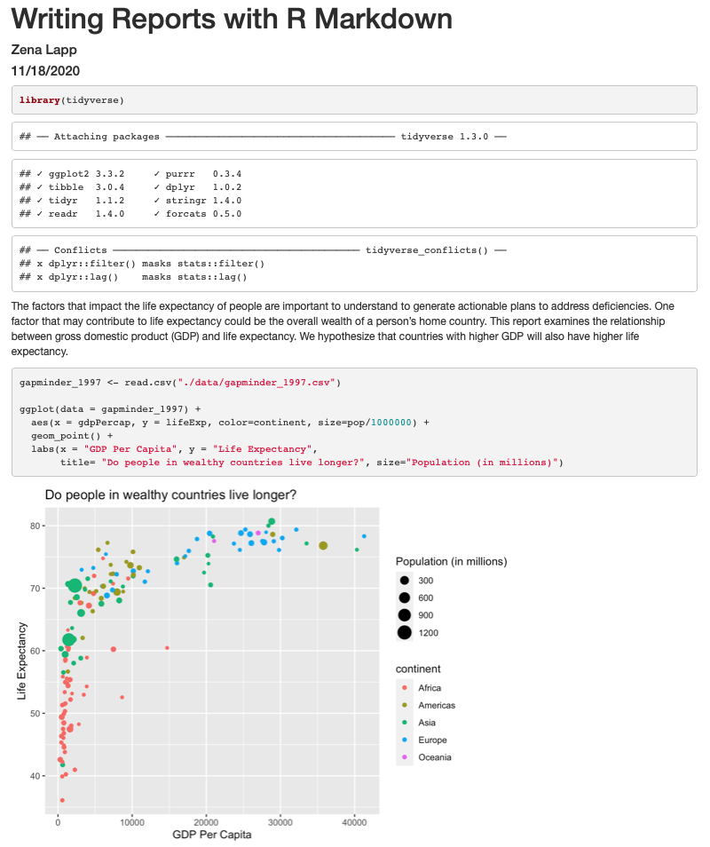
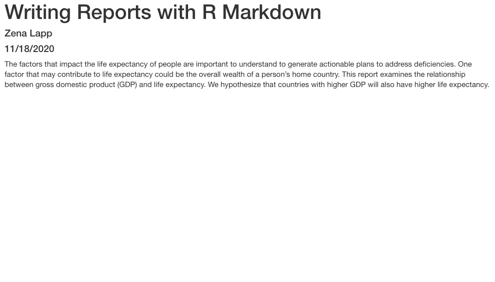
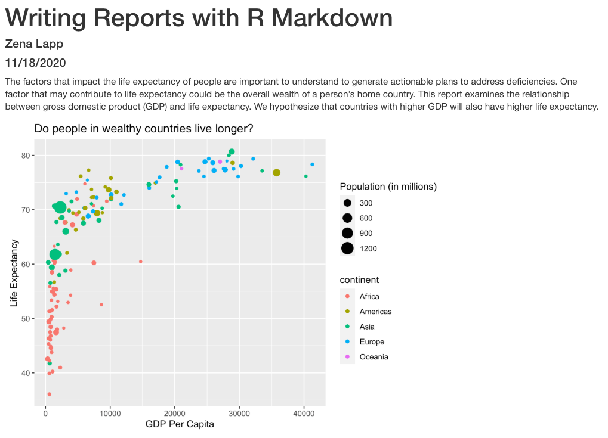

```{r, include=FALSE}
source("../bin/chunk-options.R")
knitr_fig_path("01-")
```

Remember that our goal is to generate a report about how a country's life expectancy is related to GDP.

## Creating a reports directory

Let's start by using the Unix Shell to create a directory within `un-report` called `reports` where we will write our reports to the UN.
First, open the Unix Shell and `cd` to `un-report`

```
pwd
mkdir reports
```

```
/home/USERNAME/Desktop/un-report/reports/
```
TODO make this input and output look like SWC website.

To start, I have a question for you:
How do you usually share data analyses with your collaborators? 
Many people share them through Word document, spreadsheets, attachments, etc. 

## Why use R Markdown?

We're going to learn a way to create a report in R using something called R markdown. 
This allows you to integrate the text of the report, the code you used, and your figures and other output into one document, which you can then "render" into a html or PDF file and share with others. 
The text can be experimental methods, an analysis and discussion of the results, or whatever else you want to include.
:We use this for writing reproducible analysis reports, publication, sharing work with collaborators, writing up homework, and keeping a computational notebook of our work, among other things.
If you're writing a publication or sharing results with collaborators who won't be interested in seeing that nitty-gritty part of your work, you can even hide the code. 
We call these types of reports *reproducible* reports because the code is embedded in the document and anyone can take the report and re-run the code to get the same output. 
It's also useful because if you change any of your code or text because you found an error or want to modify the text or a figure, you can just re-run the report to get the updated output! 

R Markdown combines Markdown (which renders plain text) with R code, which you can use to do data analysis and make figures.

## Creating an R Markdown file

Now that we have a better understanding of what we can use R Markdown files for, let's start writing a report!

To create an R Markdown file: (TODO: Include screen shots or is that overkill?)
- Open RStudio
- Go to File &rarr; New File &rarr; R Markdown
- Give your document a title (Q for learners: what should we call it? - TODO: choose name - un-report?)
- Keep the default output format as HTML. You need TeX installed if you want to generate PDF documents. (TODO: Add link to how to install TeX/render PDFs)
- R Markdown files always end in `.Rmd`

## Basic components of R Markdown

### Header

The first part is a *header* at the top of the file between the lines of `---`. This contains instructions for R to specify the type of document to be created and options to choose (ex. title, author, date). These are in the form of key-value pairs (`key: value`; YAML).

Here's an example:

```
---
title: 'Writing Reports with R Markdown'
author: "Zena Lapp"
date: "11/18/2020"
output: html_document
---
```

### Code chunks

The next section is a *code chunk*, or embedded R code, that sets up options for all code chunks. Here is the default when you create a new R Markdown file:

```{r,comment=NA,echo=F,collapse=T}
cat('```{r setup, include=FALSE}\n')
cat('knitr::opts_chunk$set(echo = TRUE)\n')
cat('```\n')
```

All code chunks have this format:

```{r,comment=NA,echo=F,collapse=T}
cat('```{r}\n# Your code here\n```')
```

All of the code is enclosed in 3 backticks (`cat('```')`), and the `{r}` part indicates that it's a chunk of R code. 

You can also include other information within the curly brackets to indicate different information about that code chunk. 
For instance, the first code block is named "setup", and `include=FALSE` prevents code and results from showing up in the output file.

Inside the code chunk, you can put any R code that you want to run, and you can have as many code chunks as you want in your file.

As we mentioned above, in the first code chunk you set options for the entire file. 
`echo = TRUE` means that you want your code to be shown in the output file. 
There are also many other options that you can change, but we won't go into those details in this workshop. 
TODO: Add link to where can learn more.

### Text

Finally, you can include text in your R Markdown file. 
This is any text or explanation you want to include, and it's formatted with Markdown. 
We'll learn more about Markdown formatting soon!

## Starting the report

First, let's delete everything below the setup code chunk.

Next, let's save our R markdown file to the `reports` directory. 
You can do this by clicking the save icon in the top left. 

There's one other thing that we need to do before we get started with our report.
To render our documents into html format, we can "knit" them in R Studio. 
Usually, R markdown renders documents from the directory where the document is saved (the location of the `.Rmd` file), but we want it to render from the main project directory where our `.Rproj` file is.
This is because that's where all of our relative paths are from and it's good practice to have all of your relative paths from the main project directory.
To change this default, click on the down arrow next to the "Knit" button at the top left of R Studio, go to "Knit Directory" and click "Project Directory". 
Now it will assume all of your relative paths for reading and writing files are from the `un-report` directory, rather than the `reports` directory.

Now that we have that set up, let's start on the report!

We're going to use the code you generated yesterday to plot GDP vs Life Expectancy to include in the report. Recall that we needed a couple R packages to generate these plots. We can create a new code chunk to library the needed packages. You could also include this in the previous setup chunck, it's up to your personal preference. We can specify `include=FALSE` like the setup chuck so we dont see the messages from loading packages in the report output. 

```{r,comment=NA,echo=F,collapse=T}
cat('```{r packages, include=FALSE}\n')
cat('library(tidyverse)\n')
cat('```\n')
```

Now in a real report this is when we would type out the background and purpose of the report to provide context to the readers of the report. However, since writing is not a focus of this workshop we will avoid lengthy prose and stick to short descriptions. You can copy the text below into your report below the package code chunk.

```
(couple sentances with purpose/question/hypothesis for the report that can be copied and pasted into the report)
```

Now since we want to show our results comparing GDP and life expectancy by country, we need to read in this data so we can regenerate our plot. We will add another code chunk to prepare the data. 

```{r,comment=NA,echo=F,collapse=T}
cat('```{r data}\n')
cat('gapminder_1997 <- read.csv("./data/gapminder_1997.csv")\n')
cat('```\n')
```

Now that we have the data we need to produce the plot, let's create it!

```{r,comment=NA,echo=F,collapse=T}
cat('```{r gdp_lifeexp_1997}\n')
cat('ggplot(data = gapminder_1997) + \n
  aes(x = gdpPercap, y = lifeExp, color=continent, size=pop/1000000) +\n
  geom_point() +\n
  labs(x = "GDP Per Capita", y = "Life Expectancy",\n
       title= "Do people in wealthy countries live longer?", size="Population (in millions)")\n')
cat('```\n')
```

Now we can knit our document to see how our report looks
TODO: add in using the knit button and changing knit directory or rmarkdown::render('file.rmd', output_dir = "dirpath/")



Amazing! We've created a report! Lets push this to github to make sure we preserve this document. 

TODO: instructions for pushing to github

It's looking pretty good, but there seem to be a few extra bits that we don't need in the report. For example, the report shows that we load the tidyverse package and the accompanying messages. 


To get rid of this, we can revise our packages code chunk by adding `include=FALSE` like in the setup chunk to prevent code and messages in this chunk from showing up in our report. 

```{r,comment=NA,echo=F,collapse=T}
cat('```{r packages, include=FALSE}\n')
cat('library(tidyverse)\n')
cat('```\n')
```

We can also see the code that was used to generate the plot. Depending on the purpose and audience for your report, you may want to include the code. If we dont want to code to appear, how can prevent it? What happens if we add `include=FALSE` to the plot code chunk too?



Oops! Now the plot doesn't show up in our report. This is because setting `include=FALSE` prevents anything in the code chunk from appearing in the report. Instead we can add `echo=FALSE` for the code chunk to tell it that we don't want to see the code but we want to see the output.

```{r,comment=NA,echo=F,collapse=T}
cat('```{r gdp_lifeexp_1997, echo=FALSE}\n')
cat('ggplot(data = gapminder_1997) + \n
  aes(x = gdpPercap, y = lifeExp, color=continent, size=pop/1000000) +\n
  geom_point() +\n
  labs(x = "GDP Per Capita", y = "Life Expectancy",\n
       title= "Do people in wealthy countries live longer?", size="Population (in millions)")\n')
cat('```\n')
```

When we knit this again, we can see the plot again!


Now that we have a report we are happy with, let's push the changes to git hub. 

## Integrating it all together: Paired exercise

You've learned so much in the past two days - how to use the Unix Shell to move around your computer, how to use git for version control and GitHub for collaborating with others on code, how to make pretty plots and do data analysis in R, and how to incorporate it all into a report. 
Now, you're going to work in pairs to practice everything you learned. Ideally, you'll have the same pair as for the git/GitHub lesson.
Don't worry - if you have questions, the instructor and helpers can help you out!

Only one of the people in your pair is going to create the R Markdown file. The other person is going to collaborate with that person using GitHub. So the first step is to choose one person in your pair to create/host the R Markdown file.

**For the person who is going to host the new R Markdown file:**
1. Make a new R markdown file.
1. Give it an informative title.
1. Delete all the unnecessary Markdown and R code (everything below the setup R chunk).
1. Save it to the `reports` directory using an informative file name.

**For the person who is going to collaborate with the host of the R Markdown file:**

If you don't already have your partner's GitHub repo cloned from the git/GitHub lesson, clone their repo to your Desktop under the name `USERNAME-un-report`. If you don't remember how to do this, you can review the git lesson (LINK). 

The way you will collaborate with each other is as follows:
1. For each exercise, both people will be thinking about how to answer the question, but only one person will be writing the code.
This is called _paired programming_.
1. Once you have completed an exercise, the person working on the exercise will add, commit, and push the changes to GitHub.
1. Then the other person will pull the changes from GitHub.
1. The person who pulled changes will code for the next exercise. 
1. Repeat the process for as many exercises as you can finish in the remaining time. 
Don't worry if you don't finish all of the exercises, and it's not a race between groups! 
This is just a way for you to practice what you've learned.

### Exercises using the gapminder data

First we're going to start out with a few questions about the gapminder dataset.

#### Investigating population over time.

1. Make a scatter plot of year vs. population, separated into a plot for each contient.

```{r}
ggplot(gapminder, aes(x=year,y=pop)) + geom_point() + facet_wrap(~continent)
```

1. It seems like there are 2 outliers - which countries are those?

```{r}
gapminder %>% filter(pop > 1e9) %>% select(country) %>% unique()
```

1. Plot year vs. population separated into a plot for each continent but excluding the 2 outlier countries. 

```{r}
gapminder %>% filter(country != 'China' & country != 'India') %>% ggplot(aes(x=year,y=pop)) + geom_point() + facet_wrap(~continent)
```

1. What's the outlier country now?

```{r}
gapminder %>% filter(pop > 2.5e8) %>% select(country) %>% unique()
```

1. In the plot above, the years look kind of messy. Can you rotate the x axis text 90 degrees so that the years are more readable? Feel free to search the internet if you don't know how to do it!

```{r}
gapminder %>% filter(country != 'China' & country != 'India') %>% ggplot(aes(x=year,y=pop)) + geom_point() + facet_wrap(~continent) + theme(axis.text.x=element_text(angle=90))
```

1. It's hard to see which country is which here. Can you change the scatter plot to a line plot so we can get a better sense of trends over time? HINT: This website has more information: https://www.r-graph-gallery.com/line-chart-several-groups-ggplot2.html

```{r}
gapminder %>% filter(country != 'China' & country != 'India') %>% ggplot(aes(x=year,y=pop,group=country)) + geom_line() + facet_wrap(~continent) + theme(axis.text.x=element_text(angle=90))
```

#### Looking into life expectancy a bit more.

1. What country had the highest life expectancy in 1982? Hint: use the `slice_max` function to get the row for a maximum value in a dataset. You can use `?slice_max` and/or the internet to learn more about how to use the function.

```{r,comment=NA,echo=F,collapse=T}
filter(gapminder, year==1982) %>% slice_max(lifeExp)
```

1. Now, do the same thing but for all years! (How many years are there?) 

```{r}

gapminder %>% select(year) %>% unique() %>% nrow()

gapminder %>% group_by(year) %>% select(country,year,lifeExp) %>% slice_max(lifeExp) %>% print(n=Inf)
```

1. Make a boxplot for the life expectancies of the countries in each continent for 2007.

```{r,comment=NA,echo=F,collapse=T}
gapminder %>% filter(year==2007) %>% ggplot(aes(x=continent,y=lifeExp)) + geom_boxplot()
```

1. **Challenge question:** Which country has had the greatest increase in life expectancy from 1952 to 2007? HINT: You might want to use the `pivot_wider` function to get your data in a format with the columns for : country, 1952 life expectancy, 2007 life expectancy, and the difference between 2007 and 1992 life expectancy. 
TODO: Move this to the end? 

```{r,comment=NA,echo=F,collapse=T}
filter(gapminder, year == 1952 | year == 2007) %>% select('country','year',lifeExp) %>% pivot_wider(names_from=year,values_from=lifeExp) %>% mutate(diff=`2007`-`1952`) %>% slice_max(diff)
```

1. What countries had a decrease in life expectancy from 1952 to 2007?

```{r,comment=NA,echo=F,collapse=T}
filter(gapminder, year == 1952 | year == 2007) %>% select('country','year',lifeExp) %>% pivot_wider(names_from=year,values_from=lifeExp) %>% mutate(diff=`2007`-`1952`) %>% filter(diff < 0)
```

### Exercises integrating a new dataset


