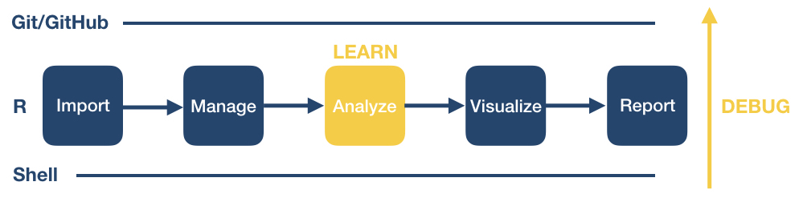

# Where to go from here?: Departing on your own coding journey

{width=400}

We have come to the end of this workshop. You learned some basic procedures for importing, managing, visualizing and reporting your data. 

As you continue on your coding journey, two things will happen: 

1. You will encounter bugs and need to figure out how to solve them ("debugging"), and
2. You will want to learn new data processing and analysis techniques.

As we complete the course, we want to  share with you some  tips and tricks that have helped us on our own programming journeys.

## Dealing with coding errors
Even well seasoned coders run into bugs all the time. Here are some strategies of how programmers try to debug their code:

* Don't panic. Bugs are a normal part of the coding process. Think of each bug as a great opportunity for becoming better at writing code.
* Read the error message that your program issues and see if that helps you figure out the problem. The error message may give you a hint which particular line in your code, i.e., function call, is failing.
* Check your code syntax. For example, are all parentheses correctly closed?
* Check out in-built help tools and documentation. 
  * __R__: Typing a question mark immediately followed by a function name, i.e., `?<command>`, pulls up the R documentation for that function. This provides  a function description, as well as in-depth information about each function argument including its purpose, default and other available options.
  * __Shell__: Use `man <command>` or `<command> --help` pulls up the manual page with more information. To quit, click `q`.
  * __Git__: `git help` displays help information about git. Read more [here](https://git-scm.com/docs/git-help).
* Search online for the error message along with the function that is not working. Most likely, someone encountered this error before you  and the examples online will help you figure out your own issue.
* Perform a general online search for what you are trying to do, e.g., "how to import a comma separated spreadsheet into R", "how to delete a directory from the command line", "how to merge conflicts in git". Typically, you will find step-by-step online documentation that you can adapt for your own purposes.
* Ask for help. If you are unable to solve your issue with existing online documentation, take your problem to a user forum. Typically, R users provide a piece of sample data along with the function call and error message  to request feedback from other users.

## Learning new code
Free open-source programming languages such as bash, Git and R are constantly evolving. As you try out new data processing and analysis techniques, you will continue to learn new coding logic, concepts, functions, and libraries. Widely available user tools and documentation are a main benefit of free open-source software.

In the following, we list some strategies and resources we find useful. As you move forward, you are likely to identify other resources that fit your own learning style.

### General 
* [Stack Overflow](https://stackoverflow.com/): Users post questions or errors and other users respond.
* Cheat Sheets!! You can find many different cheat sheets for entire languages or specific libraries or even functions online. Just search for "<something> cheat sheet" to see what is available. We have listed a few below.
* Study other people's code. Increasingly, people publish their code (e.g., in a Github repository) to facilitate reproducible research. You can take someone else' code as a starting point and adapt it to your own needs.

### Bash/Shell
* [Bash Scripting Cheat Sheet](https://devhints.io/bash)
* [Bash Scripting Tutorial for Beginners](https://linuxconfig.org/bash-scripting-tutorial-for-beginners)
* [The Bash Guide](https://guide.bash.academy/)

### Git/GitHub
* [Documentation](https://git-scm.com/doc)
* [Git Cheat Sheet](https://education.github.com/git-cheat-sheet-education.pdf)
* [GitHub Help Documentation](https://docs.github.com/en/free-pro-team@latest/github)

### R
* [R package library](https://cran.r-project.org/)
* [Base R Cheat Sheet](https://rstudio.com/wp-content/uploads/2016/10/r-cheat-sheet-3.pdf)
* [R Markdown Cheat Sheet](https://rstudio.com/wp-content/uploads/2016/03/rmarkdown-cheatsheet-2.0.pdf)
* [R Tidyverse Cheat Sheet](https://s3.amazonaws.com/assets.datacamp.com/blog_assets/Tidyverse+Cheat+Sheet.pdf)
* [R ggplot2 Cheat Sheet](https://rstudio.com/wp-content/uploads/2015/03/ggplot2-cheatsheet.pdf)

## Writing code  at the University of Michigan

There are many local opportunities at the University of Michigan or around the Ann Arbor campus to find coding support, learn new programming skills, and connect with other users.

### Get help and/or connect
* [CSCAR consulting](https://cscar.research.umich.edu/) and [workshops](https://cscar.research.umich.edu/events/category/workshops/)
* [CoderSpaces](https://datascience.isr.umich.edu/), [CoderSpaces Slack Space](https://join.slack.com/t/umcoderspaces/signup)
* [DANG!](https://um-dang.github.io/)
* [Software Carpentry Workshops](https://umswc.github.io/workshops/)
* [Local meetup groups](https://www.meetup.com/topics/computer-programming/us/mi/ann_arbor/)

### Free learning platforms available at U-M
* [Michigan Online](https://online.umich.edu/)
* [LinkedIn Learning](https://hr.umich.edu/working-u-m/organizational-learning-resources-faculty-staff/professional-development-courses-resources/linkedin-learning)


