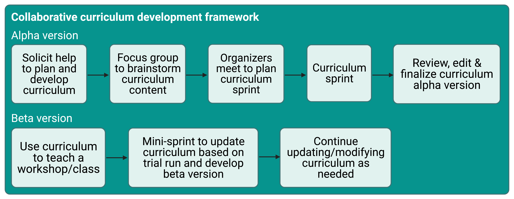
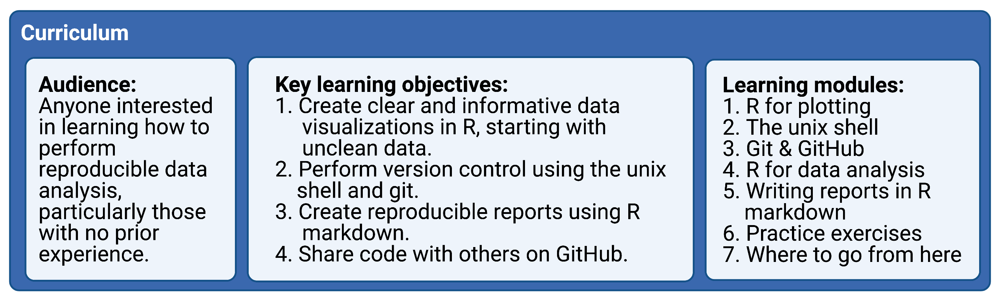

# Summary

Inspired by well-established material and pedagogy provided by The Carpentries
[@wilson_software_2016], we developed a two-day workshop curriculum that teaches
introductory R programming for managing, analyzing, plotting and reporting data using the R tidyverse
[@wickham_welcome_2019], the Unix shell, version control with git, and GitHub.
While the official Software Carpentry curriculum is well-thought-out and comprehensive, we found
that it contains too much content for  a two-day workshop.
We also felt that the independent nature of the lessons left learners confused about how to
integrate the newly acquired programming skills in their own work.
Thus, we developed a new curriculum (https://umcarpentries.org/intro-curriculum-r/) that
aims to teach novices how to implement reproducible research principles in
in their own data analysis.
To emphasize the iterative nature of coding and data analysis
we integrated live coding lessons with individual-level and group-based practice exercises.
Our new curriculum also serves as a succinct resource material that learners can reference both during and after
the workshop. Moreover, it lowers the entry barrier for new instructors as they do not
have to develop their own teaching materials or sift through extensive content.
We developed this curriculum during a two-day sprint,
successfully used it to host a two-day virtual workshop with almost 40 participants,
and updated the material based on instructor and learner feedback.
We hope that our new curriculum will prove useful to future instructors interested in
teaching workshops with similar learning objectives.

# Statement of Need

For the past five years, the University of Michigan instance of The Carpentries taught workshops
using versions of curriculum originally created by The Carpentries organization.
In that time, our instructors found several advantages and disadvantages to
using the original Software Carpentry curriculum.
Some of the advantages were that any programming language lesson (e.g., R or
Python) could be paired with lessons on the Unix shell and version control,
lessons had been refined by many contributors over the years and taught at
workshops around the world, and
the instructional design demonstrated good pedagogy for teaching novice data
science practitioners.
However, The Carpentries material was designed more as a reference material rather than a lesson plan, 
and thus there was too much content for the time available during a two-day workshop.
As a result, workshops taught with this material were inconsistent  depending on who was teaching, and new
instructors faced an overwhelming amount of work to prepare for their first
workshop.
Furthermore, the modular nature of the curriculum meant that each lesson was independent
from the others, so it was not apparent to learners how all of the skills could be integrated
for the purpose of a reproducible research project.

Given these constraints, we sought to create a new curriculum that would allow us to
teach computational skills in an integrated manner, demonstrate the
reproducible research workflows we use in our own work,
deliver an appropriate and consistent amount of content,
and reduce the burden for new instructors to get involved,
all while maintaining the same inclusive pedagogy that has been refined by The Carpentries organization.

# Collaborative Curriculum Development

We drew on the expertise of The Carpentries community at the
University of Michigan to develop a custom curriculum that would meet our goals
(Figure 1).
To start, we organized a two-day sprint, where members of our community worked
collaboratively to create an initial draft of the content.
During the sprint, we met virtually to discuss our goals, then broke up into
teams to work on individual lessons before coming back together to review our
progress.
We hosted the curriculum in a public GitHub repository
(https://github.com/umcarpentries/intro-curriculum-r) to facilitate
collaborative work and peer review using issues, branches, and pull requests.
Under this model, a team member creates or edits content in a new branch to
resolve an issue,
then creates a pull request and asks for review from another team member,
who finally merges the changes into the default branch.
GitHub pages automatically uses the default branch to build a website that would allow us to
host the polished curriculum (https://umcarpentries.org/intro-curriculum-r/).
Our collaborative model ensured that at least two pairs of eyes viewed any changes before they
could be included in the curriculum. This strategy helped us reduce mistakes and create
better quality content.

Following the sprint, contributors finalized edits and continued to review each
others' pull requests to complete the alpha version of our curriculum.
Next, we hosted a workshop for instructors to pilot the curriculum.
We collected feedback from the learners and instructors at the end of the pilot
workshop and then held a smaller half-day sprint to revise the curriculum based on
the feedback.
Currently, our community members are continuously able to create issues, make edits, and review pull
requests to keep refining the curriculum for future use.
We are planning more workshops with new instructors who were not involved in the original curriculum development
 to gather their feedback.

# Curriculum

Our curriculum is tailored to people with no prior coding experience who want to
learn how to use R programming for data analysis, visualization and the reporting of results (Figure 2).
Not only do we aim to teach our learners the basics of performing empirical data analysis,
we also seek to provide a rigorous framework for adhering to reproducible
research principles that enable researchers to easily share their empirical work with others.

## Learning Objectives

The key learning objectives for our curriculum are:

1. Create clear and informative data visualizations in R, starting with messy data.
1. Perform version control using the Unix shell and git.
1. Create reproducible reports using R Markdown.
1. Share code with others on GitHub.

We believe these skills provide learners with a solid foundation from which they can teach
themselves any additional coding skills for future use.

## Course Content

Our curriculum consists of nine modules that cover software setup, data analysis and
visualization, version control, sharing code, and writing reports (see below for more details). 
We also set an overall goal for the workshop to make the content substantively interesting
and relatable to a wide audience regardless of their original academic discipline or professional practice. Specifically, we task our learners with producing a fictitious report to the
United Nations that examines the relationship between gross domestic product (GDP), life
expectancy, and CO~2~ emissions.
The R programming lessons take a "tidyverse first" approach
[@robinson_teach_2017] so learners can meet this goal.
The nine curriculum modules are:

0. Setup
1. Welcome
1. R for plotting (uses the tidyverse R packages)
1. The Unix shell
1. Git and GitHub
1. R for data analysis (uses the tidyverse R packages)
1. Writing reports in R Markdown (uses the rmarkdown R package [@xie_r_2018])
1. Group practice exercises
1. Where to go from here

Each lesson builds on the previous ones.
The Unix shell, git, and GitHub are introduced using the files generated in the
R for plotting lesson.
The lesson content for subsequent modules is then intermittently committed and
pushed to GitHub.
The `Writing reports in R Markdown' lesson combines all of the skills learned previously to produce a
report (as a pdf, Word, or html document) that one could share with the United Nations.
Next, learners put everything they have learned into
practice by forming small groups and working on practice problems that cover the entire course
content.
The workshop completes with a short module recapping everything that the curriculum covered as well as offering suggestions on how
learners can continue to get help and keep learning once the workshop ends.

## Instructional Design
<!-- teaching philosophy / pedagogy -->

Our modules and instructor suggestions are developed in the style of [Software Carpentry](https://software-carpentry.org/):

1. Each module contains learning objectives at the beginning of each lesson and
a summary of key points at the end.
1. The five core modules (2 to 6) are designed to be taught via live coding of
the content to learners.
This is a central feature of Carpentries lessons, and we believe it is a great
way to learn how to program. It requires learners to follow along and
encounter errors that they must debug along the way, fostering additional
questions about the course content. It also leads to instructors making mistakes
and then demonstrating how to deal with them in an ad hoc and iterative manner.
1. We incorporate formative assessments in the form of short practice exercises
throughout each lesson such that learners can practice what they have learned, while
instructors can gauge learner understanding of the material.

We also incorporated a few additional key components into the curriculum:

1. Each lesson builds off of previous lessons, with the goal of creating a final report
that can be shared with others.
1. We structured the curriculum such that it could be taught through an
in-person or virtual workshop. Virtual workshops are sometimes necessary, as during the COVID-19 pandemic, but are also useful to allow people from a variety of geographic locations to instruct and attend.
1. We not only require learners to install all software before the workshop (as The
Carpentries also requires), but also ask them to run an example script that tests
whether everything is installed correctly.
To attend the workshop, learners must send screenshots of the script output to the workshop lead in
advance. This ensures that any installation issues can be
addressed before the workshop begins.
1. An extensive small group practice module towards the end of the workshop
allows learners to more independently practice the skills they have learned.
1. The workshop concludes with a recap of what was covered and resources
available for learners to continue learning and getting help as their skills
develop.

## Pilot Workshop
<!-- experience of use -->

We piloted our curriculum during a virtual two-day Software Carpentry workshop.
In line with The Carpentries recommendations
[@the_carpentries_carpentries_2018], we had four instructors and six helpers at
the workshop to assist with learner questions and technical issues.
We also used the "sticky note" system for formative assessment, where learners
indicate their progress on exercises and request help by using different
colored sticky notes [@becker_responding_2016; @the_carpentries_live_2018].
As the workshop was virtual, we used Zoom reaction icons as virtual sticky
notes, with the red X reaction to ask for help and the green checkmark to
indicate that an exercise was successfully completed.
We had thirty-nine learners of various skill levels from several different
countries, all of whom provided very positive reviews of the workshop.
By the end of the workshop, learners on average felt more confident writing programs, using programming to work with data, overcoming problems while programming, and searching for answers to technical questions online (n = 14 survey respondents; data from Carpentries pre- and post-workshop surveys).
All attendees who filled out the post-workshop survey (n = 19) would recommend the workshop to others.

### Virtual Workshop Reflection

We credit the success of our first virtual workshop in large part due to the
curriculum structure and content, as well as the instructors and helpers
involved.
However, we also believe that the following helped make the workshop as
smooth as possible:

1. We suggested that learners have Zoom and RStudio (or the Unix shell) open side-by-side on their computer to minimize toggling between different panels.
1. We used Slack for communication among instructors and helpers, as well as between helpers and learners.
Learners asked questions in a group Slack channel where helpers could respond.
This allowed us to address the vast majority of learner questions and bugs quickly, clearly, and efficiently without disrupting the lesson or moving the learner to a Zoom breakout room.
Furthermore, Slack worked much better than the Zoom chat as questions could be answered in threads, were preserved and visible to all learners regardless of whether they were connected to Zoom at the time, and didn't get lost as easily.  
1. Whenever a learner needed more help than was possible on Slack, a helper and the
learner entered a Zoom breakout room together to troubleshoot.
However, we tried to minimize this option as much as possible to prevent the learner from missing content
covered in the main room.

# Acknowledgements

We thank The Carpentries organization for providing instructor training,
workshop protocols, and the open-source Software Carpentry curriculum upon
which this curriculum is based. We also thank them for allowing us to use the
pre- and post-workshop survey results in this manuscript.
The Carpentries is a fiscally sponsored project of Community Initiatives, a registered 501(c)3 non-profit organisation based in California, USA.

We are grateful to Victoria Alden and Scott Martin for assisting us in
organizing and advertising our pilot workshop.
We thank Shelly Johnson for volunteering as a helper at the workshop and
contributing to the setup instructions.
We also thank Bennet Fauber for contributing to the setup instructions.

We thank the learners who participated in the workshop, provided feedback, and completed the surveys.

# Funding

Salary support for PDS came from NIH grant R01CA215574.
KLS received support from the NIH Training Program in Bioinformatics (T32
GM070449).
ZL received support from the National Science Foundation Graduate Research
Fellowship Program under Grant No. DGE 1256260.
Any opinions, findings, and conclusions or recommendations expressed in this
material are those of the authors and do not necessarily reflect the views of
the National Science Foundation.

# Author Contributions

ZL and KLS contributed equally. ZL is first among the co-first authors because
KLS threatened to reject all pull requests where ZL put KLS first. :)

PDS supervised the project.
ZL and KLS organized the initial sprint, led the development of the curriculum,
and drafted the manuscript.
ZL, KLS, JK, and MML instructed at the first pilot workshop
while CRA, JMA, ST, SKL, and CB assisted learners.
All authors contributed to the development of the curriculum.

# Conflicts of Interest

None.

# References
